# MXWUI组件文档

按组件列表页分类整理，与源码 / Demo 一一对应。

## 组件界面

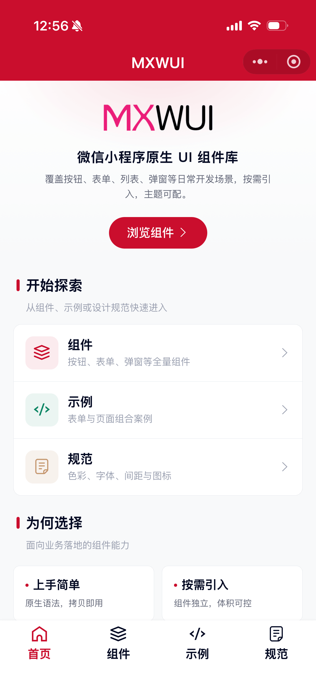
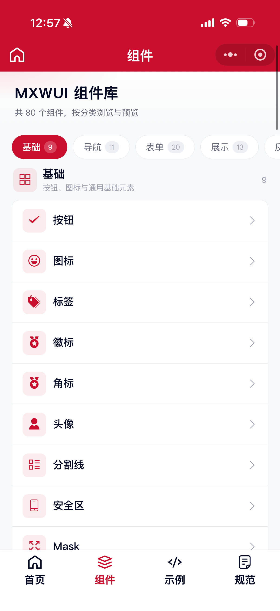
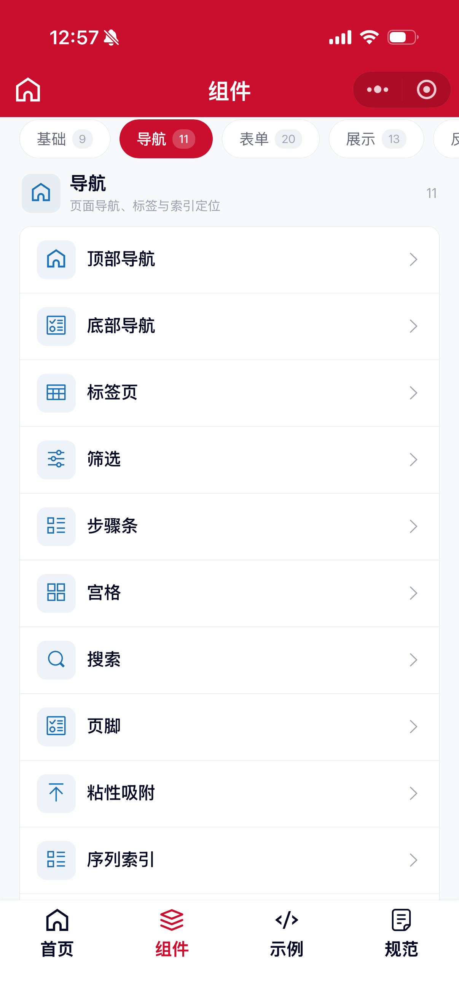
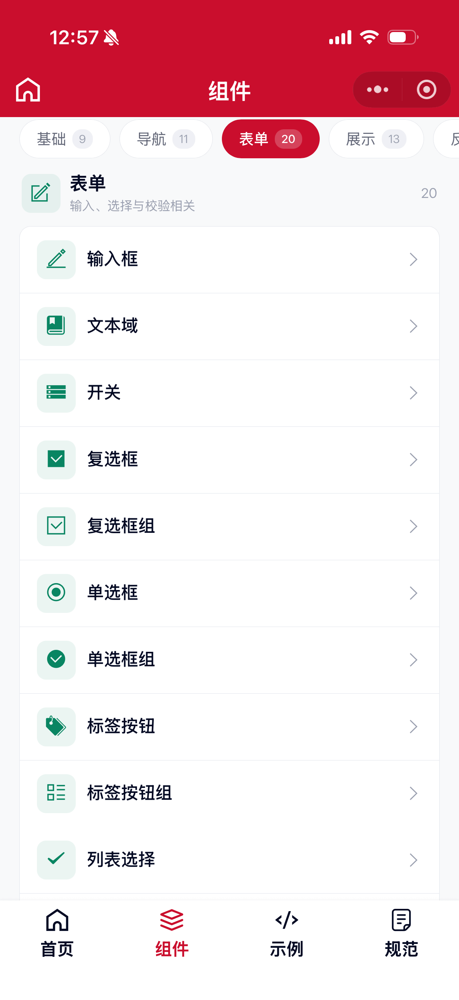
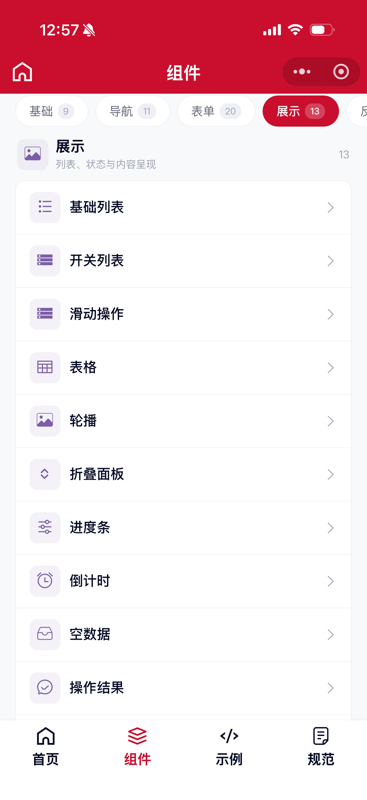
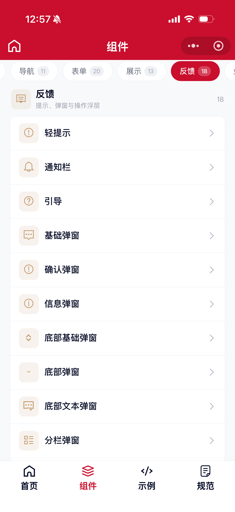
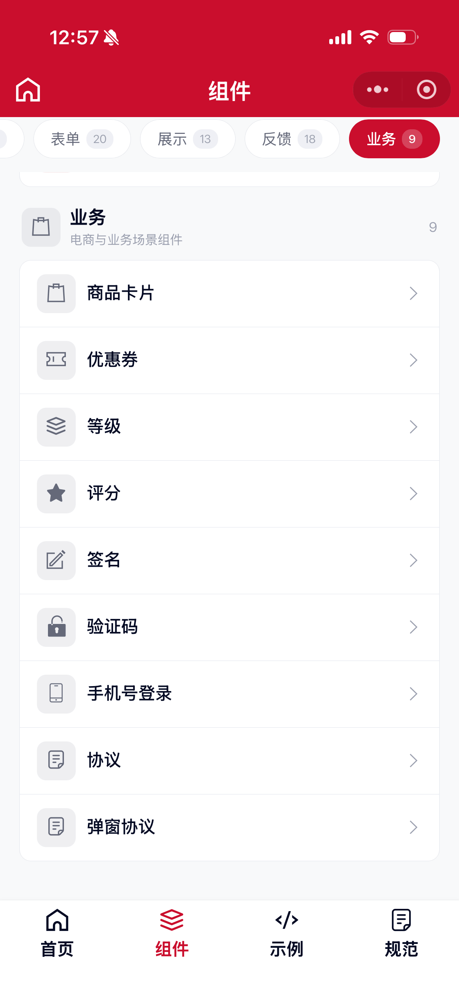

## 组件规范

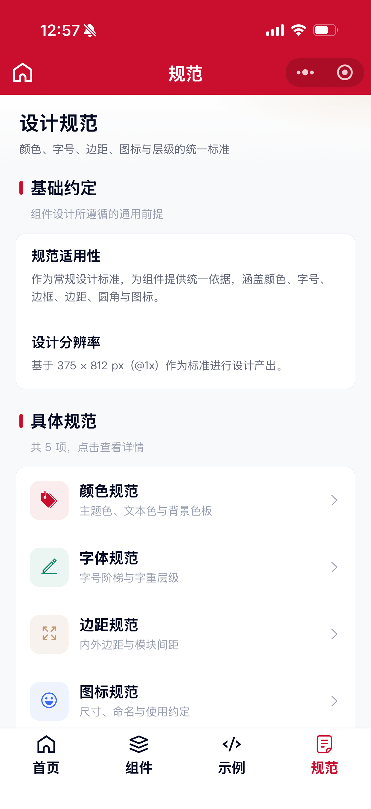
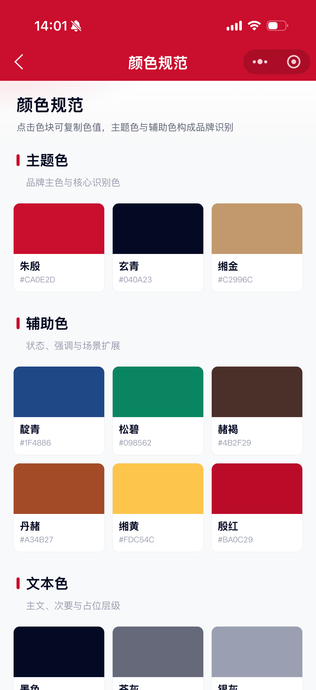
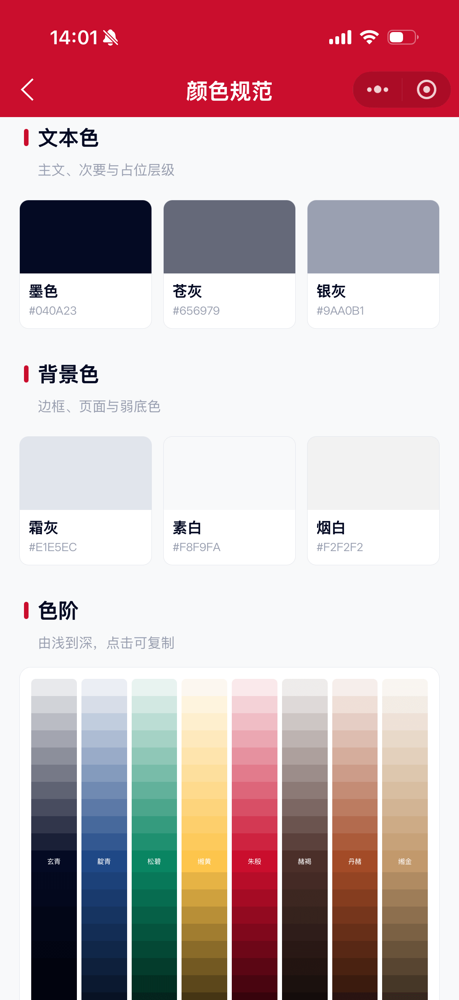
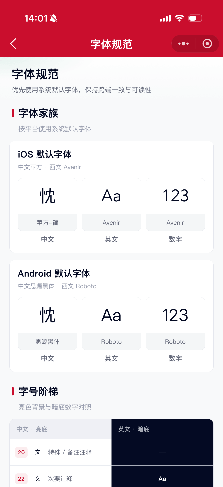
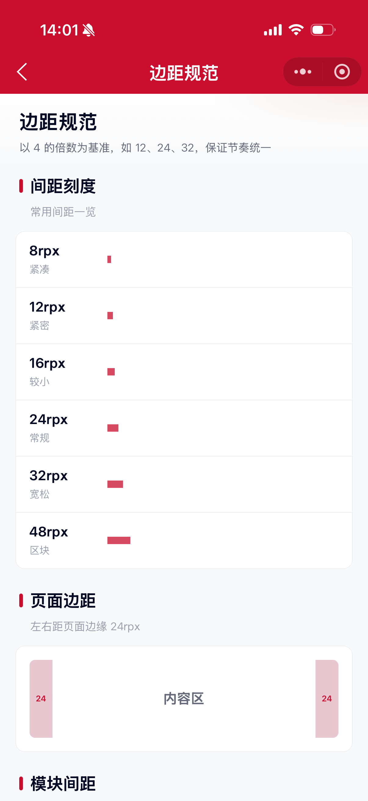
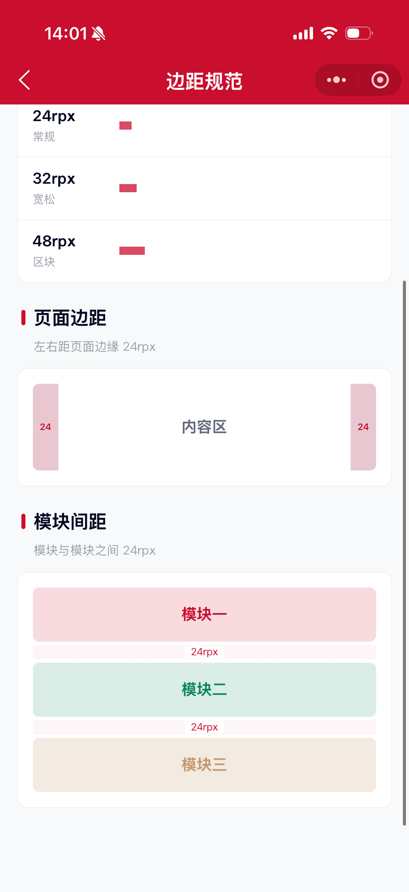
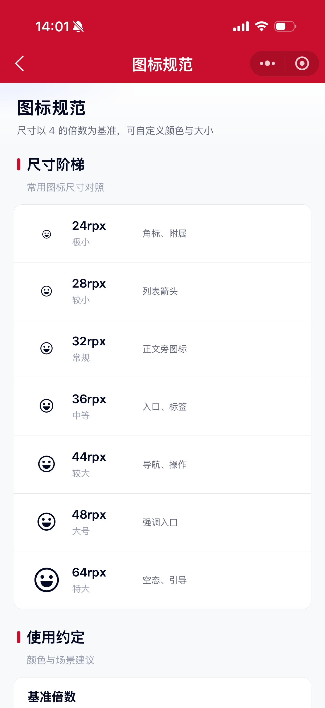
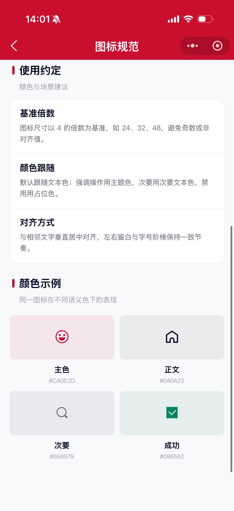
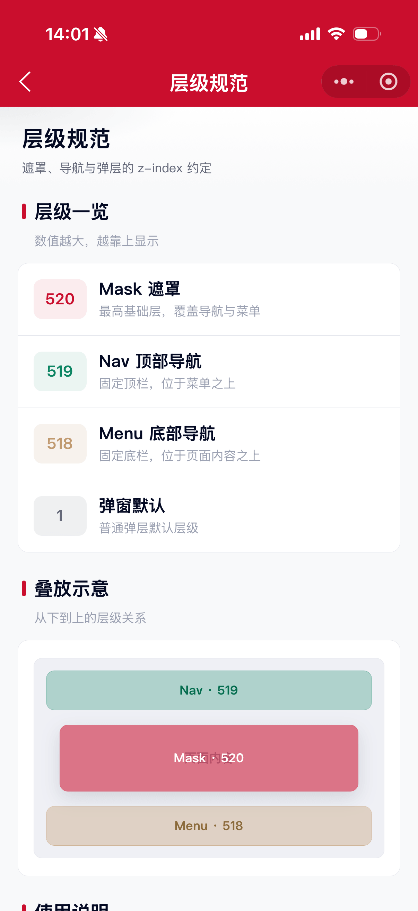

## 基础组件
- [Btn 按钮组件](./components/btn.md)
- [Icon 图标组件](./components/icon.md)
- [Tag 标签组件](./components/tag.md)
- [Badge 徽标组件](./components/badge.md)
- [CornerMark 角标组件](./components/cornerMark.md)
- [Avatar 头像组件](./components/avatar.md)
- [Divider 分割线组件](./components/divider.md)
- [SafeArea 安全区组件](./components/safeArea.md)
- [Mask 蒙层组件](./components/mask.md)

## 导航组件
- [Nav 顶部导航组件](./components/nav.md)
- [Menu 底部导航组件](./components/menu.md)
- [Tabs 标签页组件](./components/tabs.md)
- [TabsFilter 筛选组件](./components/tabsFilter.md)
- [Steps 步骤条组件](./components/steps.md)
- [Grid 宫格组件](./components/grid.md)
- [Search 搜索组件](./components/search.md)
- [Footer 页脚组件](./components/footer.md)
- [Sticky 粘性吸附组件](./components/sticky.md)
- [IndexBar 序列索引组件](./components/indexBar.md)
- [ToTop 回到顶部组件](./components/toTop.md)

## 表单组件
- [Input 输入框组件](./components/input.md)
- [Textarea 文本域组件](./components/textarea.md)
- [Switch 开关组件](./components/switch.md)
- [Checkbox 复选框组件](./components/checkbox.md)
- [CheckboxGroup 复选框组](./components/checkboxGroup.md)
- [Radio 单选框组件](./components/radio.md)
- [RadioGroup 单选框组](./components/radioGroup.md)
- [Label 标签按钮组件](./components/label.md)
- [LabelGroup 标签按钮组](./components/labelGroup.md)
- [ListSelect 列表选择组件](./components/listSelect.md)
- [ListPicker 列表下拉组件](./components/listPicker.md)
- [SelectContact 选人组件](./components/selectContact.md)
- [Stepper 步长器组件](./components/stepper.md)
- [Slider 滑块组件](./components/slider.md)
- [NumberKeyboard 数字键盘组件](./components/numberKeyboard.md)
- [Calendar 日历组件](./components/calendar.md)
- [Datetime 日期时间组件](./components/datetime.md)
- [DatetimeRange 日期时间范围组件](./components/datetimeRange.md)
- [Upload 上传组件](./components/upload.md)
- [UploadGroup 上传组](./components/uploadGroup.md)

## 展示组件
- [ListBasic 基础列表组件](./components/listBasic.md)
- [ListSwitch 开关列表组件](./components/listSwitch.md)
- [SwipeAction 滑动操作组件](./components/swipeAction.md)
- [Table 表格组件](./components/table.md)
- [Swiper 轮播组件](./components/swiper.md)
- [Collapse 折叠面板组件](./components/collapse.md)
- [ProgressBar 进度条组件](./components/progressBar.md)
- [Countdown 倒计时组件](./components/countdown.md)
- [Empty 空数据组件](./components/empty.md)
- [Result 操作结果组件](./components/result.md)
- [Loading 加载中组件](./components/loading.md)
- [Skeleton 骨架屏组件](./components/skeleton.md)
- [WaterMark 水印组件](./components/waterMark.md)

## 反馈组件
- [Toast 轻提示组件](./components/toast.md)
- [Notice 通知栏组件](./components/notice.md)
- [Lead 引导组件](./components/lead.md)
- [Dialog 基础弹窗组件](./components/dialog.md)
- [Confirm 确认弹窗组件](./components/confirm.md)
- [Alert 信息弹窗组件](./components/alert.md)
- [DialogBottom 底部基础弹窗组件](./components/dialogBottom.md)
- [DialogBasic 底部弹窗组件](./components/dialogBasic.md)
- [DialogText 底部文本弹窗组件](./components/dialogText.md)
- [DialogColumn 分栏弹窗组件](./components/dialogColumn.md)
- [ActionSheet 按钮操作栏组件](./components/actionSheet.md)
- [Popup 侧边弹窗组件](./components/popup.md)
- [Popover 气泡弹出框](./components/popover.md)
- [Dropdown 下拉菜单组件](./components/dropdown.md)
- [Share 分享弹窗组件](./components/share.md)
- [FixedFoot 吸底组件](./components/fixedFoot.md)
- [FootBtns 吸底按钮组](./components/footBtns.md)
- [FootInput 吸底输入框](./components/footInput.md)

## 业务组件
- [SaleItem 商品卡片组件](./components/saleItem.md)
- [Coupon 优惠券组件](./components/coupon.md)
- [Level 等级组件](./components/level.md)
- [Rate 评分组件](./components/rate.md)
- [Signature 签名组件](./components/signature.md)
- [VerificationCode 验证码组件](./components/verificationCode.md)
- [PhoneLogin 手机号登录组件](./components/phoneLogin.md)
- [Protocol 协议组件](./components/protocol.md)
- [ProtocolDialog 弹窗协议组件](./components/protocolDialog.md)
