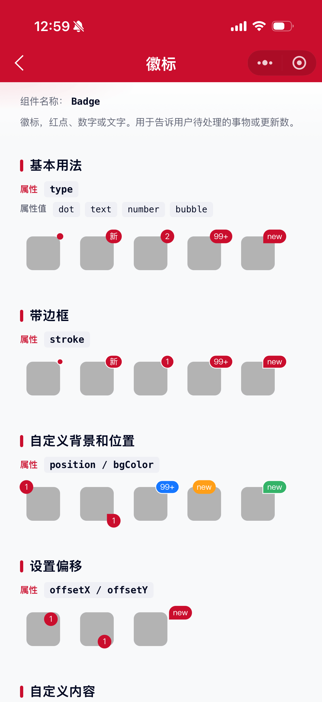

# Badge 徽标组件

徽标，红点、数字或文字。用于告诉用户待处理的事物或更新数。适用于新消息、新功能、新服务等内容的提醒。

## 示例图



## 扫码查看


## 基础用法
页面 `.json` 文件 `usingComponents` 中引入组件
```json
// json
{
    "usingComponents": {
        "mx-badge": "/components/mxwui/badge/index"
    }
}
```

页面 `.wxml` 文件中使用组件
```html
<mx-badge type="dot">
    <view class="box"></view>
</mx-badge>

<mx-badge type="number" text="{{2}}">
    <view class="box"></view>
</mx-badge>

<mx-badge type="text" text="新">
    <view class="box"></view>
</mx-badge>

<mx-badge type="bubble" text="new">
    <view class="box"></view>
</mx-badge>
```

## 更多用法示例
### # 类型 type
属性：`type`，可选 `dot`、`number`、`text`、`bubble`，默认 `dot`。

- `dot`：红点
- `number`：数字类型，超过 99 自动显示为 `99+`
- `text`：文字气泡
- `bubble`：气泡形态（对应角为直角，形成箭头感）
```html
<mx-badge type="dot"><view class="box"></view></mx-badge>
<mx-badge type="number" text="{{100}}"><view class="box"></view></mx-badge>
<mx-badge type="text" text="新"><view class="box"></view></mx-badge>
<mx-badge type="bubble" text="new"><view class="box"></view></mx-badge>
```

### # 内容 text
属性：`text`，徽标展示内容。为空时 `number` / `text` / `bubble` 可走 `slot="text"` 自定义内容；`dot` 类型忽略该属性。
```html
<mx-badge type="number" text="{{8}}"><view class="box"></view></mx-badge>
<mx-badge type="text" text="HOT"><view class="box"></view></mx-badge>
```

### # 位置 position
属性：`position`，徽标相对子节点的方位，默认 `top-right`。

可选：`top-left`、`top-center`、`top-right`、`left`、`right`、`bottom-left`、`bottom-center`、`bottom-right`。
```html
<mx-badge type="number" text="{{1}}" position="top-left">
    <view class="box"></view>
</mx-badge>
<mx-badge type="bubble" text="1" position="bottom-right">
    <view class="box"></view>
</mx-badge>
```

### # 偏移 offsetX / offsetY
属性：`offsetX`、`offsetY`，水平 / 垂直偏移，默认均为 `-50%`。需带单位，如 `-20px`、`2px`、`-50%`。
```html
<mx-badge type="text" text="1" offsetX="-20px" offsetY="0px">
    <view class="box"></view>
</mx-badge>
```

### # 描边 stroke
属性：`stroke`，是否白色描边，默认 `false`。深色背景上更清晰。
```html
<mx-badge type="dot" stroke>
    <view class="box"></view>
</mx-badge>
```

### # 背景色 bgColor
属性：`bgColor`，自定义徽标背景色，默认主题色 `#CA0E2D`。
```html
<mx-badge type="number" text="{{100}}" bgColor="#1677FF">
    <view class="box"></view>
</mx-badge>
```

### # 文字色 textColor
属性：`textColor`，自定义徽标文字色，默认 `#FFFFFF`。对 `dot` 无效。
```html
<mx-badge type="text" text="新" bgColor="#FF9F18" textColor="#040A23">
    <view class="box"></view>
</mx-badge>
```

### # 自定义内容 slot
不传 `text` 时，可通过 `slot="text"` 自定义徽标内容（需配合 `type="text"` / `number` / `bubble`）。
```html
<mx-badge type="text" position="top-right">
    <mx-icon slot="text" name="remind" size="{{20}}" color="#FFFFFF" />
    <view class="box"></view>
</mx-badge>
```

### # 自定义根样式 customStyle
属性：`customStyle`，写入根节点内联样式。
```html
<mx-badge type="dot" customStyle="margin-right:32rpx;">
    <view class="box"></view>
</mx-badge>
```

## 参数
|参数|类型|必填|可选值|默认值|参数描述|
|----|----|----|----|----|----|
|type|String||`dot`、`number`、`text`、`bubble`|`dot`|徽标类型|
|text|String / Number||||徽标内容；`number` 且 ≥100 时显示 `99+`|
|position|String||`top-left`、`top-center`、`top-right`、`left`、`right`、`bottom-left`、`bottom-center`、`bottom-right`|`top-right`|徽标相对子节点位置|
|offsetX|String||||水平偏移，默认 `-50%`|
|offsetY|String||||垂直偏移，默认 `-50%`|
|stroke|Boolean||`true`、`false`|`false`|是否描边|
|bgColor|String||颜色值|主题色|徽标背景色|
|textColor|String||颜色值|`#FFFFFF`|徽标文字色，`dot` 无效|
|customStyle|String||CSS 字符串|`''`|根节点自定义样式|

## 其他说明
- 子节点通过默认 slot 传入，作为徽标锚定的内容容器。
- `bubble` 会在对应方位去掉一个圆角，形成气泡尖角效果。
- 与商品角标组件 `CornerMark` 不同：`Badge` 用于消息/数字提醒；`CornerMark` 用于商品图四角运营角标。
