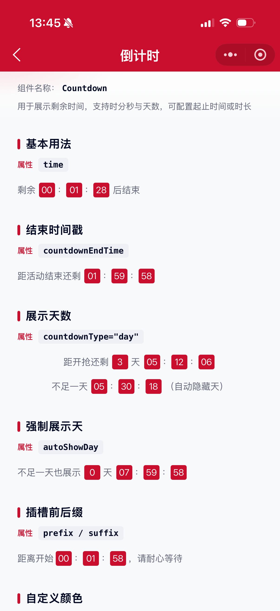

# Countdown 倒计时组件

用于展示剩余时间，支持按时长或起止时间戳倒计时，可展示天数，并支持前后缀与颜色自定义。

## 示例图



## 扫码查看


## 基础用法
页面 `.json` 文件 `usingComponents` 中引入组件
```json
// json
{
    "usingComponents": {
        "mx-countdown": "/components/mxwui/countdown/index"
    }
}
```

页面 `.wxml` 文件中使用组件
```html
<mx-countdown time="{{90}}" prefix="剩余" suffix="后结束" />
```

## 更多用法示例
### # 倒计时时长 time
属性：`time`，单位秒，默认 `0`。未传 `countdownEndTime` 时，以「当前时间 + time」作为结束时间。
```html
<mx-countdown time="{{90}}" prefix="剩余" suffix="后结束" />
```

### # 结束时间 countdownEndTime
属性：`countdownEndTime`，结束时间戳（毫秒或 10 位秒级）。与 `time` 二选一，优先使用本属性。
```html
<mx-countdown countdownEndTime="{{endTime}}" prefix="距活动结束还剩" />
```

### # 起始时间 countdownStartTime
属性：`countdownStartTime`，起始时间戳。默认取本地当前时间。

当起始时间与本地时间相差 10 秒以内时，以本地时间为准；否则按起止时间差逐秒递减（适用于服务端对时场景）。
```html
<mx-countdown
    countdownStartTime="{{startTime}}"
    countdownEndTime="{{endTime}}"
/>
```

### # 展示天数 countdownType
属性：`countdownType`，可选空字符串、`day`，默认空。

- 默认：仅展示 `时：分：秒`（小时可超过 24）
- `day`：展示 `天 时：分：秒`（小时为当天内 0-23）
```html
<mx-countdown
    countdownType="day"
    countdownEndTime="{{endTime}}"
    prefix="距开抢还剩"
/>
```

### # 自动隐藏天 autoShowDay
属性：`autoShowDay`，默认 `true`。仅在 `countdownType="day"` 时生效；剩余不足一天时自动不展示「天」。
```html
<!-- 不足一天也强制展示天 -->
<mx-countdown
    countdownType="day"
    autoShowDay="{{false}}"
    countdownEndTime="{{endTime}}"
/>
```

### # 前后缀 prefix / suffix
属性：`prefix`、`suffix`，也可用具名插槽 `prefix`、`suffix`。传入属性时优先于插槽。
```html
<mx-countdown time="{{120}}" prefix="距离开始" suffix="，请耐心等待" />

<mx-countdown time="{{120}}">
    <text slot="prefix">距离开始</text>
    <text slot="suffix">，请耐心等待</text>
</mx-countdown>
```

### # 自定义颜色
属性：`color`（整体文字色，默认次文本色）、`numberColor`（数字色，默认白色）、`numberBg`（数字背景，默认主题色）。
```html
<mx-countdown
    time="{{3600}}"
    prefix="自定义"
    color="#040A23"
    numberBg="#098562"
    numberColor="#FFFFFF"
/>
```

## 自定义事件
事件：`countdown_change`，每秒倒计时变化时触发，返回剩余时间明细。

事件：`countdown_finish`，倒计时结束时触发。
```html
<mx-countdown
    time="{{15}}"
    bind:countdown_change="handleCountdownChange"
    bind:countdown_finish="handleCountdownFinish"
/>
```

## 参数
|参数|类型|必填|可选值|默认值|参数描述|
|----|----|----|----|----|----|
|time|Number|||`0`|倒计时时长，单位秒；未传 countdownEndTime 时生效|
|countdownEndTime|String / Number||||结束时间戳（毫秒或 10 位秒）|
|countdownStartTime|String / Number||||起始时间戳，默认当前时间|
|countdownType|String||``、`day`|``|是否按天展示|
|autoShowDay|Boolean||`true`、`false`|`true`|不足一天时是否自动隐藏「天」|
|prefix|String||||前缀文案|
|suffix|String||||后缀文案|
|color|String||颜色值|`#656979`|整体文字颜色|
|numberColor|String||颜色值|`#FFFFFF`|数字颜色|
|numberBg|String||颜色值|`#CA0E2D`|数字背景色|
|customStyle|String||||根节点自定义样式|

## 事件
|事件名称|类型|返回值|事件说明|
|----|----|----|----|
|bind:countdown_change|Change|`{ remainTime, day, hour, min, sec }`|倒计时变化，remainTime 单位毫秒|
|bind:countdown_finish|Finish||倒计时结束|

## 插槽
|名称|说明|
|----|----|
|prefix|倒计时前缀（未传 prefix 属性时生效）|
|suffix|倒计时后缀（未传 suffix 属性时生效）|

## 其他说明
- `countdownEndTime` 与 `time` 同时传入时，以 `countdownEndTime` 为准。
- 10 位秒级时间戳会自动补齐为毫秒。
- 组件销毁时会自动清除定时器。
