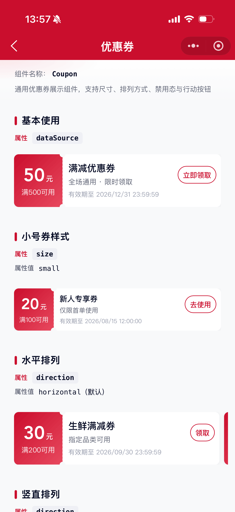
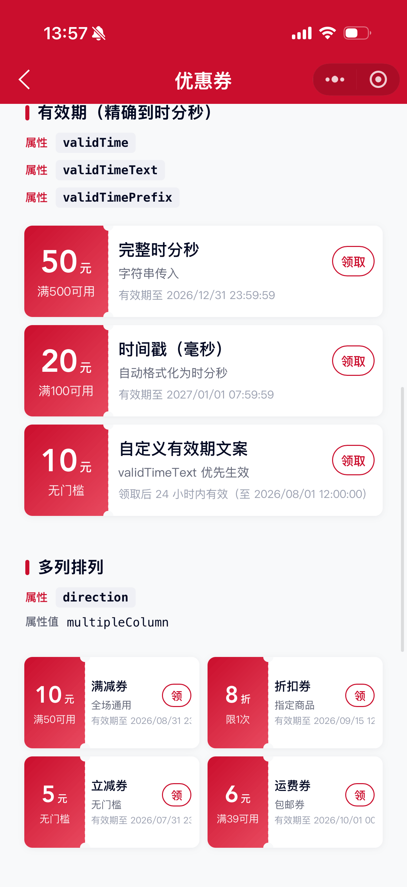

# Coupon 优惠券组件

通用优惠券展示组件。支持大/小尺寸、水平/竖直/多列排列、禁用态、行动按钮与主题色定制。

## 示例图




## 基础用法
页面 `.json` 文件 `usingComponents` 中引入组件
```json
// json
{
    "usingComponents": {
        "mx-coupon": "/components/mxwui/coupon/index"
    }
}
```

页面 `.wxml` 文件中使用组件
```html
<mx-coupon dataSource="{{list}}" />
```

```js
Page({
    data: {
        list: [
            {
                title: '满减优惠券',
                desc: '全场通用 · 限时领取',
                money: '50',
                moneyUnit: '元',
                threshold: '满500可用',
                validTime: '2026/12/31 23:59:59',
                actionAreaInfo: {
                    text: '立即领取',
                },
            },
        ],
    },
});
```

## 更多用法示例
### # 数据源 dataSource
属性：`dataSource`，优惠券数组，必填。

每项支持：`title`、`desc`、`money`、`moneyUnit`、`threshold`、`validTime`、`validTimeText`、`disabled`、`actionAreaInfo`。
```html
<mx-coupon dataSource="{{list}}" />
```

### # 券尺寸 size
属性：`size`，默认 `large`，可选 `large`、`small`。
```html
<mx-coupon size="small" dataSource="{{list}}" />
```

### # 排列方式 direction
属性：`direction`，默认 `horizontal`，可选 `horizontal`、`vertical`、`multipleColumn`。

- `horizontal`：水平滑动排列
- `vertical`：竖直堆叠排列
- `multipleColumn`：两列网格排列
```html
<mx-coupon direction="vertical" dataSource="{{list}}" />

<mx-coupon direction="multipleColumn" dataSource="{{list}}" />
```

### # 有效期 validTime
属性：`dataSource` 单项的 `validTime`，支持精确到时分秒，券面上单行完整展示（不换行、不截断）。

支持传入：

- 完整字符串：`2026/12/31 23:59:59`（也兼容 `-` 分隔）
- 仅日期：`2026/12/31`（自动补齐为 `23:59:59`）
- 时间戳：毫秒 / 秒（数字或纯数字字符串）
- 兼容别名：`expireTime`

展示格式统一为：`YYYY/MM/DD HH:mm:ss`，默认带前缀「有效期至」。
```js
{
    title: '满减优惠券',
    money: '50',
    threshold: '满500可用',
    validTime: '2026/12/31 23:59:59',
}
```
```html
<mx-coupon dataSource="{{list}}" />
```

### # 自定义有效期文案 validTimeText
属性：`dataSource` 单项的 `validTimeText`。有值时优先生效，不再走 `validTime` 格式化。
```js
{
    title: '限时券',
    money: '10',
    validTimeText: '领取后 24 小时内有效（至 2026/08/01 12:00:00）',
}
```

### # 有效期前缀 validTimePrefix
属性：`validTimePrefix`，默认 `有效期至`。传空字符串可去掉前缀。
```html
<mx-coupon validTimePrefix="截止" dataSource="{{list}}" />
```

### # 主题色 themeColor
属性：`themeColor`，默认 `#CA0E2D`，支持任何合法的颜色值。用于左侧金额区与行动按钮强调色。
```html
<mx-coupon themeColor="#1677FF" dataSource="{{list}}" />
```

### # 自定义样式 customStyle
属性：`customStyle`，作用在组件根节点。
```html
<mx-coupon customStyle="padding: 0 24rpx;" dataSource="{{list}}" />
```

### # 禁用态 disabled
在 `dataSource` 单项上设置 `disabled`。禁用后不可点击，并降低不透明度。
```js
{
    title: '已过期优惠券',
    money: '30',
    threshold: '满200可用',
    validTime: '2026/06/30 23:59:59',
    disabled: true,
    actionAreaInfo: {
        text: '已过期',
        disabled: true,
    },
}
```

### # 行动区 actionAreaInfo
`dataSource` 单项的 `actionAreaInfo`：

|参数|类型|默认值|说明|
|----|----|----|----|
|text|String||按钮文案|
|disabled|Boolean|`false`|按钮是否禁用|
|imageUrl|String||完成态图片，有值时优先展示图片|

```js
actionAreaInfo: {
    text: '立即领取',
    disabled: false,
    // imageUrl: 'https://xxx.png',
}
```

## 自定义事件
事件：`bind:coupon_tap`，点击整张券，返回 `event.detail.item`、`event.detail.index`。

事件：`bind:coupon_btn_tap`，点击行动按钮，返回 `event.detail.item`、`event.detail.index`。禁用态不触发。
```html
<mx-coupon
    dataSource="{{list}}"
    bind:coupon_tap="handleCouponTap"
    bind:coupon_btn_tap="handleBtnTap"
/>
```

```js
handleCouponTap(e) {
    const { item, index } = e.detail;
},
handleBtnTap(e) {
    const { item, index } = e.detail;
},
```

## 参数
|参数|类型|必填|可选值|默认值|参数描述|
|----|----|----|----|----|----|
|dataSource|Array|是|||优惠券数据源|
|size|String||`large`、`small`|`large`|券尺寸|
|direction|String||`horizontal`、`vertical`、`multipleColumn`|`horizontal`|多张券排列方式|
|validTimePrefix|String|||`有效期至`|有效期前缀，空字符串可去掉前缀|
|themeColor|String||颜色值|`#CA0E2D`|主题色，支持任何合法的颜色值|
|customStyle|String||||自定义样式|

### dataSource 单项
|参数|类型|必填|可选值|默认值|参数描述|
|----|----|----|----|----|----|
|title|String||||券标题|
|desc|String||||券描述|
|money|String||||金额/折扣文案|
|moneyUnit|String|||`元`|单位文案，如「元」「折」|
|threshold|String||||使用门槛文案|
|validTime|String / Number||||有效期，支持到时分秒；日期字符串 / 时间戳均可|
|expireTime|String / Number||||`validTime` 别名|
|validTimeText|String||||自定义有效期完整文案，优先于 `validTime`|
|disabled|Boolean||`true`、`false`|`false`|是否禁用整张券|
|actionAreaInfo|Object||||行动区域配置|

### actionAreaInfo
|参数|类型|必填|可选值|默认值|参数描述|
|----|----|----|----|----|----|
|text|String||||按钮文案|
|disabled|Boolean||`true`、`false`|`false`|按钮是否禁用|
|imageUrl|String||||完成态图片地址，有值时不展示按钮|

## 事件
|事件名称|类型|返回值|事件说明|
|----|----|----|----|
|bind:coupon_tap|Click|`event`|点击整张券，返回 `event.detail.item`、`event.detail.index`|
|bind:coupon_btn_tap|Click|`event`|点击行动按钮，返回 `event.detail.item`、`event.detail.index`|

## 插槽
|名称|说明|
|----|----|
|action|行动区域插槽；当单项未配置 `actionAreaInfo` 时展示|

## 其他说明
- 金额文案超过 3 个字符时，组件会自动使用较小字号，避免溢出。
- 有效期按 `YYYY/MM/DD HH:mm:ss` 单行完整展示，不换行、不截断。
- 仅传入日期（如 `2026/12/31`）时，自动补齐为当天 `23:59:59`。
