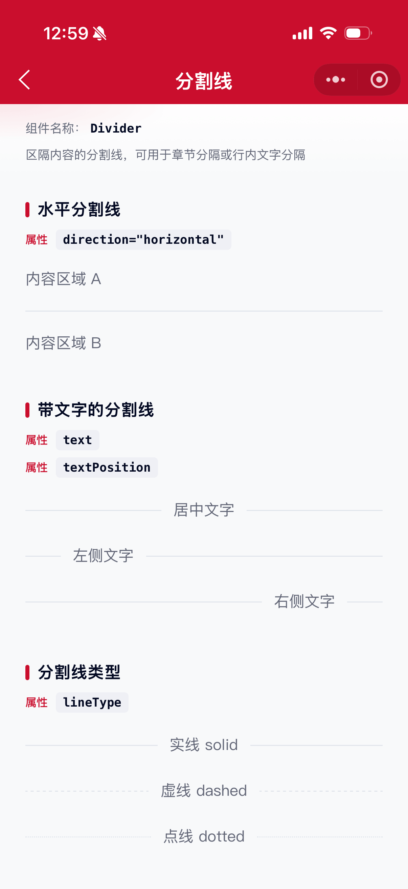
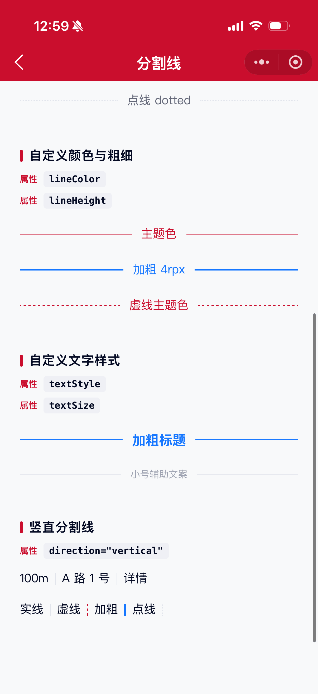

# Divider 分割线组件

区隔内容的分割线。可用于对不同章节的文本段落进行分割，也可对行内文字/链接进行分隔。

## 示例图




## 扫码查看


## 基础用法
页面 `.json` 文件 `usingComponents` 中引入组件
```json
// json
{
    "usingComponents": {
        "mx-divider": "/components/mxwui/divider/index"
    }
}
```

页面 `.wxml` 文件中使用组件
```html
<mx-divider />
```

## 更多用法示例
### # 方向 direction
属性：`direction`，可选 `horizontal`、`vertical`，默认 `horizontal`。
```html
<!-- 水平分割线 -->
<mx-divider />

<!-- 竖直分割线 -->
<view style="display:flex;align-items:center;">
    <text>100m</text>
    <mx-divider direction="vertical" />
    <text>A 路 1 号</text>
</view>
```

### # 带文字 text / textPosition
属性：`text` 为分割线文字；`textPosition` 可选 `left`、`center`、`right`，默认 `center`。仅水平方向生效。
```html
<mx-divider text="居中文字" />
<mx-divider text="左侧文字" textPosition="left" />
<mx-divider text="右侧文字" textPosition="right" />
```

### # 分割线类型 lineType
属性：`lineType`，可选 `solid`、`dashed`、`dotted`，默认 `solid`。
```html
<mx-divider text="实线" lineType="solid" />
<mx-divider text="虚线" lineType="dashed" />
<mx-divider text="点线" lineType="dotted" />
```

### # 颜色与粗细 lineColor / lineHeight / lineWidth
属性：`lineColor` 默认边框色 `#E1E5EC`；`lineHeight` 为水平分割线高度（粗细），单位 `rpx`，默认 `2`；`lineWidth` 为竖直分割线宽度（粗细），单位 `rpx`，默认 `2`。
```html
<mx-divider text="主题色" lineColor="#CA0E2D" textColor="#CA0E2D" />
<mx-divider text="加粗" lineHeight="{{4}}" lineColor="#1677FF" />
<mx-divider direction="vertical" lineWidth="{{4}}" lineColor="#1677FF" />
```

### # 文字样式 textColor / textSize / textStyle
属性：`textColor` 默认次文本色 `#656979`；`textSize` 单位 `rpx`，默认 `28`；`textStyle` 为文字节点内联样式。
```html
<mx-divider
    text="加粗标题"
    textSize="{{32}}"
    textStyle="font-weight:600;"
    lineColor="#1677FF"
    textColor="#1677FF"
/>
```

### # 自定义根样式 customStyle
属性：`customStyle`，写入根节点内联样式。
```html
<mx-divider customStyle="padding:48rpx 0;" />
```

## 参数
|参数|类型|必填|可选值|默认值|参数描述|
|----|----|----|----|----|----|
|direction|String||`horizontal`、`vertical`|`horizontal`|分割线方向|
|text|String||||分割线文字，仅水平方向生效|
|textPosition|String||`left`、`center`、`right`|`center`|文字位置，仅水平方向且有文字时生效|
|textColor|String||颜色值|`#656979`|文字颜色|
|textSize|Number||数字|`28`|文字字号，单位 rpx|
|textStyle|String||CSS 字符串|`''`|文字节点自定义样式|
|lineColor|String||颜色值|`#E1E5EC`|分割线颜色|
|lineHeight|Number||数字|`2`|水平分割线高度（粗细），单位 rpx|
|lineWidth|Number||数字|`2`|竖直分割线宽度（粗细），单位 rpx|
|lineType|String||`solid`、`dashed`、`dotted`|`solid`|分割线类型|
|customStyle|String||CSS 字符串|`''`|根节点自定义样式|

## 其他说明
- `text`、`textPosition`、`textColor`、`textSize`、`textStyle` 仅在 `direction="horizontal"` 时生效。
- `lineHeight` 仅影响水平分割线粗细；`lineWidth` 仅影响竖直分割线粗细。
- 竖直分割线默认高度为 `1em`（相对组件字号），可通过 `customStyle` 覆盖高度。
