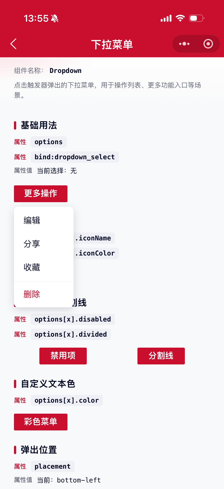

# Dropdown 下拉菜单组件

点击触发器弹出的下拉菜单，用于操作列表、更多功能入口等场景。

## 示例图



## 基础用法
页面 `.json` 文件 `usingComponents` 中引入组件
```json
// json
{
    "usingComponents": {
        "mx-dropdown": "/components/mxwui/dropdown/index"
    }
}
```

页面 `.js` 文件中定义
```js
// js
options: [
    {text: '编辑'},
    {text: '分享'},
    {text: '删除', color: '#CA0E2D', divided: true}
]
```

页面 `.wxml` 文件中使用组件
```html
<mx-dropdown options="{{options}}" bind:dropdown_select="handleSelect">
    <mx-btn>更多操作</mx-btn>
</mx-dropdown>
```

默认插槽为触发器；菜单内容可通过 `options` 或 `menu` 具名插槽传入。

## 更多用法示例
### # 数据项 options
属性：`options`，每一项菜单配置，`text` 字段必填。

参数：`color`，文案颜色，支持任何合法颜色值。

参数：`disabled`，是否禁用，默认 `false`。

参数：`divided`，是否在该项上方显示分割线，默认 `false`。

参数：`iconName`，图标名称，只支持图标库中图标。

参数：`iconColor`，图标颜色，默认跟随文案色。

参数：`iconUrl`，自定义图片地址，传入则不使用 `iconName`。

参数：`iconSize`，图标/图片大小，默认 `36`，单位 rpx。

```html
<mx-dropdown options="{{options}}" bind:dropdown_select="handleSelect">
    <mx-btn>更多操作</mx-btn>
</mx-dropdown>
```
```js
// js
options: [
    {text: '编辑', iconName: 'edit'},
    {text: '分享', iconName: 'share'},
    {text: '删除', iconName: 'delete', color: '#CA0E2D', divided: true},
    {text: '禁用项', disabled: true}
]
```

### # 位置 placement
属性：`placement`，可选 `bottom-left`、`bottom`、`bottom-right`、`top-left`、`top`、`top-right`，默认 `bottom-left`。
```html
<mx-dropdown options="{{options}}" placement="bottom-right">
    <mx-btn>右下弹出</mx-btn>
</mx-dropdown>

<mx-dropdown options="{{options}}" placement="top">
    <mx-btn>上方弹出</mx-btn>
</mx-dropdown>
```

### # 受控显示 visible
属性：`visible`，手动控制显隐。配合 `bind:dropdown_visible_change` 使用。
```html
<mx-dropdown
    options="{{options}}"
    visible="{{visible}}"
    bind:dropdown_visible_change="handleVisibleChange"
    bind:dropdown_select="handleSelect"
>
    <text>外部控制</text>
</mx-dropdown>
```

```js
Page({
    data: {
        visible: false,
    },
    handleVisibleChange(e) {
        this.setData({
            visible: e.detail.visible,
        });
    },
});
```

### # 默认显示 defaultVisible
属性：`defaultVisible`，非受控模式下默认是否显示，默认 `false`。
```html
<mx-dropdown options="{{options}}" defaultVisible>
    <mx-btn>默认展开</mx-btn>
</mx-dropdown>
```

### # 蒙层 showMask
属性：`showMask`，是否展示透明蒙层，为 `true` 时点击空白处可关闭，默认 `true`。
```html
<mx-dropdown options="{{options}}" showMask="{{false}}">
    <mx-btn>无蒙层</mx-btn>
</mx-dropdown>
```

### # 选中后关闭 closeOnSelect
属性：`closeOnSelect`，点击菜单项后是否自动关闭，默认 `true`。
```html
<mx-dropdown options="{{options}}" closeOnSelect="{{false}}">
    <mx-btn>保持打开</mx-btn>
</mx-dropdown>
```

### # 菜单宽度 menuWidth
属性：`menuWidth`，菜单最小宽度。传数字时单位为 rpx，也可传带单位字符串。
```html
<mx-dropdown options="{{options}}" menuWidth="{{280}}">
    <mx-btn>固定宽度</mx-btn>
</mx-dropdown>
```

### # 自动调整位置 autoAdjustOverflow
属性：`autoAdjustOverflow`，菜单被遮挡时是否自动调整位置，默认 `true`。
```html
<mx-dropdown options="{{options}}" placement="bottom" autoAdjustOverflow>
    <mx-btn>靠近边缘</mx-btn>
</mx-dropdown>
```

### # 关闭时销毁 destroyOnClose
属性：`destroyOnClose`，不可见时是否卸载菜单内容，默认 `false`。
```html
<mx-dropdown options="{{options}}" destroyOnClose>
    <mx-btn>关闭即销毁</mx-btn>
</mx-dropdown>
```

### # 自定义菜单插槽
不传 `options` 或 `options` 为空时，可通过 `slot="menu"` 自定义菜单内容。
```html
<mx-dropdown placement="bottom-left">
    <mx-btn>自定义菜单</mx-btn>
    <view slot="menu">
        <view>自定义内容</view>
    </view>
</mx-dropdown>
```

## 自定义事件
事件：`bind:dropdown_select`，点击菜单项时触发，返回 `item`、`index`。

事件：`bind:dropdown_visible_change`，显隐变化时触发，返回 `visible`、`type`（`trigger` / `mask` / `select`）。

```html
<mx-dropdown
    options="{{options}}"
    visible="{{visible}}"
    bind:dropdown_select="handleSelect"
    bind:dropdown_visible_change="handleVisibleChange"
>
    <mx-btn>更多操作</mx-btn>
</mx-dropdown>
```

## 参数
|参数|类型|必填|可选值|默认值|参数描述|
|----|----|----|----|----|----|
|options|Array||||菜单项配置，详见上文|
|placement|String||`bottom-left`、`bottom`、`bottom-right`、`top-left`、`top`、`top-right`|`bottom-left`|菜单弹出位置|
|visible|Boolean||||是否显示（受控）|
|defaultVisible|Boolean||`true`、`false`|`false`|默认是否显示（非受控）|
|showMask|Boolean||`true`、`false`|`true`|是否展示透明蒙层|
|closeOnSelect|Boolean||`true`、`false`|`true`|选中后是否自动关闭|
|autoAdjustOverflow|Boolean||`true`、`false`|`true`|被遮挡时是否自动调整位置|
|destroyOnClose|Boolean||`true`、`false`|`false`|关闭时是否销毁内容|
|menuWidth|Number / String||||菜单最小宽度，数字单位为 rpx|
|menuStyle|String||||菜单区域自定义样式|
|zIndex|Number||数字|`999`|层级|

## 事件
|事件名称|类型|返回值|事件说明|
|----|----|----|----|
|bind:dropdown_select|Click|`{item, index}`|点击菜单项时触发（禁用项不触发）|
|bind:dropdown_visible_change|Change|`{visible, type}`|显隐变化时触发，`type` 为 `trigger`、`mask` 或 `select`|

## 其他说明
- 默认插槽为触发器内容，点击触发器切换显隐。
- 同时传入 `visible` 时为受控模式，需在 `dropdown_visible_change` 中同步更新 `visible`。
- `options` 与 `slot="menu"` 二选一，优先使用非空 `options`。
- 开启 `autoAdjustOverflow` 时：空间不足会先翻转上下/左右方向，仍超出边界时会自动贴边位移。
