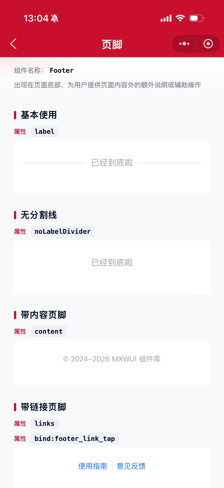
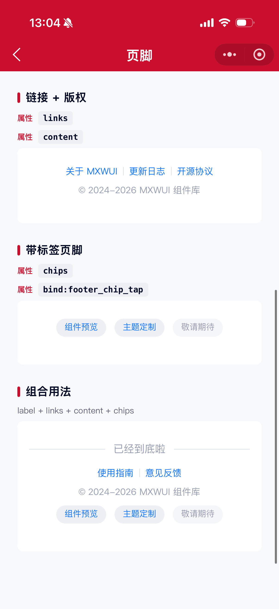

# Footer 页脚组件

出现在页面底部，为用户提供页面内容外的额外说明或辅助操作。支持顶部文案（可带分割线）、链接、版权内容、底部标签。

## 示例图




## 基础用法
页面 `.json` 文件 `usingComponents` 中引入组件
```json
// json
{
    "usingComponents": {
        "mx-footer": "/components/mxwui/footer/index"
    }
}
```

页面 `.wxml` 文件中使用组件
```html
<mx-footer label="已经到底啦" />
```

## 更多用法示例
### # 顶部文案 label
属性：`label`，展示在页脚顶部的文案，默认带左右分割线。
```html
<mx-footer label="已经到底啦" />
```

### # 无分割线 noLabelDivider
属性：`noLabelDivider`，默认 `false`。为 `true` 时仅展示文案，不带分割线。
```html
<mx-footer label="已经到底啦" noLabelDivider />
```

### # 内容 content
属性：`content`，普通内容区域，常用于版权信息。
```html
<mx-footer content="© 2024-2026 MXWUI 组件库" />
```

### # 链接 links
属性：`links`，链接数组。每项支持 `key`、`text`、`disabled`。

事件：`bind:footer_link_tap`，点击链接回调，`e.detail` 含 `item`、`index`。
```html
<mx-footer links="{{links}}" bind:footer_link_tap="handleLinkTap" />
```

```js
Page({
    data: {
        links: [
            { key: 'docs', text: '使用指南' },
            { key: 'feedback', text: '意见反馈' },
        ],
    },
    handleLinkTap(e) {
        const { item, index } = e.detail;
        console.log(item, index);
    },
});
```

### # 底部标签 chips
属性：`chips`，底部标签数组。每项支持 `key`、`text`、`disabled`。

事件：`bind:footer_chip_tap`，点击标签回调，`e.detail` 含 `item`、`index`。`disabled` 项不可点击。
```html
<mx-footer chips="{{chips}}" bind:footer_chip_tap="handleChipTap" />
```

```js
Page({
    data: {
        chips: [
            { key: 'components', text: '组件预览' },
            { key: 'theme', text: '主题定制' },
            { key: 'soon', text: '敬请期待', disabled: true },
        ],
    },
    handleChipTap(e) {
        const { item, index } = e.detail;
        console.log(item, index);
    },
});
```

### # 组合用法
```html
<mx-footer
    label="已经到底啦"
    links="{{links}}"
    content="© 2024-2026 MXWUI 组件库"
    chips="{{chips}}"
    bind:footer_link_tap="handleLinkTap"
    bind:footer_chip_tap="handleChipTap"
/>
```

### # 自定义根样式 customStyle
属性：`customStyle`，写入根节点内联样式。
```html
<mx-footer label="已经到底啦" customStyle="padding-top:48rpx;" />
```

### # 插槽
支持 `label`、`content` 具名插槽，未传对应属性时可自定义内容。
```html
<mx-footer>
    <view slot="label">自定义顶部文案</view>
    <view slot="content">自定义版权信息</view>
</mx-footer>
```

## 参数
|参数|类型|必填|可选值|默认值|参数描述|
|----|----|----|----|----|----|
|label|String||||带分割线的顶部文案|
|content|String||||普通内容（如版权信息）|
|links|Array||||链接列表，见 ActionItem|
|chips|Array||||底部标签列表，见 ActionItem|
|noLabelDivider|Boolean|||`false`|为 true 时 label 不展示分割线|
|customStyle|String||CSS 字符串|`''`|根节点自定义样式|

### ActionItem
|参数|类型|必填|可选值|默认值|参数描述|
|----|----|----|----|----|----|
|key|String||||唯一标识|
|text|String|是|||展示文案|
|disabled|Boolean|||`false`|是否禁用（禁用项不可点击）|

## 事件
|事件名称|类型|返回值|事件说明|
|----|----|----|----|
|bind:footer_link_tap|Click|`{ item, index }`|链接点击回调|
|bind:footer_chip_tap|Click|`{ item, index }`|底部标签点击回调|

## 其他说明
- `links`、`chips` 中 `disabled` 为 `true` 的项不会触发点击事件。
- 未传 `label` / `content` 时可分别使用 `label`、`content` 插槽自定义内容。
