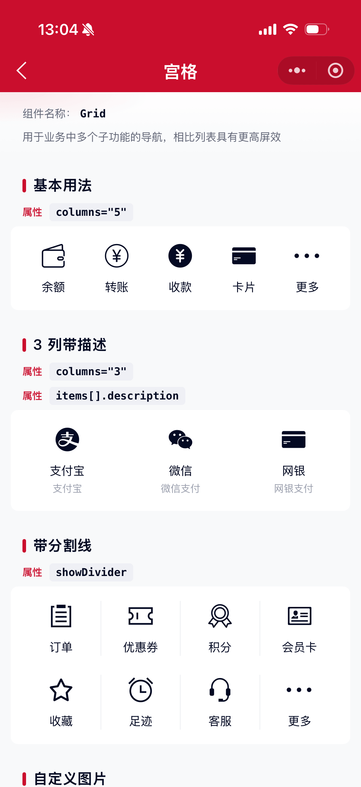
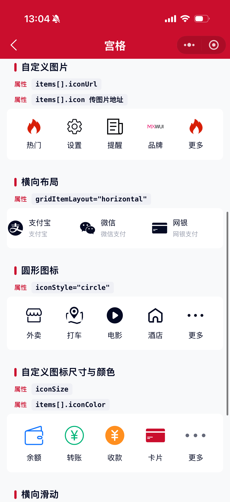

# Grid 宫格组件

用于业务中多个子功能的导航，相比于列表形式具有更高屏效。

## 示例图




## 扫码查看


## 基础用法
页面 `.json` 文件 `usingComponents` 中引入组件
```json
// json
{
    "usingComponents": {
        "mx-grid": "/components/mxwui/grid/index"
    }
}
```

页面 `.wxml` 文件中使用组件
```html
<mx-grid items="{{items}}" columns="{{5}}" bind:grid_tap="handleTap" />
```

```js
Page({
    data: {
        items: [
            { title: '余额', icon: 'wallet' },
            { title: '转账', icon: 'money' },
            { title: '收款', icon: 'money_fill' },
            { title: '卡片', icon: 'bankcard' },
            { title: '更多', icon: 'more' },
        ],
    },
    handleTap(e) {
        const { item, index } = e.detail;
        console.log(item, index);
    },
});
```

## 更多用法示例
### # 每行列数 columns
属性：`columns`，默认 `5`，仅 `mode="default"` 时生效。
```html
<mx-grid items="{{items}}" columns="{{3}}" />
<mx-grid items="{{items}}" columns="{{4}}" />
```

### # 描述文案 description
在 `items` 项中传入 `description`。
```html
<mx-grid
    items="{{[
        { title: '余额宝', icon: 'wallet', description: '收益最新提醒' },
        { title: '转账', icon: 'money', description: '最新上线' },
        { title: '网商银行', icon: 'bankcard', description: '提供服务' }
    ]}}"
    columns="{{3}}"
/>
```

### # 分割线 showDivider
属性：`showDivider`，默认 `false`。开启后在同行元素间展示竖向分割线。
```html
<mx-grid items="{{items}}" columns="{{4}}" showDivider />
```

### # 元素布局 gridItemLayout
属性：`gridItemLayout`，可选 `vertical`、`horizontal`，默认 `vertical`。
```html
<mx-grid items="{{items}}" columns="{{3}}" gridItemLayout="horizontal" />
```

### # 图标样式 iconStyle
属性：`iconStyle`，可选 `normal`、`circle`，默认 `normal`。也可在单项上覆盖。
```html
<mx-grid items="{{items}}" iconStyle="circle" />
```

### # 图标尺寸 iconSize
属性：`iconSize`，单位 `rpx`，默认 `56`。
```html
<mx-grid items="{{items}}" iconSize="{{72}}" />
```

### # 图标来源 icon / iconName / iconUrl
`items[].icon` 支持：
- 图标库名称（走 `mx-icon`）
- 图片地址（`http(s)://`、`//`、`data:image` 或常见图片后缀）

也可显式使用 `iconName` / `iconUrl`，以及 `iconColor` 控制图标色。
```html
<mx-grid
    items="{{[
        { title: '余额', icon: 'wallet', iconColor: '#1677FF' },
        { title: '图片', iconUrl: 'https://example.com/icon.png' }
    ]}}"
/>
```

### # 横向滑动 mode
属性：`mode`，可选 `default`、`scroll`，默认 `default`。`scroll` 模式下可横向滑动，并展示底部分页指示条。
```html
<mx-grid items="{{items}}" mode="scroll" />
```

### # 分页条颜色
`scroll` 模式生效：
- `paginationFillColor`：轨道色，默认 `#F5F5F5`
- `paginationFrontColor`：滑块色，默认主题色
```html
<mx-grid
    items="{{items}}"
    mode="scroll"
    paginationFillColor="#EFF0F5"
    paginationFrontColor="#1677FF"
/>
```

## 自定义事件
```html
<mx-grid items="{{items}}" bind:grid_tap="handleTap" />
```

```js
handleTap(e) {
    // e.detail = { item, index }
    const { item, index } = e.detail;
}
```

## 参数
|参数|类型|必填|可选值|默认值|参数描述|
|----|----|----|----|----|----|
|items|Array||GridItem[]|`[]`|宫格数据|
|columns|Number||数字|`5`|每行列数，default 模式生效|
|mode|String||`default`、`scroll`|`default`|布局模式|
|gridItemLayout|String||`vertical`、`horizontal`|`vertical`|item 内图标与文案布局|
|iconSize|Number||数字|`56`|图标尺寸，单位 rpx|
|iconStyle|String||`normal`、`circle`|`normal`|图标样式|
|showDivider|Boolean||`true`、`false`|`false`|是否展示分割线|
|paginationFillColor|String||颜色值|`#F5F5F5`|滑动分页条背景色|
|paginationFrontColor|String||颜色值|主题色|滑动分页条前景色|

### GridItem
|参数|类型|必填|可选值|默认值|参数描述|
|----|----|----|----|----|----|
|title|String||||标题|
|description|String||||描述|
|icon|String||||图标名或图片地址|
|iconName|String||||图标库名称（优先于非图片 icon）|
|iconUrl|String||||自定义图片地址|
|iconColor|String||||图标颜色（iconfont 生效）|
|iconStyle|String||`normal`、`circle`||单项图标样式，优先级高于组件|

## 事件
|事件名|说明|回调参数|
|----|----|----|
|grid_tap|点击宫格项|`{ item, index }`|

## 其他说明
- 微信小程序不支持带作用域的 Slot，暂不提供 icon / title / description 自定义插槽。
- `mode="scroll"` 时 `columns` 不生效，单项固定宽度约 `130rpx`。
- `horizontal` 布局更适合列数较少（如 2~3 列）且带描述的场景。
