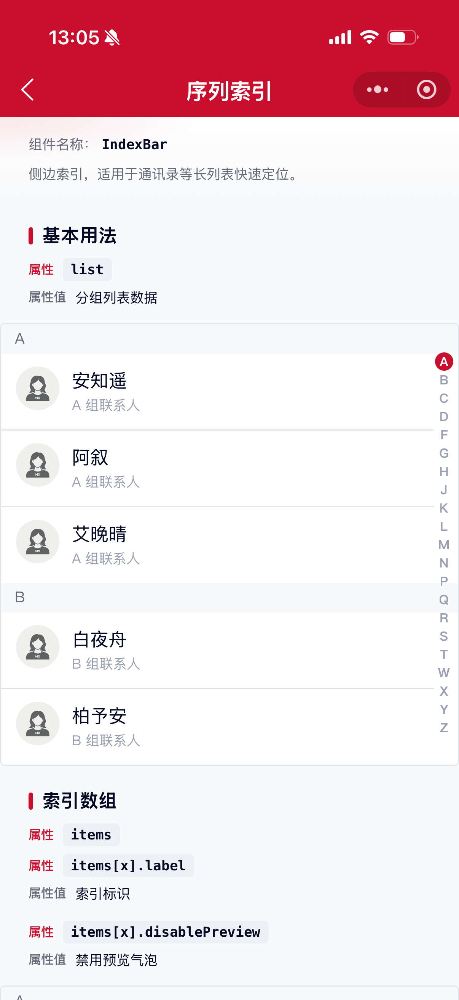
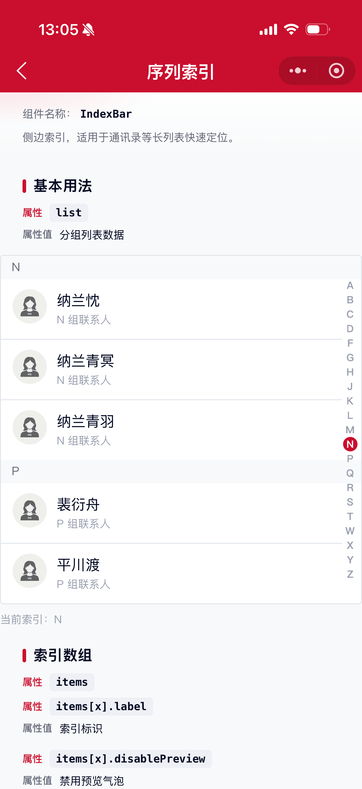
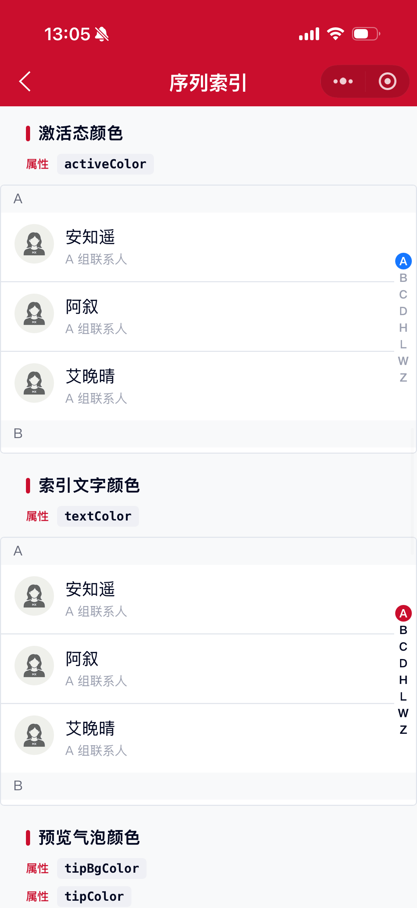

# IndexBar 序列索引组件

侧边索引，适用于通讯录等长列表快速定位。

## 示例图





## 扫码查看


## 基础用法
页面 `.json` 文件 `usingComponents` 中引入组件
```json
// json
{
    "usingComponents": {
        "mx-index-bar": "/components/mxwui/index-bar/index"
    }
}
```

页面 `.wxml` 文件中使用组件
```html
<mx-index-bar list="{{list}}" />
```

## 更多用法示例
### # 分组列表 list
属性：`list`，数组。按索引分组的数据，用于渲染列表内容。

参数：`index`，分组索引标识，需与侧边索引对应。

参数：`children`，该分组下的列表项。

参数：`children[x].name`，名称。

参数：`children[x].desc`，描述，可选。

参数：`children[x].avatar`，头像地址，可选。

```js
// js
data: {
    list: [
        {
            index: 'A',
            children: [
                {name: '安安', desc: '描述', avatar: ''},
                {name: '阿伟'},
            ]
        },
        {
            index: 'B',
            children: [
                {name: '白杨'},
            ]
        }
    ]
}
```
```html
<mx-index-bar list="{{list}}" />
```

### # 索引数组 items
属性：`items`，数组。侧边索引项，不传则从 `list` 的 `index` 自动生成。

参数：`label`，索引标识。

参数：`disablePreview`，是否禁用选中时的预览气泡，可选。

也支持直接传字符串数组，如 `['A','B','C']`。

```js
// js
data: {
    items: [
        {label: 'A'},
        {label: 'B', disablePreview: true},
        {label: '#'},
    ]
}
```
```html
<mx-index-bar list="{{list}}" items="{{items}}" />
```

仅展示侧边索引（列表内容自行实现）时，可只传 `items`，通过 `bind:change` 自行滚动定位：
```html
<mx-index-bar items="{{items}}" bind:change="handleChange">
    <!-- 自定义内容 -->
</mx-index-bar>
```

### # 默认索引 defaultCurrent
属性：`defaultCurrent`，默认选中的索引值，如 `A`。
```html
<mx-index-bar list="{{list}}" defaultCurrent="H" />
```

### # 受控索引 current
属性：`current`，受控当前索引值。传入后由外部控制高亮索引。
```html
<mx-index-bar list="{{list}}" current="{{current}}" />
```

### # 索引尺寸 size
属性：`size`，默认 `16`，数字，单位 px，控制侧边每个索引的宽高。
```html
<mx-index-bar list="{{list}}" size="18" />
```

### # 组件高度 height
属性：`height`，默认 `100%`，带单位，如 `100%`、`80vh`、`1000rpx`。
```html
<mx-index-bar list="{{list}}" height="80vh" />
```

### # 激活态颜色 activeColor
属性：`activeColor`，默认主题色 `#CA0E2D`，支持任何合法的颜色值。
```html
<mx-index-bar list="{{list}}" activeColor="#1677FF" />
```

### # 索引文字颜色 textColor
属性：`textColor`，默认 `#9AA0B1`，支持任何合法的颜色值。
```html
<mx-index-bar list="{{list}}" textColor="#656979" />
```

### # 预览气泡背景色 tipBgColor
属性：`tipBgColor`，默认 `#CCCCCC`，支持任何合法的颜色值。
```html
<mx-index-bar list="{{list}}" tipBgColor="#1677FF" />
```

### # 预览气泡文字色 tipColor
属性：`tipColor`，默认 `#FFFFFF`，支持任何合法的颜色值。
```html
<mx-index-bar list="{{list}}" tipColor="#FFFFFF" />
```

### # 分组标题背景色 headerBgColor
属性：`headerBgColor`，默认 `#F8F9FA`，支持任何合法的颜色值。
```html
<mx-index-bar list="{{list}}" headerBgColor="#EFF0F5" />
```

### # 分组标题文字色 headerColor
属性：`headerColor`，默认 `#656979`，支持任何合法的颜色值。
```html
<mx-index-bar list="{{list}}" headerColor="#040A23" />
```

### # 是否吸顶 sticky
属性：`sticky`，默认 `true`，分组标题是否吸顶。
```html
<mx-index-bar list="{{list}}" sticky />

<mx-index-bar list="{{list}}" sticky="{{false}}" />
```

### # 是否显示头像 showAvatar
属性：`showAvatar`，默认 `true`。
```html
<mx-index-bar list="{{list}}" showAvatar />

<mx-index-bar list="{{list}}" showAvatar="{{false}}" />
```

### # 头像尺寸 avatarSize
属性：`avatarSize`，默认 `72`，数字，不带单位，默认使用 rpx。
```html
<mx-index-bar list="{{list}}" avatarSize="96" />
```

## 自定义事件
事件：`bind:change`，索引改变时触发，返回 `item`、`index`、`label`。

事件：`bind:select`，点击列表项时触发，返回 `item`、`group`、`index`、`groupIndex`。

```html
<mx-index-bar
    list="{{list}}"
    bind:change="handleChange"
    bind:select="handleSelect"
/>
```

<!-- ## 参数示意图
 -->

## 参数
|参数|类型|必填|可选值|默认值|参数描述|
|----|----|----|----|----|----|
|list|Array||||分组列表数据|
|items|Array||||侧边索引数组，不传则从 list 自动生成|
|current|String||||受控当前索引|
|defaultCurrent|String||||默认索引|
|size|Number||数字|`16`|索引尺寸（宽高，单位 px）|
|height|String|||`100%`|组件高度，带单位|
|activeColor|String||颜色值|`#CA0E2D`|激活态颜色|
|textColor|String||颜色值|`#9AA0B1`|索引文字颜色|
|tipBgColor|String||颜色值|`#CCCCCC`|预览气泡背景色|
|tipColor|String||颜色值|`#FFFFFF`|预览气泡文字色|
|headerBgColor|String||颜色值|`#F8F9FA`|分组标题背景色|
|headerColor|String||颜色值|`#656979`|分组标题文字色|
|sticky|Boolean||`true`、`false`|`true`|分组标题是否吸顶|
|showAvatar|Boolean||`true`、`false`|`true`|是否显示头像|
|avatarSize|Number||数字|`72`|头像尺寸，不带单位，默认使用 rpx|

### list
|参数|类型|必填|可选值|默认值|参数描述|
|----|----|----|----|----|----|
|index|String|是|||分组索引标识|
|children|Array|是|||该分组下的列表项|

### list.children
|参数|类型|必填|可选值|默认值|参数描述|
|----|----|----|----|----|----|
|name|String|是|||名称|
|desc|String||||描述|
|avatar|String||||头像地址|

### items
|参数|类型|必填|可选值|默认值|参数描述|
|----|----|----|----|----|----|
|label|String|是|||索引标识|
|disablePreview|Boolean||`true`、`false`||是否禁用选中时的预览气泡|

## 事件
|事件名称|类型|返回值|事件说明|
|----|----|----|----|
|bind:change|Change|`{item, index, label}`|索引改变时触发|
|bind:select|Click|`{item, group, index, groupIndex}`|点击列表项时触发|

## 其他说明
- 组件需要有明确高度（父容器或 `height`），侧边索引与列表才能正常联动。
- 微信小程序不支持作用域插槽，结合列表的内容渲染请使用 `list` 数据驱动；仅侧边栏场景可用默认插槽自定义内容。
