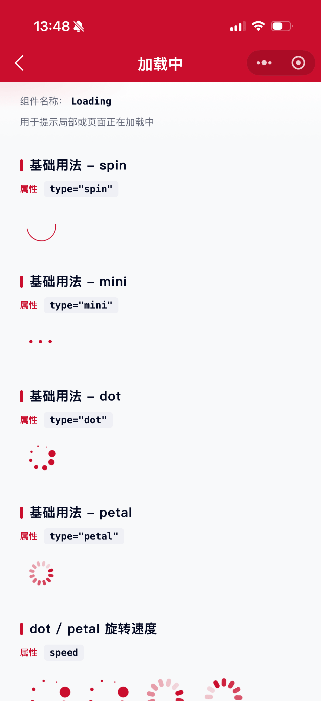
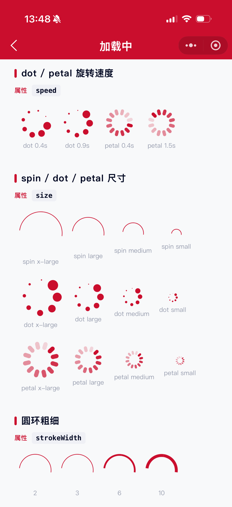

# Loading 加载中组件

用于提示局部或页面正在加载中。支持旋转圆环（spin）、点状圆环（dot）、矩形段圆环（petal）与三点跳动（mini）四种形态。

## 示例图




## 扫码查看


## 基础用法
页面 `.json` 文件 `usingComponents` 中引入组件
```json
// json
{
    "usingComponents": {
        "mx-loading": "/components/mxwui/loading/index"
    }
}
```

页面 `.wxml` 文件中使用组件
```html
<mx-loading type="spin" />
<mx-loading type="dot" />
<mx-loading type="petal" />
<mx-loading type="mini" />
```

## 更多用法示例
### # 类型 type
属性：`type`，可选 `spin`、`dot`、`petal`、`mini`，默认 `spin`。

- 旋转圆环
```html
<mx-loading type="spin" />
```

- 点状圆环（8 点大小渐变）
```html
<mx-loading type="dot" />
```

- 矩形段圆环（透明度渐变）
```html
<mx-loading type="petal" />
```

- 三点跳动
```html
<mx-loading type="mini" />
```

### # 尺寸 size
属性：`size`，仅 `type="spin"` / `type="dot"` / `type="petal"` 时生效。可选 `small`、`medium`、`large`、`x-large`，默认 `medium`。
```html
<mx-loading type="spin" size="x-large" />
<mx-loading type="dot" size="large" />
<mx-loading type="petal" size="medium" />
```

### # 圆环粗细 strokeWidth
属性：`strokeWidth`，仅 `type="spin"` 时生效，单位 `rpx`，默认 `3`。
```html
<mx-loading type="spin" size="large" strokeWidth="{{2}}" />
<mx-loading type="spin" size="large" strokeWidth="{{6}}" />
<mx-loading type="spin" size="large" strokeWidth="{{10}}" />
```

### # 旋转速度 speed
属性：`speed`，仅 `type="dot"` / `type="petal"` 时生效，表示旋转一周的耗时（秒），默认 `0.9`。数值越小旋转越快。
```html
<mx-loading type="dot" speed="{{0.4}}" />
<mx-loading type="petal" speed="{{0.9}}" />
<mx-loading type="petal" speed="{{1.5}}" />
```

### # 颜色 color
属性：`color`，默认主题色 `#CA0E2D`。
```html
<mx-loading type="mini" color="#1677FF" />
<mx-loading type="dot" color="#098562" />
<mx-loading type="petal" color="#CA0E2D" />
```

### # 自定义尺寸 customStyle
属性：`customStyle`，写入根节点内联样式，可覆盖预设尺寸。
```html
<mx-loading customStyle="width:80rpx;height:80rpx;" />
<mx-loading type="petal" customStyle="width:40rpx;height:40rpx;" />
```

## 参数
|参数|类型|必填|可选值|默认值|参数描述|
|----|----|----|----|----|----|
|type|String||`spin`、`dot`、`petal`、`mini`|`spin`|加载样式类型|
|color|String||颜色值|`#CA0E2D`|加载颜色|
|size|String||`small`、`medium`、`large`、`x-large`|`medium`|spin / dot / petal 图标尺寸|
|strokeWidth|Number||数字|`3`|spin 圆环粗细，单位 rpx|
|speed|Number||数字|`0.9`|dot / petal 旋转一周耗时，单位秒|
|customStyle|String||CSS 字符串|`''`|根节点自定义样式|

## 其他说明
- `size` 对 `spin`、`dot`、`petal` 生效；`mini` 使用固定三点尺寸。
- `strokeWidth` 仅对 `spin` 生效；`speed` 对 `dot`、`petal` 生效。
- 深色背景场景可将 `color` 设为 `#FFFFFF`。
- `customStyle` 传入的宽高会覆盖 `size` 对应的预设尺寸。
