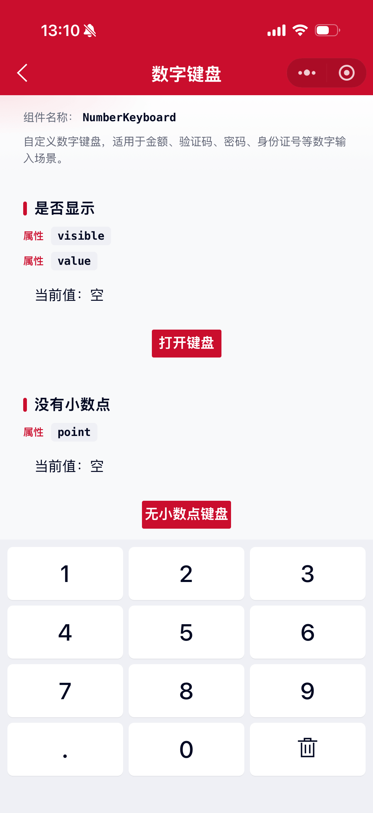
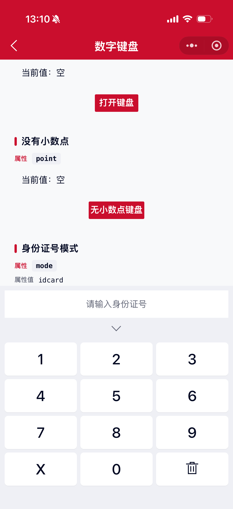
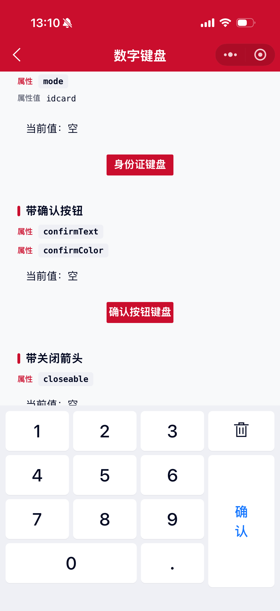
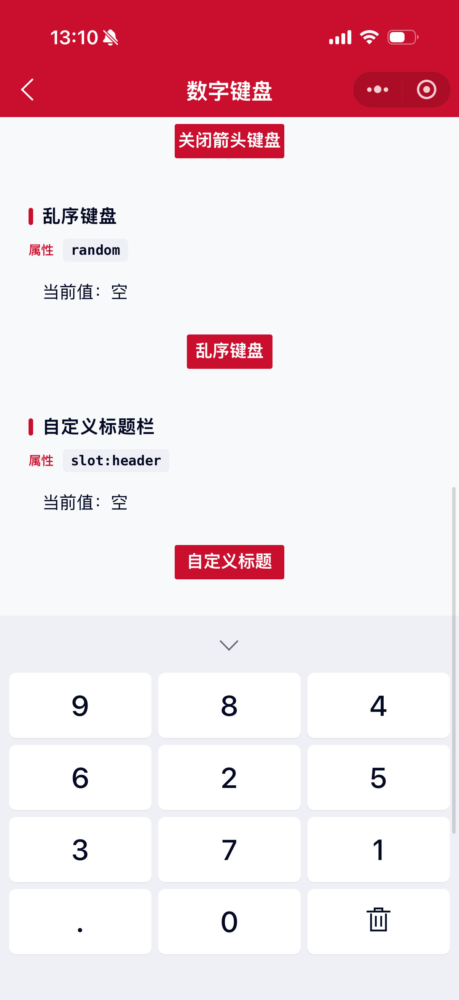

# NumberKeyboard 数字键盘组件

自定义数字键盘，适用于金额、验证码、密码、身份证号等数字输入场景。

## 示例图






## 扫码查看


## 注意事项

1. 数字键盘暂未解决键盘遮挡输入框的问题，需要开发者自行设置屏幕滚动来解决此类问题。
2. 组件为受控模式，需通过 `value` 传入当前值，并在 `bind:number_keyboard_change` 中同步更新。

## 基础用法
页面 `.json` 文件 `usingComponents` 中引入组件
```json
// json
{
    "usingComponents": {
        "mx-number-keyboard": "/components/mxwui/number-keyboard/index"
    }
}
```

页面 `.js` 文件中定义
```js
// js
data: {
    visible: false,
    value: ''
},
onChange(e) {
    this.setData({
        value: e.detail.value
    });
},
onClose() {
    this.setData({
        visible: false
    });
}
```

页面 `.wxml` 文件中使用组件
```html
<mx-number-keyboard
    visible="{{visible}}"
    value="{{value}}"
    bind:number_keyboard_change="onChange"
    bind:number_keyboard_close="onClose"
/>
```

## 更多用法示例
### # 是否显示 visible
属性：`visible`，默认 `false` 不显示。

- 显示
```html
<mx-number-keyboard visible value="{{value}}" />

<mx-number-keyboard visible="{{true}}" value="{{value}}" />
```

- 不显示
```html
<mx-number-keyboard visible="{{false}}" value="{{value}}" />

<mx-number-keyboard value="{{value}}" />
```

### # 输入值 value
属性：`value`，当前输入值，受控属性，默认空字符串。
```html
<mx-number-keyboard visible="{{visible}}" value="{{value}}" bind:number_keyboard_change="onChange" />
```

### # 功能模式 mode
属性：`mode`，可选 `number`、`idcard`，默认 `number`。

- 数字模式（默认）
```html
<mx-number-keyboard mode="number" />
```

- 身份证号模式：左下角展示 `X`，默认最多输入 18 位，`point` 无效
```html
<mx-number-keyboard mode="idcard" />
```

### # 最大长度 maxLength
属性：`maxLength`，默认 `-1` 不限制。`mode="idcard"` 且未设置时默认 `18`。
```html
<mx-number-keyboard maxLength="{{6}}" />
<mx-number-keyboard mode="idcard" maxLength="{{18}}" />
```

### # 是否展示小数点 point
属性：`point`，默认 `true` 展示小数点。`mode="idcard"` 时无效。

- 展示
```html
<mx-number-keyboard point />

<mx-number-keyboard point="{{true}}" />
```

- 不展示
```html
<mx-number-keyboard point="{{false}}" />
```

### # 确认按钮文案 confirmText
属性：`confirmText`，传入后右侧展示删除键与确认按钮。
```html
<mx-number-keyboard confirmText="确认" />
```

### # 确认按钮文本色 confirmColor
属性：`confirmColor`，确认按钮文案颜色，默认主题色 `#CA0E2D`，支持任何合法的颜色值。
```html
<mx-number-keyboard confirmText="确认" confirmColor="#1677FF" />
```

### # 是否显示关闭箭头 closeable
属性：`closeable`，默认 `false` 不显示关闭箭头。

- 显示
```html
<mx-number-keyboard closeable />

<mx-number-keyboard closeable="{{true}}" />
```

- 不显示
```html
<mx-number-keyboard closeable="{{false}}" />
```

### # 乱序键盘 random
属性：`random`，默认 `false`。为 `true` 时，每次打开键盘数字键随机排列。
```html
<mx-number-keyboard random />

<mx-number-keyboard random="{{true}}" />
```

### # 按键震动 vibrate
属性：`vibrate`，默认 `false`。为 `true` 时按键触发短震动反馈。
```html
<mx-number-keyboard vibrate />

<mx-number-keyboard vibrate="{{true}}" />
```

### # 底部安全区 safeArea
属性：`safeArea`，默认 `true`。开启后适配 iPhone 底部安全区。
```html
<mx-number-keyboard safeArea="{{false}}" />
```

### # 禁用确认按钮 confirmDisabled
属性：`confirmDisabled`，默认 `false`。仅在设置了 `confirmText` 时生效。
```html
<mx-number-keyboard confirmText="提交" confirmDisabled="{{true}}" />
```

### # 自定义标题栏 slot:header
插槽：`header`，用于覆盖键盘顶部标题区域。
```html
<mx-number-keyboard visible="{{visible}}" value="{{value}}">
    <view slot="header">请输入金额</view>
</mx-number-keyboard>
```

### # 自定义确认按钮 slot:confirm
插槽：`confirm`，用于覆盖确认按钮内容，需同时设置 `confirmText` 才会展示确认区域。
```html
<mx-number-keyboard visible="{{visible}}" value="{{value}}" confirmText="确认">
    <view slot="confirm">完成</view>
</mx-number-keyboard>
```

### # 层级 zIndex
属性：`zIndex`，默认 `1000`，数字。
```html
<mx-number-keyboard zIndex="{{1000}}" />
```

### # 蒙层是否可以关闭键盘 isCloseMask
属性：`isCloseMask`，默认 `true` 可关闭。

- 可关闭
```html
<mx-number-keyboard />

<mx-number-keyboard isCloseMask />

<mx-number-keyboard isCloseMask="{{true}}" />
```

- 不可关闭
```html
<mx-number-keyboard isCloseMask="{{false}}" />
```

## 自定义事件
```html
<mx-number-keyboard
    bind:number_keyboard_change="onChange"
    bind:number_keyboard_confirm="onConfirm"
    bind:number_keyboard_close="onClose"
/>
```

## 参数
|参数|类型|必填|可选值|默认值|参数描述|
|----|----|----|----|----|----|
|visible|Boolean||`true`、`false`|`false`|是否显示键盘|
|value|String||||当前输入值（受控）|
|mode|String||`number`、`idcard`|`number`|功能模式，`idcard` 为身份证号键盘|
|maxLength|Number||数字|`-1`|最大输入长度，`-1` 不限制；`idcard` 默认 `18`|
|point|Boolean||`true`、`false`|`true`|是否展示小数点（`idcard` 模式无效）|
|confirmText|String||||确认按钮文案，有值时展示确认栏|
|confirmColor|String||颜色值|`#CA0E2D`|确认按钮文本色，支持任何合法的颜色值|
|closeable|Boolean||`true`、`false`|`false`|是否显示关闭箭头|
|random|Boolean||`true`、`false`|`false`|数字键是否乱序|
|vibrate|Boolean||`true`、`false`|`false`|按键是否震动|
|safeArea|Boolean||`true`、`false`|`true`|是否开启底部安全区|
|confirmDisabled|Boolean||`true`、`false`|`false`|是否禁用确认按钮|
|zIndex|Number||数字|`1000`|层级|
|isCloseMask|Boolean||`true`、`false`|`true`|蒙层是否可以关闭键盘|
|className|String||||自定义类名|

## 事件
|事件名称|类型|返回值|事件说明|
|----|----|----|----|
|bind:number_keyboard_change|Change|`event.detail.value`|输入值变化回调|
|bind:number_keyboard_confirm|Click|`event.detail.value`|点击确认回调，随后会触发关闭|
|bind:number_keyboard_close|Click|`event.detail.type`|键盘关闭回调，`type` 为 `close` / `maskClose` / `confirm`|

## 其他说明
无
