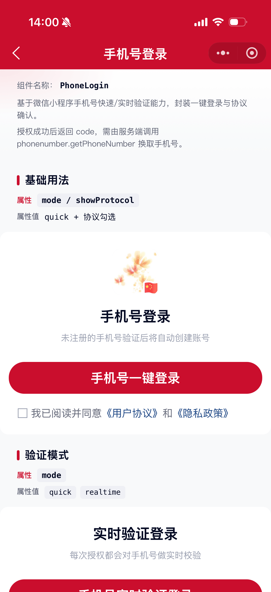

# PhoneLogin 手机号登录组件

基于微信小程序「手机号快速验证 / 实时验证」能力，封装一键登录按钮与协议确认。组件本身不解密手机号，授权成功后返回动态令牌 `code`，需由业务服务端调用微信接口换取手机号。

## 示例图



## 扫码查看


## 基础用法
页面 `.json` 文件 `usingComponents` 中引入组件
```json
// json
{
    "usingComponents": {
        "mx-phone-login": "/components/mxwui/phone-login/index"
    }
}
```

页面 `.wxml` 文件中使用组件
```html
<mx-phone-login
    bind:phone_login_success="handleSuccess"
    bind:phone_login_fail="handleFail"
    bind:protocol_change="handleProtocolChange"
    bind:protocol_click="handleProtocolClick"
/>
```

```js
handleSuccess(e) {
    // e.detail.code 传给服务端，调用 phonenumber.getPhoneNumber 换取手机号
    // 注意：该 code 与 wx.login 的 code 不同，不可混用
    console.log(e.detail);
},
handleFail(e) {
    // e.detail.type: deny / quota / fail
    console.log(e.detail);
},
```

## 更多用法示例
### # 验证模式 mode
属性：`mode`，可选 `quick`（快速验证）、`realtime`（实时验证），默认 `quick`。

- 快速验证
```html
<mx-phone-login mode="quick" />
```

- 实时验证
```html
<mx-phone-login mode="realtime" />
```

### # Logo / 标题 / 描述
属性：`logo`、`logoSize`、`title`、`desc`。

```html
<mx-phone-login
    logo="https://cdn.mingsixue.com/xcx/MXWUI/mxwui.png"
    logoSize="128"
    title="手机号登录"
    desc="未注册的手机号验证后将自动创建账号"
/>
```

### # 按钮文案与样式
属性：`btnText`、`btnType`、`themeColor`、`btnWidth`、`round`。

```html
<mx-phone-login
    btnText="微信手机号快捷登录"
    btnType="primary"
    themeColor="#07c160"
    btnWidth="702rpx"
    round
/>
```

### # 协议协议区
属性：`showProtocol`、`protocolContent`、`protocolChecked`、`requireProtocol`、`protocolTip`。

- 默认展示协议，且必须勾选后才能发起授权（`requireProtocol` 默认 `true`）
- 未勾选时点击登录按钮会 toast 提示，并触发 `phone_login_blocked`

```js
data: {
    protocolContent: [
        {text: '我已阅读并同意', color: '#656979'},
        {text: '《用户协议》', color: '#1F4886', type: 'user'},
        {text: '和', color: '#656979'},
        {text: '《隐私政策》', color: '#1F4886', type: 'privacy'},
    ],
    protocolChecked: false,
}
```

```html
<mx-phone-login
    protocolContent="{{protocolContent}}"
    protocolChecked="{{protocolChecked}}"
    requireProtocol
    protocolTip="请先阅读并同意相关协议"
    bind:protocol_change="handleProtocolChange"
    bind:protocol_click="handleProtocolClick"
/>
```

- 不展示协议
```html
<mx-phone-login showProtocol="{{false}}" />
```

- 展示协议但不强制勾选
```html
<mx-phone-login requireProtocol="{{false}}" />
```

### # 授权成功后附带 wx.login
属性：`autoWxLogin`，默认 `false`。开启后成功回调额外返回 `loginCode`。

```html
<mx-phone-login autoWxLogin />
```

### # 额度用尽提示 phoneNumberNoQuotaToast
属性：`phoneNumberNoQuotaToast`，默认 `true`。额度不足时是否展示平台默认提示；关闭后由业务根据 `errno === 1400001` 自行处理。

```html
<mx-phone-login phoneNumberNoQuotaToast="{{false}}" />
```

### # 禁用 disabled
属性：`disabled`，默认 `false`。

```html
<mx-phone-login disabled />
```

## 自定义事件
事件：`bind:phone_login_success`，授权成功。返回字段含 `code`、`mode`，可选 `loginCode`、`encryptedData`、`iv`、`cloudID`。

事件：`bind:phone_login_fail`，授权失败。返回字段含 `type`（`deny` / `quota` / `fail`）、`mode`，以及微信回调原始字段。

事件：`bind:phone_login_blocked`，因未勾选协议被拦截。返回 `{ reason: 'protocol', tip }`。

事件：`bind:protocol_change`，协议勾选变更。返回 `{ checked }`。

事件：`bind:protocol_click`，协议文本段点击。返回 `{ item }`。

```html
<mx-phone-login
    bind:phone_login_success="handleSuccess"
    bind:phone_login_fail="handleFail"
    bind:phone_login_blocked="handleBlocked"
    bind:protocol_change="handleProtocolChange"
    bind:protocol_click="handleProtocolClick"
/>
```

## 参数
|参数|类型|必填|可选值|默认值|参数描述|
|----|----|----|----|----|----|
|mode|String||`quick`、`realtime`|`quick`|验证模式|
|logo|String|||||Logo 图片地址|
|logoSize|Number||数字|`128`|Logo 尺寸，单位 rpx|
|title|String|||`手机号登录`|标题|
|desc|String|||`未注册的手机号验证后将自动创建账号`|描述|
|btnText|String|||`手机号一键登录`|按钮文案|
|btnType|String||`primary`、`default`、`ghost`|`primary`|按钮类型|
|themeColor|String||十六进制色值|`#CA0E2D`|按钮主题色|
|btnWidth|String|||`702rpx`|按钮宽度|
|round|Boolean||`true`、`false`|`true`|是否圆角按钮|
|disabled|Boolean||`true`、`false`|`false`|是否禁用|
|showProtocol|Boolean||`true`、`false`|`true`|是否展示协议|
|protocolContent|Array||||协议文案数组，结构同 `mx-protocol`|
|protocolChecked|Boolean||`true`、`false`|`false`|协议是否选中|
|requireProtocol|Boolean||`true`、`false`|`true`|是否必须勾选协议后才能授权|
|protocolTip|String|||`请先阅读并同意相关协议`|未勾选协议时的提示|
|phoneNumberNoQuotaToast|Boolean||`true`、`false`|`true`|额度用尽时是否展示平台默认提示|
|autoWxLogin|Boolean||`true`、`false`|`false`|成功后是否自动 `wx.login` 并返回 `loginCode`|
|checkboxColor|String||颜色值|`#9AA0B1`|协议复选框未选中色|
|checkboxSelectColor|String||颜色值|`#CA0E2D`|协议复选框选中色|
|checkboxSize|Number||数字|`32`|协议复选框大小，单位 rpx|

## 事件
|事件名称|类型|返回值|事件说明|
|----|----|----|----|
|bind:phone_login_success|Callback|`e.detail`|授权成功，含 `code`（及可选 `loginCode`）|
|bind:phone_login_fail|Callback|`e.detail`|授权失败 / 用户拒绝 / 额度不足|
|bind:phone_login_blocked|Callback|`e.detail`|未勾选协议被拦截|
|bind:protocol_change|Callback|`{ checked }`|协议勾选变更|
|bind:protocol_click|Callback|`{ item }`|协议文本段点击|

## 接入说明
1. 仅企业主体等符合条件的小程序可使用手机号验证能力，且需在公众平台购买资源包。
2. 前端拿到 `code` 后，应由**服务端**调用 [phonenumber.getPhoneNumber](https://developers.weixin.qq.com/miniprogram/dev/OpenApiDoc/user-info/phone-number/getPhoneNumber.html) 换取手机号；`code` 5 分钟有效且仅可消费一次。
3. `getPhoneNumber` 返回的 `code` 与 `wx.login` 返回的 `code` 用途不同，不可混用。若同时需要登录态，可开启 `autoWxLogin`。
4. 建议在成功回调后隐藏或禁用登录按钮，避免用户重复授权产生额外费用。

## 其他说明
组件内部复用 `mx-btn`、`mx-protocol`。
