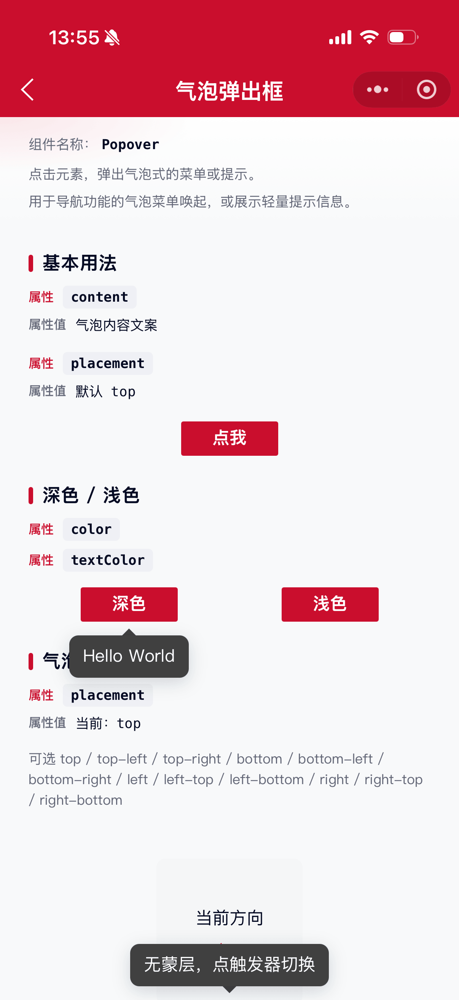
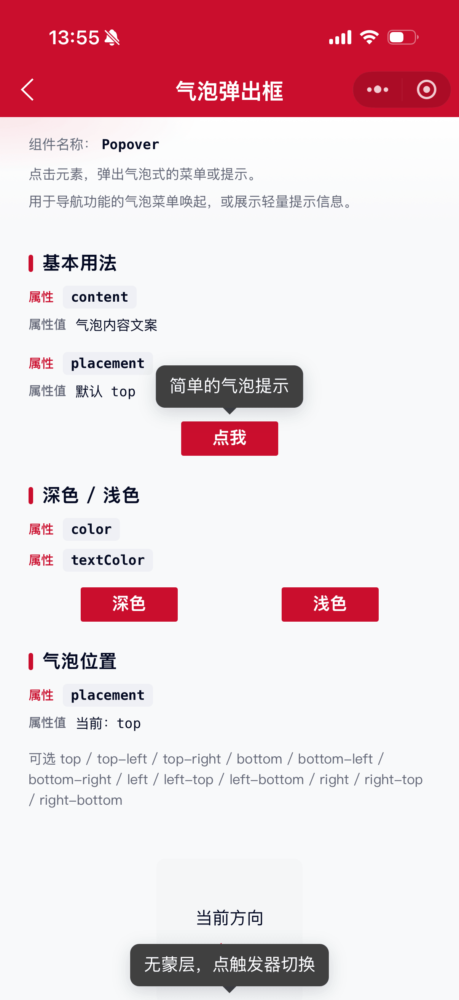
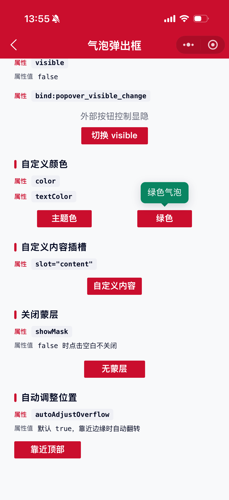

# Popover 气泡弹出框

点击元素，弹出气泡式的菜单或提示。用于导航功能的气泡菜单唤起，或展示轻量提示信息。

## 示例图





## 扫码查看


## 基础用法
页面 `.json` 文件 `usingComponents` 中引入组件
```json
// json
{
    "usingComponents": {
        "mx-popover": "/components/mxwui/popover/index"
    }
}
```

页面 `.wxml` 文件中使用组件
```html
<mx-popover content="简单的气泡提示" placement="top">
    <mx-btn>点我</mx-btn>
</mx-popover>
```

默认插槽为触发器；气泡内容可通过 `content` 属性或 `content` 具名插槽传入。

## 更多用法示例
### # 内容 content
属性：`content`，气泡文案。不传时可使用 `slot="content"` 自定义内容。
```html
<mx-popover content="Hello World">
    <mx-btn>点我</mx-btn>
</mx-popover>
```

### # 位置 placement
属性：`placement`，可选 `top`、`top-left`、`top-right`、`bottom`、`bottom-left`、`bottom-right`、`left`、`left-top`、`left-bottom`、`right`、`right-top`、`right-bottom`，默认 `top`。
```html
<mx-popover content="上方提示" placement="top">
    <mx-btn>top</mx-btn>
</mx-popover>

<mx-popover content="右上方提示" placement="top-right">
    <mx-btn>top-right</mx-btn>
</mx-popover>

<mx-popover content="左侧提示" placement="left">
    <mx-btn>left</mx-btn>
</mx-popover>
```

### # 受控显示 visible
属性：`visible`，手动控制显隐。配合 `bind:popover_visible_change` 使用。
```html
<mx-popover
    content="受控气泡"
    visible="{{visible}}"
    bind:popover_visible_change="handleVisibleChange"
>
    <text>外部控制</text>
</mx-popover>
```

```js
Page({
    data: {
        visible: false,
    },
    handleVisibleChange(e) {
        this.setData({
            visible: e.detail.visible,
        });
    },
});
```

### # 默认显示 defaultVisible
属性：`defaultVisible`，非受控模式下默认是否显示，默认 `false`。
```html
<mx-popover content="默认展开" defaultVisible>
    <mx-btn>点我</mx-btn>
</mx-popover>
```

### # 蒙层 showMask
属性：`showMask`，是否展示透明蒙层，为 `true` 时点击空白处可关闭，默认 `true`。
```html
<mx-popover content="无蒙层" showMask="{{false}}">
    <mx-btn>点我</mx-btn>
</mx-popover>
```

### # 背景色 color / 文字色 textColor
属性：`color`，气泡背景色，默认 `#404040`。

属性：`textColor`，气泡文字色，默认 `#FFFFFF`。
```html
<mx-popover content="浅色气泡" color="#FFFFFF" textColor="#040A23">
    <mx-btn>浅色</mx-btn>
</mx-popover>

<mx-popover content="主题色气泡" color="#CA0E2D">
    <mx-btn>主题色</mx-btn>
</mx-popover>
```

### # 自动调整位置 autoAdjustOverflow
属性：`autoAdjustOverflow`，气泡被遮挡时是否自动调整位置，默认 `true`。
```html
<mx-popover content="靠近边缘时自动翻转" placement="top" autoAdjustOverflow>
    <mx-btn>点我</mx-btn>
</mx-popover>
```

### # 关闭时销毁 destroyOnClose
属性：`destroyOnClose`，不可见时是否卸载内容，默认 `false`。
```html
<mx-popover content="关闭即销毁" destroyOnClose>
    <mx-btn>点我</mx-btn>
</mx-popover>
```

### # 自定义内容插槽
不传 `content` 时，可通过 `slot="content"` 自定义气泡内容。
```html
<mx-popover placement="bottom">
    <mx-btn>自定义内容</mx-btn>
    <view slot="content">
        <mx-icon name="remind" color="#FFFFFF" size="36" />
        <text>可放图标、按钮等</text>
    </view>
</mx-popover>
```

## 自定义事件
事件：`bind:popover_visible_change`，显隐变化时触发，返回 `visible`、`type`（`trigger` / `mask`）。

```html
<mx-popover
    content="提示"
    visible="{{visible}}"
    bind:popover_visible_change="handleVisibleChange"
>
    <mx-btn>点我</mx-btn>
</mx-popover>
```

## 参数
|参数|类型|必填|可选值|默认值|参数描述|
|----|----|----|----|----|----|
|content|String||||气泡内容文案|
|placement|String||`top`、`top-left`、`top-right`、`bottom`、`bottom-left`、`bottom-right`、`left`、`left-top`、`left-bottom`、`right`、`right-top`、`right-bottom`|`top`|气泡位置|
|visible|Boolean||||是否显示（受控）|
|defaultVisible|Boolean||`true`、`false`|`false`|默认是否显示（非受控）|
|showMask|Boolean||`true`、`false`|`true`|是否展示透明蒙层|
|color|String||颜色值|`#404040`|气泡背景色|
|textColor|String||颜色值|`#FFFFFF`|气泡文字色|
|autoAdjustOverflow|Boolean||`true`、`false`|`true`|被遮挡时是否自动调整位置|
|destroyOnClose|Boolean||`true`、`false`|`false`|关闭时是否销毁内容|
|contentStyle|String||||内容区域自定义样式|
|zIndex|Number||数字|`999`|层级|

## 事件
|事件名称|类型|返回值|事件说明|
|----|----|----|----|
|bind:popover_visible_change|Change|`{visible, type}`|显隐变化时触发，`type` 为 `trigger` 或 `mask`|

## 其他说明
- 默认插槽为触发器内容，点击触发器切换显隐。
- 同时传入 `visible` 时为受控模式，需在 `popover_visible_change` 中同步更新 `visible`。
- `content` 与 `slot="content"` 二选一，优先使用 `content`。
- 开启 `autoAdjustOverflow` 时：空间不足会先翻转方向，仍超出左右/上下边界时会自动贴边位移，并校正箭头指向触发器。
