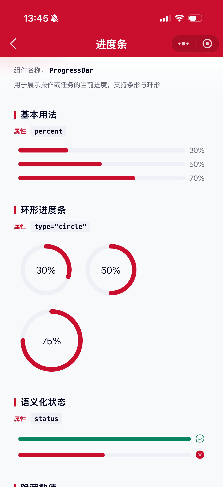
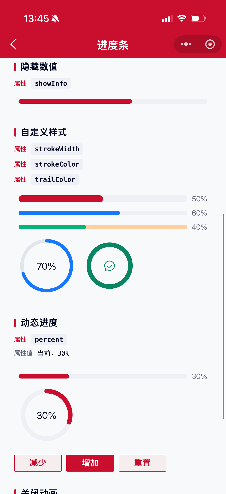

# ProgressBar 进度条组件

用于展示用户操作、任务的进度。支持条形与环形两种形态。

## 示例图




## 扫码查看


## 基础用法
页面 `.json` 文件 `usingComponents` 中引入组件
```json
// json
{
    "usingComponents": {
        "mx-progress-bar": "/components/mxwui/progress-bar/index"
    }
}
```

页面 `.wxml` 文件中使用组件
```html
<mx-progress-bar percent="{{50}}" />
<mx-progress-bar type="circle" percent="{{50}}" />
```

## 更多用法示例
### # 当前进度 percent
属性：`percent`，默认 `0`，范围 `0-100`。超出范围会自动截断。
```html
<mx-progress-bar percent="{{30}}" />
<mx-progress-bar percent="{{70}}" />
```

### # 类型 type
属性：`type`，可选 `line`、`circle`，默认 `line`。

- 条形
```html
<mx-progress-bar type="line" percent="{{50}}" />
```

- 环形
```html
<mx-progress-bar type="circle" percent="{{50}}" />
```

### # 语义化状态 status
属性：`status`，仅限 `line` 模式语义展示，可选 `success`、`exception`。

成功态会显示成功图标并使用成功色；异常态显示关闭图标并使用异常色。
```html
<mx-progress-bar percent="{{100}}" status="success" />
<mx-progress-bar percent="{{50}}" status="exception" />
```

### # 进度条颜色 strokeColor
属性：`strokeColor`，进度条填充色。默认主题色 `#CA0E2D`；`success` 默认 `#098562`，`exception` 默认 `#CA0E2D`。传入后优先生效。
```html
<mx-progress-bar percent="{{60}}" strokeColor="#1677FF" />
```

### # 轨道颜色 trailColor
属性：`trailColor`，未完成轨道色，默认 `#EFF0F5`。
```html
<mx-progress-bar percent="{{40}}" trailColor="#FFCF9F" strokeColor="#00B578" />
```

### # 进度条宽度 strokeWidth
属性：`strokeWidth`，单位 `px`，默认 `8`。条形模式下控制高度，环形模式下控制描边宽度。
```html
<mx-progress-bar percent="{{50}}" strokeWidth="{{12}}" />
<mx-progress-bar type="circle" percent="{{50}}" strokeWidth="{{6}}" />
```

### # 环形画布宽度 width
属性：`width`，仅 `type="circle"` 时生效，单位 `px`，默认 `100`。
```html
<mx-progress-bar type="circle" percent="{{75}}" width="{{120}}" />
```

### # 是否显示信息 showInfo
属性：`showInfo`，默认 `true`。为 `false` 时不展示百分比或状态图标。
```html
<mx-progress-bar percent="{{60}}" showInfo="{{false}}" />
```

### # 过渡动画 animation
属性：`animation`，默认 `true`。关闭后进度变化无过渡效果。
```html
<mx-progress-bar percent="{{80}}" animation="{{false}}" />
```

### # 环形推进速度 speed
属性：`speed`，仅环形有效，每次绘制推进的角度（deg），默认 `6`。
```html
<mx-progress-bar type="circle" percent="{{80}}" speed="{{10}}" />
```

## 参数
|参数|类型|必填|可选值|默认值|参数描述|
|----|----|----|----|----|----|
|percent|Number||`0-100`|`0`|当前进度百分比|
|type|String||`line`、`circle`|`line`|进度条类型|
|status|String||`success`、`exception`|`''`|语义化状态（主要用于 line）|
|strokeColor|String||颜色值|`''`|进度条颜色，空则按状态/主题色|
|trailColor|String||颜色值|`#EFF0F5`|轨道颜色|
|strokeWidth|Number||数字|`8`|进度条宽度，单位 px|
|width|Number||数字|`100`|环形画布宽度，单位 px|
|showInfo|Boolean||`true`、`false`|`true`|是否显示百分比或状态图标|
|animation|Boolean||`true`、`false`|`true`|是否开启过渡动画|
|speed|Number||数字|`6`|环形每次推进角度|

## 其他说明
- `percent` 支持数字或数字字符串，非法值按 `0` 处理。
- 环形进度条基于 `canvas` 绘制，同页多个实例互不影响。
- `status` 与 `strokeColor` 同时传入时，以 `strokeColor` 为准。
