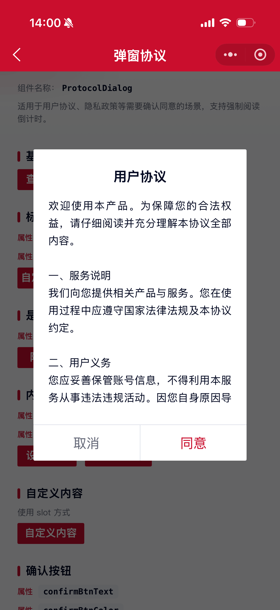
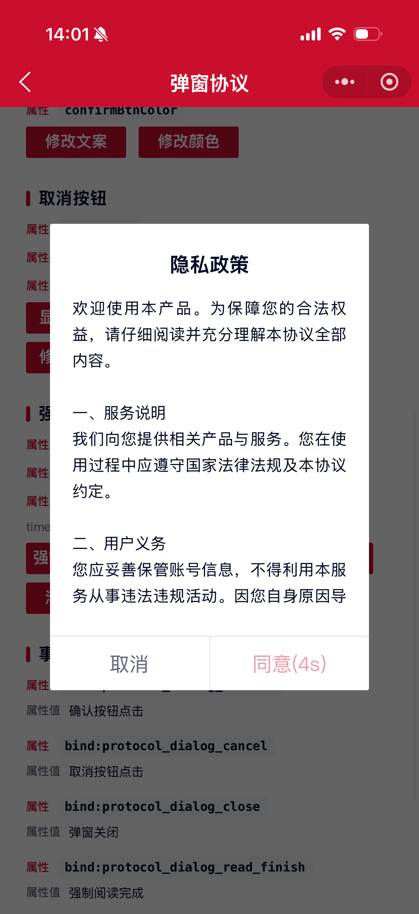
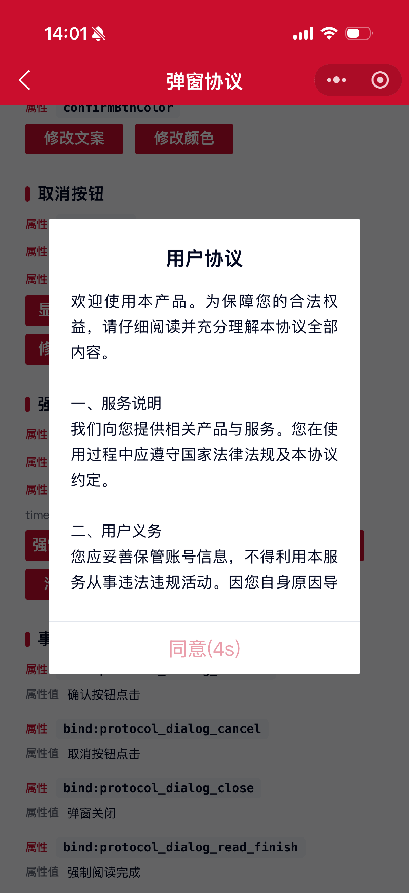

# ProtocolDialog 弹窗协议组件

适用于用户协议、隐私政策等需要确认同意的场景，支持标题显隐、取消/确认按钮以及强制阅读倒计时。

## 示例图





## 扫码查看


## 基础用法
页面 `.json` 文件 `usingComponents` 中引入组件
```json
// json
{
    "usingComponents": {
        "mx-protocol-dialog": "/components/mxwui/protocol-dialog/index"
    }
}
```

页面 `.wxml` 文件中使用组件
```html
<mx-protocol-dialog
    visible="{{true}}"
    title="用户协议"
    content="协议内容"
    bind:protocol_dialog_confirm="handleConfirm"
    bind:protocol_dialog_cancel="handleCancel"
/>
```

## 更多用法示例
### # 是否显示弹窗 visible
属性：`visible`，默认 `false` 不显示弹窗，必填字段。

- 显示
```html
<mx-protocol-dialog visible />

<mx-protocol-dialog visible="{{true}}" />
```

- 不显示
```html
<mx-protocol-dialog visible="{{false}}" />

<mx-protocol-dialog />
```

### # 标题 title
属性：`title`，自定义标题，默认 `用户协议`。
```html
<mx-protocol-dialog title="服务协议" />
```

### # 是否显示标题 showTitle
属性：`showTitle`，默认 `true` 显示标题。

- 显示
```html
<mx-protocol-dialog showTitle />

<mx-protocol-dialog showTitle="{{true}}" />
```

- 不显示
```html
<mx-protocol-dialog showTitle="{{false}}" />
```

### # 标题文本色 titleColor
属性：`titleColor`，自定义标题文本色，默认 `#040A23`，支持任何合法的颜色值。
```html
<mx-protocol-dialog titleColor="#1677FF" />
```

### # 内容 content
属性：`content`，协议内容，支持长文本滚动展示。
```html
<mx-protocol-dialog content="协议内容" />
```

### # 内容文本色 contentColor
属性：`contentColor`，自定义内容文本色，默认 `#040A23`，支持任何合法的颜色值。
```html
<mx-protocol-dialog contentColor="#1677FF" />
```

### # 自定义内容及样式
通过 `<slot></slot>` 插槽方式，内容和样式完全自定义，使用这种方式就不需要传 `content` 和 `contentColor` 了。
```html
<mx-protocol-dialog title="自定义内容">
    <!-- 自定义内容 -->
</mx-protocol-dialog>
```

### # 确认按钮相关
属性：`confirmBtn`，默认 `true` 显示确认按钮。

属性：`confirmBtnText`，确认按钮文案，默认 `同意`。

属性：`confirmBtnColor`，确认按钮文本色，默认 `#CA0E2D`，支持任何合法的颜色值。

- 确认按钮文案
```html
<mx-protocol-dialog confirmBtnText="我已阅读" />
```

- 确认按钮文本色
```html
<mx-protocol-dialog confirmBtnColor="#1677FF" />
```

- 不显示确认按钮
```html
<mx-protocol-dialog confirmBtn="{{false}}" />
```

### # 取消按钮相关
属性：`cancelBtn`，默认 `true` 显示取消按钮。

属性：`cancelBtnText`，取消按钮文案，默认 `取消`。

属性：`cancelBtnColor`，取消按钮文本色，默认 `#656979`，支持任何合法的颜色值。

- 显示取消按钮
```html
<mx-protocol-dialog cancelBtn />

<mx-protocol-dialog cancelBtn="{{true}}" />
```

- 不显示取消按钮
```html
<mx-protocol-dialog cancelBtn="{{false}}" />
```

- 取消按钮文案
```html
<mx-protocol-dialog cancelBtnText="不同意" />
```

- 取消按钮文本色
```html
<mx-protocol-dialog cancelBtnColor="#1677FF" />
```

### # 强制阅读 forceRead
属性：`forceRead`，默认 `false`。开启后确认按钮需完成强制阅读才可点击。

属性：`forceReadType`，强制阅读模式，可选 `time`、`scroll`，默认 `time`。

- `time`：倒计时结束后才可点击，倒计时期间按钮文案展示为 `同意(Ns)`
- `scroll`：滑动至协议内容底部后才可点击；内容未超出可视区域时自动可用

属性：`readSeconds`，强制阅读秒数，默认 `5`，仅在 `forceReadType="time"` 时生效。

- 倒计时模式
```html
<mx-protocol-dialog
    forceRead
    forceReadType="time"
    readSeconds="{{5}}"
    bind:protocol_dialog_read_finish="handleReadFinish"
/>
```

- 滑动阅读模式
```html
<mx-protocol-dialog
    forceRead
    forceReadType="scroll"
    bind:protocol_dialog_confirm="handleConfirm"
    bind:protocol_dialog_read_finish="handleReadFinish"
/>
```

- 仅确认按钮的强制阅读（隐藏取消按钮）
```html
<mx-protocol-dialog
    forceRead
    readSeconds="{{5}}"
    cancelBtn="{{false}}"
    confirmBtnText="同意"
    bind:protocol_dialog_confirm="handleConfirm"
    bind:protocol_dialog_read_finish="handleReadFinish"
/>
```

### # 层级 zIndex
属性：`zIndex`，默认 `1`。
```html
<mx-protocol-dialog zIndex="1" />
```

### # 点击蒙层是否可以关闭弹窗 isCloseMask
属性：`isCloseMask`，默认 `false` 不可通过蒙层关闭（协议场景建议保持）。

- 可关闭
```html
<mx-protocol-dialog isCloseMask />

<mx-protocol-dialog isCloseMask="{{true}}" />
```

- 不可关闭
```html
<mx-protocol-dialog />

<mx-protocol-dialog isCloseMask="{{false}}" />
```

## 事件
```html
<mx-protocol-dialog
    bind:protocol_dialog_confirm="handleConfirm"
    bind:protocol_dialog_cancel="handleCancel"
    bind:protocol_dialog_close="handleClose"
    bind:protocol_dialog_read_finish="handleReadFinish"
/>
```

## 参数
|参数|类型|必填|可选值|默认值|参数描述|
|----|----|----|----|----|----|
|visible|Boolean|是|`true`、`false`|`false`|是否显示弹窗|
|title|String|||`用户协议`|标题|
|showTitle|Boolean||`true`、`false`|`true`|是否显示标题|
|titleColor|String||颜色值|`#040A23`|标题文本色，支持任何合法的颜色值|
|content|String||||协议内容，或通过 `<slot>` 自定义|
|contentColor|String||颜色值|`#040A23`|内容文本色，支持任何合法的颜色值|
|confirmBtn|Boolean||`true`、`false`|`true`|是否显示确认按钮|
|confirmBtnText|String|||`同意`|确认按钮文案|
|confirmBtnColor|String||颜色值|`#CA0E2D`|确认按钮文本色|
|cancelBtn|Boolean||`true`、`false`|`true`|是否显示取消按钮|
|cancelBtnText|String|||`取消`|取消按钮文案|
|cancelBtnColor|String||颜色值|`#656979`|取消按钮文本色|
|forceRead|Boolean||`true`、`false`|`false`|是否强制阅读|
|forceReadType|String||`time`、`scroll`|`time`|强制阅读模式：倒计时 / 滑动到底|
|readSeconds|Number||数字|`5`|强制阅读秒数，仅 time 模式生效|
|zIndex|Number||数字|`1`|层级|
|isCloseMask|Boolean||`true`、`false`|`false`|点击蒙层是否可以关闭弹窗|

## 事件
|事件名称|类型|返回值|事件说明|
|----|----|----|----|
|bind:protocol_dialog_confirm|Click||确认按钮点击回调|
|bind:protocol_dialog_cancel|Click||取消按钮点击回调|
|bind:protocol_dialog_close|Click|`{type}`|弹窗关闭回调，`type` 为 `cancel` / `maskClose` 等|
|bind:protocol_dialog_read_finish|Finish|`{type}`|强制阅读完成回调，`type` 为 `time` / `scroll`|

## 其他说明
- 开启 `forceRead` 后，未完成阅读时确认按钮不可点击；取消按钮不受影响。
- `forceReadType="time"`：弹窗再次打开时会重新开始倒计时。
- `forceReadType="scroll"`：需滑至内容底部后确认按钮才可用；内容过短无需滑动时自动可用。
- 与行内协议勾选组件 `mx-protocol` 可配合使用：弹窗内阅读同意，表单底部勾选确认。
