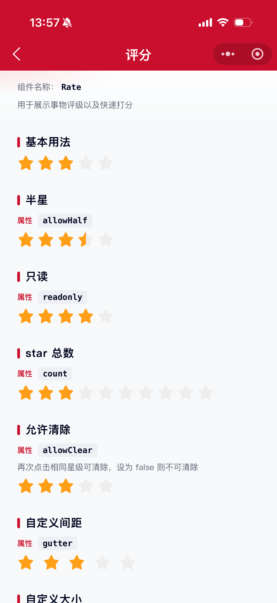

# Rate 评分组件

用于展示事物评级以及快速打分。

## 示例图



## 扫码查看


## 基础用法
页面 `.json` 文件 `usingComponents` 中引入组件
```json
// json
{
    "usingComponents": {
        "mx-rate": "/components/mxwui/rate/index"
    }
}
```

页面 `.wxml` 文件中使用组件
```html
<mx-rate value="{{3}}" bind:rate_change="changeValue" />
```

## 更多用法示例
### # 当前星级 value
属性：`value`，默认 `0`，数字。支持整数；开启半星后支持 `0.5` 步进。
```html
<mx-rate value="{{3}}" />
```

### # 半星 allowHalf
属性：`allowHalf`，默认 `false`，是否允许选择半星。
```html
<mx-rate value="{{3.5}}" allowHalf />
```

### # 只读 readonly
属性：`readonly`，默认 `false`，只读时无法交互。
```html
<mx-rate value="{{4}}" readonly />
```

### # star 总数 count
属性：`count`，默认 `5`，展示的星级数量。
```html
<mx-rate value="{{3}}" count="{{10}}" />
```

### # 再次点击清除 allowClear
属性：`allowClear`，默认 `true`。为 `true` 时再次点击当前星级可清除为 `0`。
```html
<mx-rate value="{{3}}" allowClear="{{false}}" />
```

### # 间距 gutter
属性：`gutter`，默认 `8`，单位 `rpx`，星星之间的间距。
```html
<mx-rate value="{{3}}" gutter="{{24}}" />
```

### # 大小 size
属性：`size`，默认 `48`，单位 `rpx`。
```html
<mx-rate value="{{3}}" size="{{64}}" />
```

### # 颜色 color / voidColor
属性：`color` 为选中色，默认 `#FF9F18`；`voidColor` 为未选中色，默认 `#EEEEEE`。
```html
<mx-rate value="{{3.5}}" allowHalf color="#CA0E2D" voidColor="#E1E5EC" />
```

### # 自定义字符 character
属性：`character`，默认空。传入文本后优先以字符展示评分。
```html
<mx-rate value="{{3}}" character="好" />

<mx-rate value="{{4}}" character="A" />
```

### # 自定义图标 icon
属性：`icon`，默认 `collect_checked`（对应图标类 `mx_collect_checked`）。未设置 `character` 时使用该图标。
```html
<mx-rate value="{{3}}" />

<mx-rate value="{{3.5}}" allowHalf icon="love_fill" color="#CA0E2D" />
```

### # 受控模式
通过 `value` 与 `bind:rate_change` 配合实现受控。
```html
<mx-rate value="{{value}}" bind:rate_change="changeValue" />
```

```js
Page({
    data: {
        value: 3,
    },
    changeValue(e) {
        this.setData({
            value: e.detail.value,
        });
    },
});
```

### # 事件
属性：`bind:rate_change`，打分回调事件。
```html
<mx-rate bind:rate_change="changeValue" />
```

<!-- ## 参数示意图
 -->

## 参数
|参数|类型|必填|可选值|默认值|参数描述|
|----|----|----|----|----|----|
|value|Number|是|数字|`0`|当前星级|
|count|Number||数字|`5`|star 总数|
|allowHalf|Boolean||`true`、`false`|`false`|是否允许半星|
|allowClear|Boolean||`true`、`false`|`true`|是否允许再次点击后清除|
|readonly|Boolean||`true`、`false`|`false`|是否只读|
|gutter|Number||数字|`8`|间距，单位 rpx|
|size|Number||数字|`48`|大小，单位 rpx|
|color|String||颜色值|`#FF9F18`|选中颜色|
|voidColor|String||颜色值|`#EEEEEE`|未选中颜色|
|character|String||任意字符|`''`|自定义字符，有值时优先于 icon|
|icon|String||图标名称|`collect_checked`|评分图标，默认收藏星标|

## 事件
|事件名称|类型|返回值|事件说明|
|----|----|----|----|
|bind:rate_change|Change|`event.detail`|打分回调，返回 `value` 字段|

## 其他说明
- 支持点击选择，也支持按住滑动打分。
- 开启 `allowHalf` 后，点击星星左半边为半星，右半边为整星。
