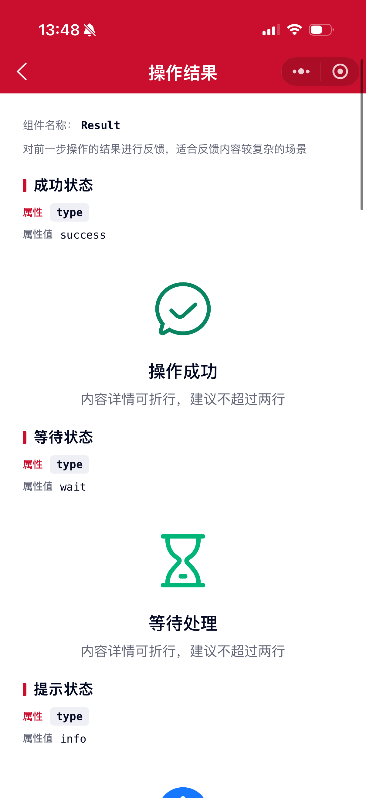
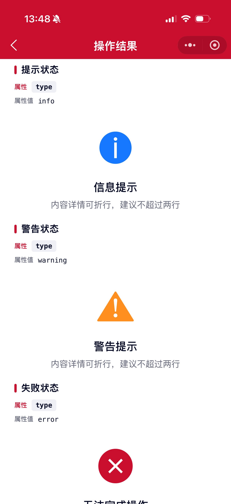
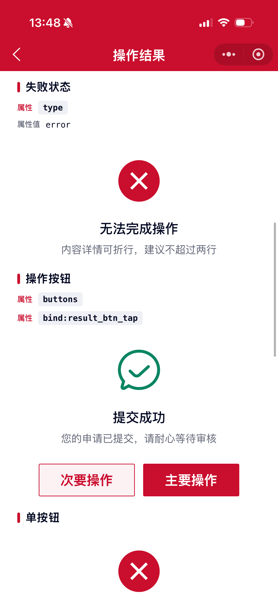

# Result 操作结果组件

对前一步操作的结果进行反馈。当有重要操作需告知用户处理结果，且反馈内容较为复杂时使用。

## 示例图





## 基础用法
页面 `.json` 文件 `usingComponents` 中引入组件
```json
// json
{
    "usingComponents": {
        "mx-result": "/components/mxwui/result/index"
    }
}
```

页面 `.wxml` 文件中使用组件
```html
<mx-result
    type="success"
    title="操作成功"
    message="内容详情可折行，建议不超过两行"
/>
```

## 更多用法示例
### # 结果类型 type
属性：`type`，可选 `success`、`error`、`info`、`warning`、`wait`。传入后展示对应内置图标与颜色。

兼容别名：`danger` → `error`，`warn` → `warning`。

```html
<mx-result type="success" title="操作成功" message="内容详情可折行，建议不超过两行" />
<mx-result type="wait" title="等待处理" message="内容详情可折行，建议不超过两行" />
<mx-result type="info" title="信息提示" message="内容详情可折行，建议不超过两行" />
<mx-result type="warning" title="警告提示" message="内容详情可折行，建议不超过两行" />
<mx-result type="error" title="无法完成操作" message="内容详情可折行，建议不超过两行" />
```

### # 主文案 title
属性：`title`，结果主标题。也可通过 `slot="title"` 自定义。

```html
<mx-result type="success" title="操作成功" />
```

### # 主文案颜色 titleColor
属性：`titleColor`，默认 `#040A23`，支持任何合法的颜色值。

```html
<mx-result type="success" title="操作成功" titleColor="#1677FF" />
```

### # 副文案 message
属性：`message`，结果描述。也可通过 `slot="message"` 自定义。

```html
<mx-result type="success" title="操作成功" message="内容详情可折行，建议不超过两行" />
```

### # 副文案颜色 messageColor
属性：`messageColor`，默认 `#656979`，支持任何合法的颜色值。

```html
<mx-result type="success" title="操作成功" message="描述文案" messageColor="#9AA0B1" />
```

### # 自定义图标 icon
属性：`icon`，使用 Icon 组件的 `name`。优先级高于 `type` / `image`。

属性：`iconColor`，图标颜色，传入后覆盖 `type` 默认色。

属性：`iconSize`，默认 `128`，不带单位，使用 rpx。

```html
<mx-result
    icon="collect_checked"
    iconColor="#CA0E2D"
    iconSize="{{128}}"
    title="收藏成功"
    message="可在「我的收藏」中查看"
/>
```

### # 自定义图片 image
属性：`image`，图片链接。无 `icon`、无 `type` 时生效。也可通过 `slot="image"` 自定义。

```html
<mx-result
    image="https://cdn.mingsixue.com/xcx/MXWUI/remind2.png"
    title="自定义图片"
    message="未设置 type / icon 时展示自定义图片"
/>
```

### # 操作按钮 buttons
属性：`buttons`，按钮列表。每一项支持：

|字段|说明|类型|默认值|
|----|----|----|----|
|text|按钮文案|String||
|type|按钮类型，`primary` / `default` / `ghost`|String|末项默认 `primary`，其余默认 `default`|
|color|按钮主题色，仅支持十六进制|String||

事件：`bind:result_btn_tap`，点击按钮回调，返回 `{ item, index }`。

```html
<mx-result
    type="success"
    title="提交成功"
    message="您的申请已提交，请耐心等待审核"
    buttons="{{buttons}}"
    bind:result_btn_tap="handleBtnTap"
/>
```

```js
Page({
    data: {
        buttons: [
            { text: '次要操作', type: 'default' },
            { text: '主要操作', type: 'primary' },
        ],
    },
    handleBtnTap(e) {
        const { item, index } = e.detail;
        console.log(item, index);
    },
});
```

### # 插槽
支持具名插槽：

- `image`：自定义图标区域（未设置 `type` / `icon` / `image` 时生效）
- `title`：自定义主文案（未设置 `title` 时生效）
- `message`：自定义副文案（未设置 `message` 时生效）
- `extra`：底部额外内容区域

```html
<mx-result type="success">
    <view slot="title" style="margin-top:40rpx;font-size:36rpx;font-weight:500;">标题插槽</view>
    <view slot="message" style="margin-top:16rpx;font-size:28rpx;color:#656979;">描述插槽</view>
    <view slot="extra" style="margin-top:32rpx;">其他补充信息</view>
</mx-result>
```

### # 距离顶部 top
属性：`top`，默认 `0`，单位 rpx。

```html
<mx-result type="info" title="设置 top" top="{{80}}" />
```

### # 自定义样式 customStyle
属性：`customStyle`，根节点内联样式。

```html
<mx-result type="success" title="操作成功" customStyle="background:#fff;" />
```

## 参数
|参数|类型|必填|可选值|默认值|参数描述|
|----|----|----|----|----|----|
|type|String||`success`、`error`、`info`、`warning`、`wait`||内置结果类型，决定图标和颜色|
|title|String||||主文案|
|titleColor|String||颜色值|`#040A23`|主文案颜色|
|message|String||||副文案|
|messageColor|String||颜色值|`#656979`|副文案颜色|
|image|String||||自定义图片，`type` / `icon` 优先时不生效|
|icon|String||||自定义图标名，优先于 `type` / `image`|
|iconColor|String||颜色值||图标颜色，传入后覆盖 `type` 默认色|
|iconSize|Number|||`128`|图标/图片大小，单位 rpx|
|buttons|Array||||操作按钮列表，`[{ text, type, color }]`|
|top|Number|||`0`|距离顶部距离，单位 rpx|
|customStyle|String||||根节点自定义样式|

## 事件
|事件名称|类型|返回值|事件说明|
|----|----|----|----|
|bind:result_btn_tap|Click|`{ item, index }`|操作按钮点击回调|

## 其他说明
- 图标展示优先级：`icon` > `type` > `image` > `slot="image"`
- 文案优先级：属性 `title` / `message` 优先于对应插槽
- `buttons` 与 `slot="extra"` 可同时使用，按钮在上、额外内容在下
