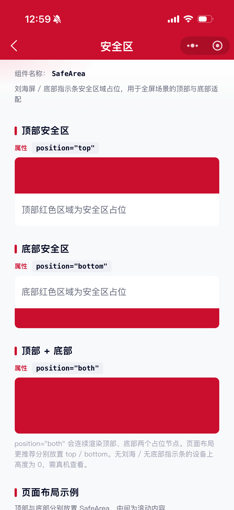

# SafeArea 安全区组件

刘海屏安全区域占位组件。当页面全屏展示时，可借助安全区进行屏幕顶部和底部适配（如刘海、底部指示条）。

## 示例图



## 基础用法
页面 `.json` 文件 `usingComponents` 中引入组件
```json
// json
{
    "usingComponents": {
        "mx-safe-area": "/components/mxwui/safe-area/index"
    }
}
```

页面 `.wxml` 文件中使用组件
```html
<mx-safe-area position="top" />
<!-- 页面内容 -->
<mx-safe-area position="bottom" />
```

## 更多用法示例
### # 位置 position
属性：`position`，可选 `top`、`bottom`、`both`，默认 `bottom`。

- 顶部安全区
```html
<mx-safe-area position="top" />
```

- 底部安全区
```html
<mx-safe-area position="bottom" />
```

- 顶部 + 底部
```html
<mx-safe-area position="both" />
```

### # 自定义样式 customStyle
属性：`customStyle`，写入根节点内联样式。
```html
<mx-safe-area position="bottom" customStyle="background:#CA0E2D;" />
```

## 参数
|参数|类型|必填|可选值|默认值|参数描述|
|----|----|----|----|----|----|
|position|String||`top`、`bottom`、`both`|`bottom`|安全区位置|
|customStyle|String||CSS 字符串|`''`|根节点自定义样式|

## 其他说明
- 组件为高度占位，本身不承载业务内容；请放在内容区域的上方 / 下方使用。
- 高度取自 CSS 环境变量 `safe-area-inset-top` / `safe-area-inset-bottom`，无安全区设备上高度为 `0`。
- 顶部安全区在自定义导航栏（`navigationStyle: custom`）场景下更有意义。
- `position="both"` 会同时渲染顶部与底部两个占位节点。
