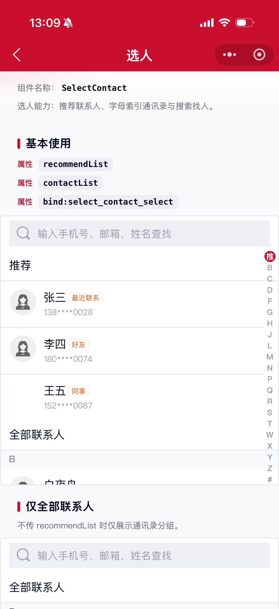
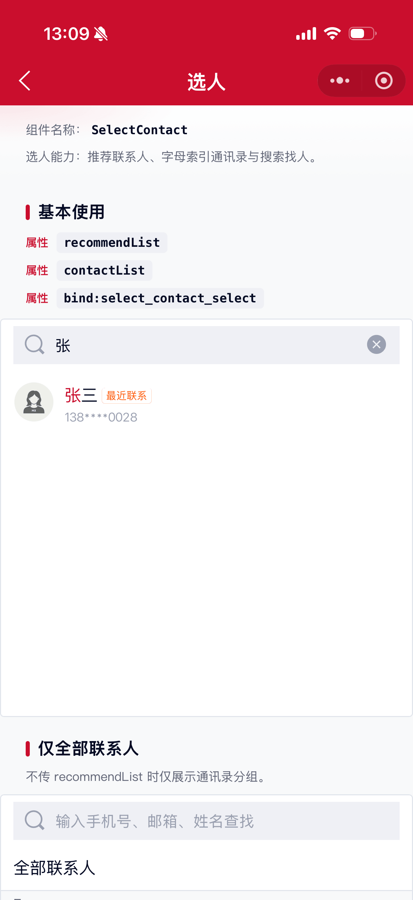
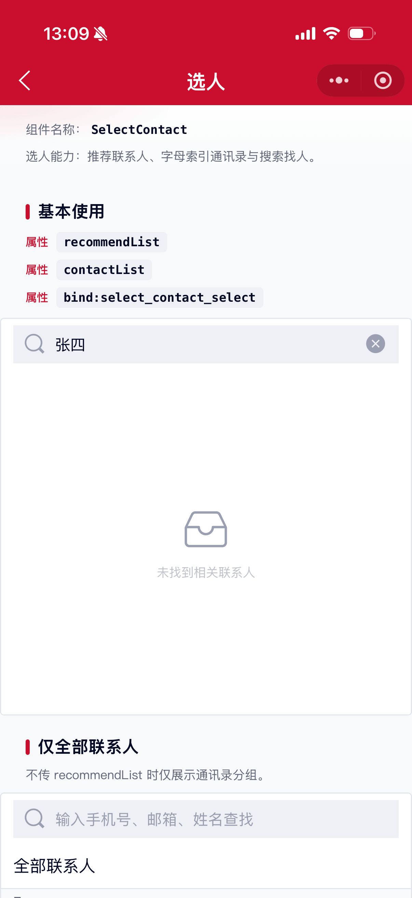

# SelectContact 选人组件

选人能力：面向赠送、代付、拉群等「找人」场景，支持推荐联系人、字母索引通讯录与关键词搜索。参考 [Ant Design Mini SelectContact](https://ant-design-mini.antgroup.com/components/select-contact)。

## 示例图





## 基础用法
页面 `.json` 文件 `usingComponents` 中引入组件
```json
// json
{
    "usingComponents": {
        "mx-select-contact": "/components/mxwui/select-contact/index"
    }
}
```

页面 `.wxml` 文件中使用组件
```html
<mx-select-contact
    recommendList="{{recommendList}}"
    contactList="{{contactList}}"
    height="100vh"
    bind:select_contact_select="handleSelect"
/>
```

```js
Page({
    data: {
        recommendList: [
            {
                userId: '1',
                displayName: '张三',
                loginId: '138****0028',
                avatar: '',
                tag: '最近联系',
                letter: 'Z',
            },
        ],
        contactList: [
            {
                userId: '2',
                displayName: '李四',
                loginId: '180****0074',
                avatar: '',
                letter: 'L',
            },
        ],
    },
    handleSelect(e) {
        const { userInfo, personSource } = e.detail;
        console.log(userInfo, personSource);
    },
});
```

## 更多用法示例
### # 推荐联系人 recommendList
属性：`recommendList`，数组。展示在列表顶部「推荐」分区。

参数：`userId`，联系人唯一标识。

参数：`displayName` / `name`，展示名称。

参数：`avatar`，头像地址，可选。

参数：`loginId` / `desc`，副文案（手机号、邮箱等），可选。

参数：`tag` / `recommendTypeDesc`，右侧/名称旁标签，可选。

参数：`letter`，拼音首字母（A-Z / `#`），可选；不传时组件会尽量自动识别。

```html
<mx-select-contact recommendList="{{recommendList}}" contactList="{{contactList}}" />
```

### # 全部联系人 contactList
属性：`contactList`，数组。字段同 `recommendList`。组件会按首字母分组，并生成侧边索引。
```html
<mx-select-contact contactList="{{contactList}}" />
```

### # 组件高度 height
属性：`height`，默认 `100%`，带单位，如 `100%`、`80vh`、`720rpx`。
```html
<mx-select-contact contactList="{{contactList}}" height="720rpx" />
```

### # 搜索 searchable / placeholder
属性：`searchable`，默认 `true`，是否展示搜索栏。

属性：`placeholder`，默认 `输入手机号、邮箱、姓名查找`。
```html
<mx-select-contact
    contactList="{{contactList}}"
    searchable
    placeholder="搜姓名 / 手机号"
/>
```

### # 本地搜索 localSearch
属性：`localSearch`，默认 `true`。为 `true` 时在组件内过滤 `recommendList + contactList`，并对名称高亮。未输入关键词时展示全部联系人。
```html
<mx-select-contact
    recommendList="{{recommendList}}"
    contactList="{{contactList}}"
    localSearch
    bind:select_contact_select="handleSelect"
    bind:select_contact_cancel="handleCancel"
/>
```

### # 外部搜索 searchResult
属性：`localSearch` 设为 `false` 时，输入会触发 `select_contact_search`，由业务方检索后回填 `searchResult`。

属性：`searching`，外部搜索加载中。

属性：`searchResult`，搜索结果列表；可带 `nodes`（`[{text, light}]`）自定义高亮。
```html
<mx-select-contact
    contactList="{{contactList}}"
    localSearch="{{false}}"
    searching="{{searching}}"
    searchResult="{{searchResult}}"
    bind:select_contact_search="handleSearch"
    bind:select_contact_select="handleSelect"
/>
```

```js
Page({
    data: {
        searching: false,
        searchResult: [],
    },
    handleSearch(e) {
        const { keyword } = e.detail;
        this.setData({ searching: true });
        // 请求接口后：
        this.setData({
            searching: false,
            searchResult: [/* ... */],
        });
    },
});
```

### # 加载与空状态
属性：`loading`，默认 `false`，整页加载中。

属性：`emptyText`，列表为空文案，默认 `暂无联系人`。

属性：`searchEmptyText`，搜索无结果文案。
```html
<mx-select-contact loading="{{true}}" height="360rpx" />
<mx-select-contact emptyText="暂无好友，去添加吧" />
```

### # 分区标题
属性：`recommendTitle`，默认 `推荐`。

属性：`contactTitle`，默认 `全部联系人`。
```html
<mx-select-contact
    recommendList="{{recommendList}}"
    contactList="{{contactList}}"
    recommendTitle="常联系"
    contactTitle="通讯录"
/>
```

### # 样式定制
属性：`avatarSize`，头像尺寸（rpx），默认 `72`。

属性：`highlightColor`，搜索高亮色，默认主题色。

属性：`tagColor` / `tagBorderColor`，标签文字色与边框色。

属性：`activeColor`，侧边索引激活色。

属性：`indexSize`，侧边索引尺寸（px），默认 `16`。

属性：`customStyle`，根节点内联样式。
```html
<mx-select-contact
    contactList="{{contactList}}"
    highlightColor="#1677FF"
    tagColor="#FF6010"
    activeColor="#1677FF"
/>
```

## 自定义事件
事件：`select_contact_select`，点击联系人。

事件：`select_contact_search`，外部搜索模式下输入关键词。

事件：`select_contact_cancel`，取消搜索。

事件：`select_contact_index`，滑动侧边索引。

事件：`select_contact_error`，数据处理异常。
```html
<mx-select-contact
    recommendList="{{recommendList}}"
    contactList="{{contactList}}"
    bind:select_contact_select="handleSelect"
    bind:select_contact_search="handleSearch"
    bind:select_contact_cancel="handleCancel"
/>
```

## 参数
|参数|类型|必填|可选值|默认值|参数描述|
|----|----|----|----|----|----|
|recommendList|Array||||推荐联系人列表|
|contactList|Array||||全部联系人列表|
|searchResult|Array||||外部搜索结果|
|height|String|||`100%`|组件高度|
|placeholder|String|||`输入手机号、邮箱、姓名查找`|搜索占位文案|
|searchable|Boolean||`true`、`false`|`true`|是否展示搜索|
|localSearch|Boolean||`true`、`false`|`true`|是否本地搜索|
|loading|Boolean||`true`、`false`|`false`|加载中|
|searching|Boolean||`true`、`false`|`false`|外部搜索中|
|emptyText|String|||`暂无联系人`|空列表文案|
|searchEmptyText|String|||`未找到相关联系人`|搜索无结果文案|
|recommendTitle|String|||`推荐`|推荐区标题|
|contactTitle|String|||`全部联系人`|全部联系人标题|
|avatarSize|Number||数字|`72`|头像尺寸（rpx）|
|highlightColor|String||颜色值|主题色|搜索高亮色|
|tagColor|String||颜色值|`#FF6010`|标签文字色|
|tagBorderColor|String||颜色值|`#FFCFB7`|标签边框色|
|activeColor|String||颜色值|主题色|侧边索引激活色|
|indexSize|Number||数字|`16`|侧边索引尺寸（px）|
|customStyle|String||||根节点自定义样式|

### ContactItem 结构
|参数|类型|必填|可选值|默认值|参数描述|
|----|----|----|----|----|----|
|userId|String|是|||联系人唯一标识|
|displayName|String|是|||展示名称，也可用 `name`|
|avatar|String||||头像地址|
|loginId|String||||副文案，也可用 `desc`|
|tag|String||||标签文案，也可用 `recommendTypeDesc`|
|letter|String||`A`-`Z`、`#`||拼音首字母，建议传入以保证索引准确|
|nodes|Array||||搜索高亮片段 `[{text, light}]`，外部搜索时可选|

## 事件
|事件名称|类型|返回值|事件说明|
|----|----|----|----|
|bind:select_contact_select|Tap|`{ userInfo, personSource }`|选中联系人；`personSource` 为 `recommend` / `all` / `search`|
|bind:select_contact_search|Input|`{ keyword }`|外部搜索模式下关键词变化|
|bind:select_contact_cancel|Tap||取消搜索|
|bind:select_contact_index|Change|`{ item, index, label }`|侧边索引变化|
|bind:select_contact_error|Error|`{ error }`|数据处理异常|

## 其他说明
1. 组件为纯展示与交互能力，不绑定后端选人接口；联系人数据由业务方传入。
2. 中文名建议传 `letter` 字段；未传时组件会按常见姓氏表尝试识别，未命中归入 `#`。
3. 全屏选人页可将 `height` 设为导航栏以下可视高度（如 `calc(100vh - xxx)` 或页面计算后的 px/rpx）。
