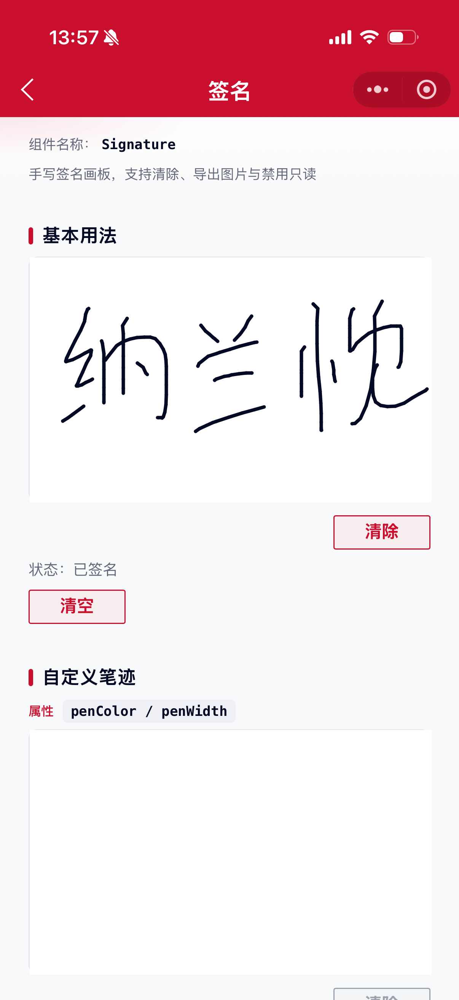

# Signature 签名组件

用于手写签名场景，基于 Canvas 实现，支持清除、导出临时图片、禁用与只读。

## 示例图



## 扫码查看


## 基础用法
页面 `.json` 文件 `usingComponents` 中引入组件
```json
// json
{
    "usingComponents": {
        "mx-signature": "/components/mxwui/signature/index"
    }
}
```

页面 `.wxml` 文件中使用组件
```html
<mx-signature bind:signature_change="onSignatureChange" />
```

## 更多用法示例
### # 画板高度 height
属性：`height`，默认 `400`，单位 `rpx`。
```html
<mx-signature height="{{280}}" />
```

### # 笔迹颜色 / 宽度 penColor / penWidth
属性：`penColor` 默认 `#040A23`；`penWidth` 默认 `3`，单位 `px`。
```html
<mx-signature penColor="#CA0E2D" penWidth="{{5}}" />
```

### # 背景色 bgColor
属性：`bgColor`，默认 `#FFFFFF`。
```html
<mx-signature bgColor="#F8F9FA" />
```

### # 空态文案 placeholder
属性：`placeholder`，默认 `请在此签名`。无笔迹时展示。
```html
<mx-signature placeholder="请在此签署姓名" />
```

### # 清除按钮 showClear / clearText
属性：`showClear` 默认 `true`；`clearText` 默认 `清除`。
```html
<mx-signature showClear clearText="重签" />

<mx-signature showClear="{{false}}" />
```

### # 确认按钮 showConfirm / confirmText
属性：`showConfirm` 默认 `false`；`confirmText` 默认 `确认`。点击后导出临时图片并触发 `signature_confirm`。
```html
<mx-signature
    showConfirm
    bind:signature_confirm="onSignatureConfirm"
/>
```

### # 禁用 / 只读 disabled / readonly
属性：`disabled`、`readonly`，默认均为 `false`。开启后不可书写。
```html
<mx-signature disabled />

<mx-signature readonly />
```

### # 导出图片类型 fileType
属性：`fileType`，可选 `png`、`jpg`，默认 `png`。
```html
<mx-signature fileType="jpg" />
```

### # 通过方法导出
通过 `selectComponent` 调用 `toTempFilePath`、`clear`、`isEmpty`、`confirm`。
```html
<mx-signature id="signature" showClear="{{false}}" />
<mx-btn bind:btn_tap="handleExport">导出</mx-btn>
```

```js
Page({
    handleExport() {
        const comp = this.selectComponent('#signature');
        if (!comp || comp.isEmpty()) {
            wx.showToast({title: '请先签名', icon: 'none'});
            return;
        }
        comp.toTempFilePath().then((res) => {
            console.log(res.tempFilePath);
        });
    },
});
```

## 自定义事件
事件：`bind:signature_start`，开始落笔。

事件：`bind:signature_signing`，书写过程中。

事件：`bind:signature_end`，抬笔结束。

事件：`bind:signature_change`，签名内容变化，返回 `empty`。

事件：`bind:signature_clear`，清除完成。

事件：`bind:signature_confirm`，确认导出，返回 `tempFilePath`、`empty`。
```html
<mx-signature
    showConfirm
    bind:signature_change="onSignatureChange"
    bind:signature_confirm="onSignatureConfirm"
    bind:signature_clear="onSignatureClear"
/>
```

## 参数
|参数|类型|必填|可选值|默认值|参数描述|
|----|----|----|----|----|----|
|height|Number||数字|`400`|画板高度，单位 rpx|
|penColor|String||颜色值|`#040A23`|笔迹颜色|
|penWidth|Number||数字|`3`|笔迹宽度，单位 px|
|bgColor|String||颜色值|`#FFFFFF`|画板背景色|
|placeholder|String||||空态提示文案，默认「请在此签名」|
|showClear|Boolean||`true`、`false`|`true`|是否显示清除按钮|
|clearText|String||||清除按钮文案，默认「清除」|
|showConfirm|Boolean||`true`、`false`|`false`|是否显示确认按钮|
|confirmText|String||||确认按钮文案，默认「确认」|
|fileType|String||`png`、`jpg`|`png`|导出图片类型|
|disabled|Boolean||`true`、`false`|`false`|是否禁用|
|readonly|Boolean||`true`、`false`|`false`|是否只读|
|customStyle|String||||根节点自定义样式|

## 事件
|事件名称|类型|返回值|事件说明|
|----|----|----|----|
|bind:signature_start|Touch|`event.detail`|开始落笔，返回坐标|
|bind:signature_signing|Touch|`event.detail`|书写过程中，返回坐标|
|bind:signature_end|Touch|`event.detail`|抬笔结束，返回 `empty`|
|bind:signature_change|Change|`event.detail`|内容变化，返回 `empty`|
|bind:signature_clear|Click||清除完成|
|bind:signature_confirm|Change|`event.detail`|确认导出，返回 `tempFilePath`、`empty`|

## 组件方法
|方法名|说明|返回值|
|----|----|----|
|clear()|清空签名|-|
|isEmpty()|是否为空签名|`Boolean`|
|toTempFilePath(options?)|导出临时图片，支持 `fileType`、`quality` 及 success/fail 回调|`Promise<{tempFilePath, empty}>`|
|confirm()|确认并导出，同时触发 `signature_confirm`|同 `toTempFilePath`|

## 其他说明
- 书写时会禁用画布区域滚动（`disable-scroll`），避免签名时页面跟着滑动。
- 画板宽度默认撑满父容器，高度由 `height` 控制；尺寸变化后会重新初始化画布。
- 导出得到的是本地临时路径，可用于预览、上传等后续流程。
