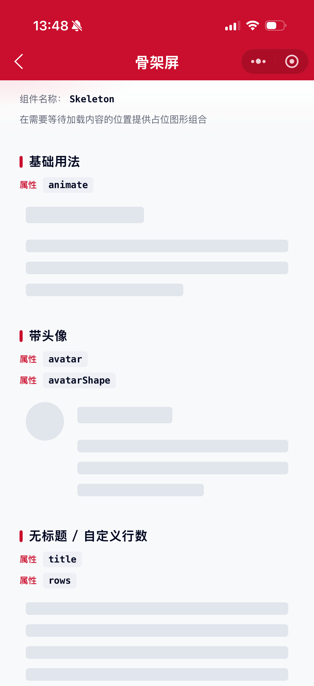
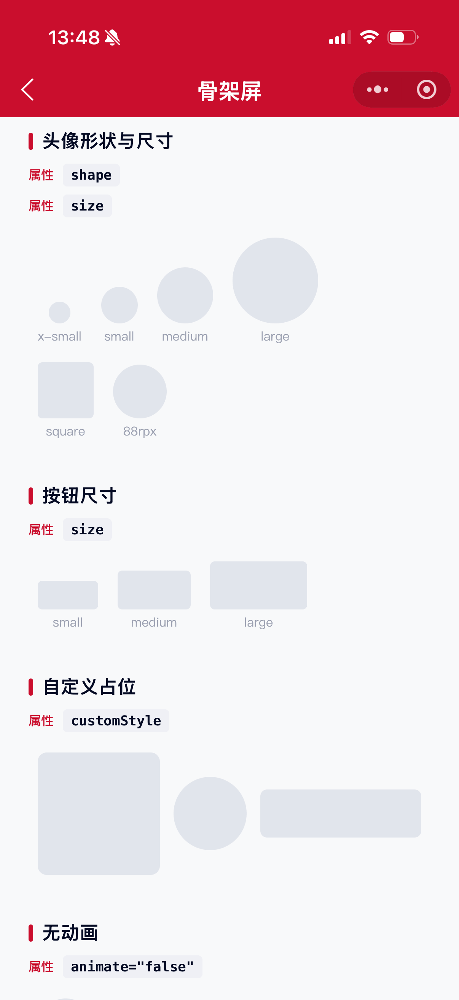

# Skeleton 骨架屏组件

在需要等待加载内容的位置提供占位图形组合。适用于图文信息较多的首页、列表与卡片；网络较慢且仅首次加载时使用。

## 示例图




## 基础用法
页面 `.json` 文件 `usingComponents` 中引入组件
```json
// json
{
    "usingComponents": {
        "mx-skeleton": "/components/mxwui/skeleton/index",
        "mx-skeleton-avatar": "/components/mxwui/skeleton/avatar/index",
        "mx-skeleton-title": "/components/mxwui/skeleton/title/index",
        "mx-skeleton-paragraph": "/components/mxwui/skeleton/paragraph/index",
        "mx-skeleton-button": "/components/mxwui/skeleton/button/index",
        "mx-skeleton-input": "/components/mxwui/skeleton/input/index",
        "mx-skeleton-custom": "/components/mxwui/skeleton/custom/index"
    }
}
```

页面 `.wxml` 文件中使用组件
```html
<mx-skeleton animate="{{true}}" />
```

## 更多用法示例
### # 动画 animate
属性：`animate`，是否展示扫光动画，默认 `false`。
```html
<mx-skeleton animate="{{true}}" />
```

### # 头像 avatar / avatarShape / avatarSize
属性：`avatar` 是否显示头像占位；`avatarShape` 可选 `circle`、`square`，默认 `square`；`avatarSize` 可选 `x-small`、`small`、`medium`、`large`，或自定义尺寸如 `88rpx`，默认 `medium`。
```html
<mx-skeleton
    animate="{{true}}"
    avatar="{{true}}"
    avatarShape="circle"
    avatarSize="large"
/>
```

### # 标题与段落 title / rows
属性：`title` 是否显示标题占位，默认 `true`；`rows` 为段落行数，大于 `0` 展示，默认 `3`。
```html
<mx-skeleton title="{{false}}" rows="{{5}}" animate="{{true}}" />
```

### # 加载切换 loading
属性：`loading`，为 `true` 时显示占位图，为 `false` 时展示子节点内容，默认 `true`。
```html
<mx-skeleton loading="{{showLoading}}" animate="{{true}}" avatar="{{true}}">
    <view>真实内容</view>
</mx-skeleton>
```

### # 自定义组合
可单独使用子组件自由拼装。
```html
<mx-skeleton-avatar animate="{{true}}" shape="circle" size="large" />
<mx-skeleton-title animate="{{true}}" />
<mx-skeleton-paragraph animate="{{true}}" rows="{{2}}" />
<mx-skeleton-input animate="{{true}}" />
<mx-skeleton-button animate="{{true}}" size="medium" />
```

### # 自定义占位 custom
属性：`customStyle` 控制宽高与圆角，用于自定义形状。
```html
<mx-skeleton-custom
    animate="{{true}}"
    customStyle="width:200rpx;height:200rpx;border-radius:16rpx;"
/>
```

## 参数

### Skeleton
|参数|类型|必填|可选值|默认值|参数描述|
|----|----|----|----|----|----|
|loading|Boolean|||`true`|为 true 时显示占位图，反之展示子节点|
|animate|Boolean|||`false`|是否展示动画效果|
|avatar|Boolean|||`false`|是否显示头像占位|
|title|Boolean|||`true`|是否显示标题占位|
|rows|Number|||`3`|段落行数，大于 0 展示|
|avatarSize|String||`x-small`、`small`、`medium`、`large` 或自定义尺寸|`medium`|头像大小|
|avatarShape|String||`circle`、`square`|`square`|头像形状|
|customStyle|String||CSS 字符串|`''`|根节点自定义样式|

### Skeleton Avatar
|参数|类型|必填|可选值|默认值|参数描述|
|----|----|----|----|----|----|
|loading|Boolean|||`true`|为 true 时显示占位图，反之展示子节点|
|animate|Boolean|||`false`|是否展示动画效果|
|shape|String||`circle`、`square`|`square`|头像形状|
|size|String||`x-small`、`small`、`medium`、`large` 或自定义尺寸|`medium`|头像大小|
|customStyle|String||CSS 字符串|`''`|根节点自定义样式|

### Skeleton Title
|参数|类型|必填|可选值|默认值|参数描述|
|----|----|----|----|----|----|
|loading|Boolean|||`true`|为 true 时显示占位图，反之展示子节点|
|animate|Boolean|||`false`|是否展示动画效果|
|customStyle|String||CSS 字符串|`''`|根节点自定义样式|

### Skeleton Paragraph
|参数|类型|必填|可选值|默认值|参数描述|
|----|----|----|----|----|----|
|loading|Boolean|||`true`|为 true 时显示占位图，反之展示子节点|
|animate|Boolean|||`false`|是否展示动画效果|
|rows|Number|||`3`|段落行数，大于 0 展示|
|customStyle|String||CSS 字符串|`''`|根节点自定义样式|

### Skeleton Button
|参数|类型|必填|可选值|默认值|参数描述|
|----|----|----|----|----|----|
|loading|Boolean|||`true`|为 true 时显示占位图，反之展示子节点|
|animate|Boolean|||`false`|是否展示动画效果|
|size|String||`small`、`medium`、`large`|`medium`|按钮尺寸|
|customStyle|String||CSS 字符串|`''`|根节点自定义样式|

### Skeleton Input
|参数|类型|必填|可选值|默认值|参数描述|
|----|----|----|----|----|----|
|loading|Boolean|||`true`|为 true 时显示占位图，反之展示子节点|
|animate|Boolean|||`false`|是否展示动画效果|
|customStyle|String||CSS 字符串|`''`|根节点自定义样式|

### Skeleton Custom
|参数|类型|必填|可选值|默认值|参数描述|
|----|----|----|----|----|----|
|loading|Boolean|||`true`|为 true 时显示占位图，反之展示子节点|
|animate|Boolean|||`false`|是否展示动画效果|
|customStyle|String||CSS 字符串|`''`|根节点自定义样式，常用于宽高与圆角|

## 其他说明
- 段落最后一行默认宽度为 `60%`，用于模拟真实文本排版。
- `avatarSize` / Avatar 的 `size` 支持预设尺寸，也支持直接传入带单位的值（如 `88rpx`）。
- 小模块（如弹窗）不建议使用骨架屏；优先考虑预加载。
