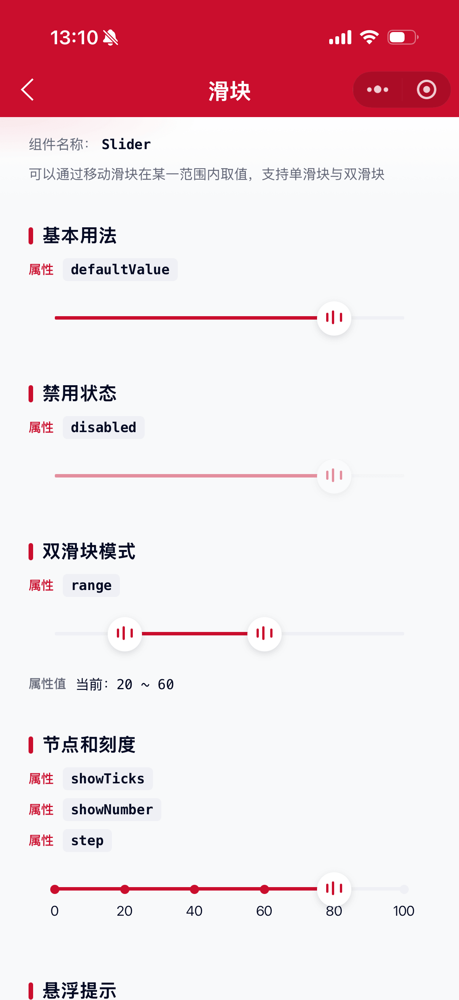

# Slider 滑块组件

可以通过移动滑块在某一范围内取值。用于在一定范围内获取单个或者区间数值。

## 示例图



## 扫码查看


## 基础用法
页面 `.json` 文件 `usingComponents` 中引入组件
```json
// json
{
    "usingComponents": {
        "mx-slider": "/components/mxwui/slider/index"
    }
}
```

页面 `.wxml` 文件中使用组件
```html
<mx-slider
    defaultValue="{{80}}"
    bind:slider_change="onChange"
    bind:slider_afterchange="onAfterChange"
/>
```

```js
// js
Page({
    onChange(e) {
        console.log('slider_change', e.detail.value);
    },
    onAfterChange(e) {
        console.log('slider_afterchange', e.detail.value);
    }
});
```

## 更多用法示例
### # 初始值 defaultValue
属性：`defaultValue`，非受控初始值。单滑块为数字，双滑块为数组。
```html
<mx-slider defaultValue="{{80}}" />
```

### # 当前值 value
属性：`value`，受控当前值。与 `bind:slider_change` 配合可实现受控模式。

单滑块为 `Number`，双滑块为 `[Number, Number]`。
```html
<mx-slider value="{{value}}" bind:slider_change="onChange" />
```

```js
Page({
    data: {
        value: 80
    },
    onChange(e) {
        this.setData({
            value: e.detail.value
        });
    }
});
```

### # 最小值 min
属性：`min`，默认 `0`，数字。
```html
<mx-slider min="{{0}}" defaultValue="{{20}}" />
```

### # 最大值 max
属性：`max`，默认 `100`，数字。
```html
<mx-slider max="{{100}}" defaultValue="{{80}}" />
```

### # 步长 step
属性：`step`，默认 `1`，取值必须大于 `0`，并且可被 `(max - min)` 整除。
```html
<mx-slider step="{{20}}" defaultValue="{{80}}" showTicks showNumber />
```

### # 是否禁用 disabled
属性：`disabled`，默认 `false`。
```html
<mx-slider defaultValue="{{80}}" disabled />
```

### # 双滑块模式 range
属性：`range`，默认 `false`。开启后 `value` / `defaultValue` 类型变为数组。
```html
<mx-slider range defaultValue="{{[20, 60]}}" />
```

### # 显示刻度 showTicks
属性：`showTicks`，默认 `false`。根据 `step` 生成刻度点。
```html
<mx-slider step="{{20}}" showTicks defaultValue="{{80}}" />
```

### # 显示刻度数值 showNumber
属性：`showNumber`，默认 `false`。需配合 `showTicks` 使用。
```html
<mx-slider step="{{20}}" showTicks showNumber defaultValue="{{80}}" />
```

### # 悬浮提示 showTooltip
属性：`showTooltip`，默认 `false`。拖动时在滑块上方显示当前值。
```html
<mx-slider defaultValue="{{80}}" showTooltip />
```

### # 激活色 activeColor
属性：`activeColor`，默认 `#CA0E2D`，支持任何合法颜色值。
```html
<mx-slider defaultValue="{{60}}" activeColor="#1677FF" />
```

### # 未激活色 inactiveColor
属性：`inactiveColor`，默认 `#EFF0F5`，支持任何合法颜色值。
```html
<mx-slider defaultValue="{{60}}" inactiveColor="#E1E5EC" />
```

### # 滑块手柄色 handleColor
属性：`handleColor`，默认 `#FFFFFF`。
```html
<mx-slider defaultValue="{{60}}" handleColor="#FFFFFF" />
```

### # 选中线条样式 activeLineStyle
属性：`activeLineStyle`，字符串，写入选中轨道的 inline style。
```html
<mx-slider defaultValue="{{60}}" activeLineStyle="background-color: #ff8f1f;" />
```

### # 选中刻度样式 activeDotStyle
属性：`activeDotStyle`，字符串，写入激活刻度点的 inline style。
```html
<mx-slider step="{{20}}" showTicks defaultValue="{{60}}" activeDotStyle="background-color: red;" />
```

### # 事件
属性：`bind:slider_change`，拖动过程中值变化时触发。

属性：`bind:slider_afterchange`，松手时触发，时机与 `touchend` 一致。
```html
<mx-slider
    defaultValue="{{80}}"
    bind:slider_change="onChange"
    bind:slider_afterchange="onAfterChange"
/>
```

## 参数
|参数|类型|必填|可选值|默认值|参数描述|
|----|----|----|----|----|----|
|value|Number / Array||数字或 `[min, max]`|`null`|受控当前值|
|defaultValue|Number / Array||数字或 `[min, max]`|`null`|非受控初始值|
|min|Number||数字|`0`|最小值|
|max|Number||数字|`100`|最大值|
|step|Number||数字|`1`|步长|
|disabled|Boolean||`true`、`false`|`false`|是否禁用|
|range|Boolean||`true`、`false`|`false`|是否双滑块|
|showTicks|Boolean||`true`、`false`|`false`|是否显示刻度|
|showNumber|Boolean||`true`、`false`|`false`|是否显示刻度数值|
|showTooltip|Boolean||`true`、`false`|`false`|拖动时是否显示悬浮提示|
|activeColor|String||颜色值|`#CA0E2D`|激活色|
|inactiveColor|String||颜色值|`#EFF0F5`|未激活轨道色|
|handleColor|String||颜色值|`#FFFFFF`|滑块手柄色|
|activeLineStyle|String||CSS 字符串|`''`|选中线条自定义样式|
|activeDotStyle|String||CSS 字符串|`''`|选中刻度自定义样式|

## 事件
|事件名称|类型|返回值|事件说明|
|----|----|----|----|
|bind:slider_change|Change|`event.detail.value`|值变化时触发，单滑块返回数字，双滑块返回数组|
|bind:slider_afterchange|Change|`event.detail.value`|松手后触发，返回最终值|

## 其他说明
- 受控模式下请在 `slider_change` 中同步更新 `value`，否则松手后会回弹到外部传入值。
- `step` 建议能被 `(max - min)` 整除，否则刻度数量可能出现舍入误差。
