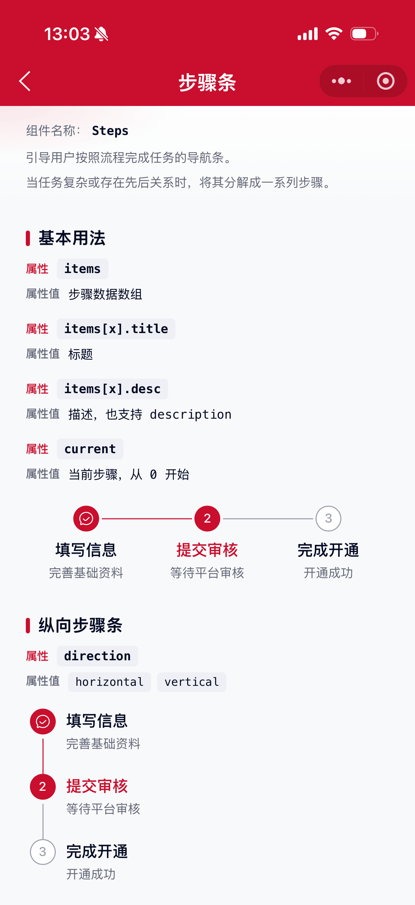
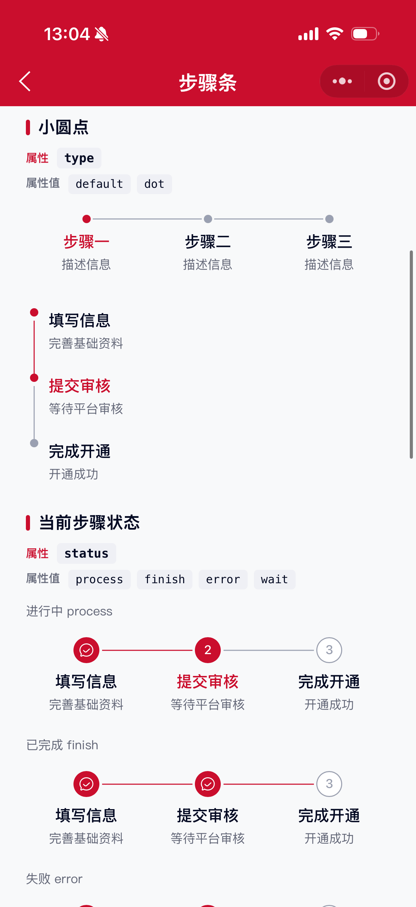
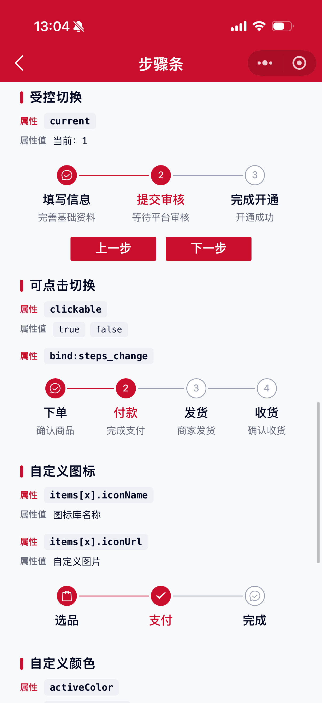
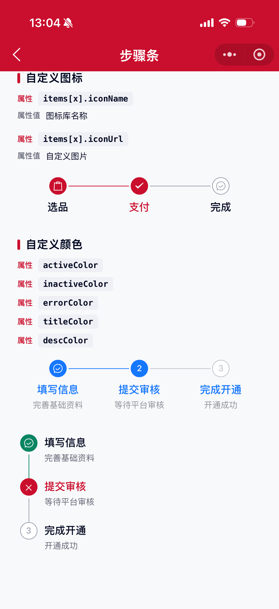

# Steps 步骤条组件

引导用户按照流程完成任务的导航条。当任务复杂或者存在先后关系时，将其分解成一系列步骤，从而简化任务。

## 示例图






## 扫码查看


## 基础用法
页面 `.json` 文件 `usingComponents` 中引入组件
```json
// json
{
    "usingComponents": {
        "mx-steps": "/components/mxwui/steps/index"
    }
}
```

页面 `.wxml` 文件中使用组件
```html
<mx-steps items="{{items}}" current="{{1}}" />
```

```js
// js
data: {
    items: [
        {title: '填写信息', desc: '完善基础资料'},
        {title: '提交审核', desc: '等待平台审核'},
        {title: '完成开通', desc: '开通成功'},
    ]
}
```

## 更多用法示例
### # 步骤数据 items
属性：`items`，数组。

参数：`title`，标题。

参数：`desc` / `description`，描述文案，可选。

参数：`status`，单项状态，可选 `wait`、`process`、`finish`、`error`，不传则根据 `current` 自动计算。

参数：`fail`，是否为失败步骤，等价于 `status: 'error'`。

参数：`iconName`，自定义图标名称（图标库）。

参数：`iconUrl`，自定义图片地址。

参数：`disabled`，是否禁用点击，配合 `clickable` 使用。

```js
// js
data: {
    items: [
        {title: '步骤一', desc: '描述'},
        {title: '步骤二', description: '描述'},
        {title: '步骤三', fail: true},
    ]
}
```
```html
<mx-steps items="{{items}}" current="{{1}}" />
```

### # 当前步骤 current
属性：`current`，默认 `0`，从 0 开始计数。
```html
<mx-steps items="{{items}}" current="{{1}}" />
```

### # 方向 direction
属性：`direction`，可选 `horizontal`、`vertical`，默认 `horizontal`。

- 横向
```html
<mx-steps items="{{items}}" direction="horizontal" />
```

- 纵向
```html
<mx-steps items="{{items}}" direction="vertical" />
```

### # 样式类型 type
属性：`type`，可选 `default`、`dot`，默认 `default`。

- 默认（序号/图标）
```html
<mx-steps items="{{items}}" current="{{1}}" />
```

- 小圆点
```html
<mx-steps items="{{items}}" current="{{0}}" type="dot" activeColor="#1677FF" />
```

### # 当前步骤状态 status
属性：`status`，指定当前步骤（`current` 对应项）的状态，可选 `process`、`finish`、`error`、`wait`，默认 `process`。
```html
<mx-steps items="{{items}}" current="{{1}}" status="error" />

<mx-steps items="{{items}}" current="{{1}}" status="finish" />
```

### # 可点击切换 clickable
属性：`clickable`，默认 `false`。开启后点击步骤可切换，并触发 `steps_change`。
```html
<mx-steps
    items="{{items}}"
    current="{{current}}"
    clickable
    bind:steps_change="handleChange"
/>
```

### # 激活色 activeColor
属性：`activeColor`，默认主题色 `#CA0E2D`，支持任何合法的颜色值。
```html
<mx-steps items="{{items}}" activeColor="#1677FF" />
```

### # 未激活色 inactiveColor
属性：`inactiveColor`，默认 `#9AA0B1`，支持任何合法的颜色值。
```html
<mx-steps items="{{items}}" inactiveColor="#C0C4CC" />
```

### # 错误色 errorColor
属性：`errorColor`，默认 `#CA0E2D`，支持任何合法的颜色值。
```html
<mx-steps items="{{items}}" current="{{1}}" status="error" errorColor="#CA0E2D" />
```

### # 标题色 titleColor
属性：`titleColor`，默认 `#040A23`，支持任何合法的颜色值。
```html
<mx-steps items="{{items}}" titleColor="#1677FF" />
```

### # 描述色 descColor
属性：`descColor`，默认 `#656979`，支持任何合法的颜色值。
```html
<mx-steps items="{{items}}" descColor="#909399" />
```

## 自定义事件
事件：`bind:steps_change`，点击切换步骤时触发（需开启 `clickable`），返回 `current`、`item`、`status`。

```html
<mx-steps
    items="{{items}}"
    current="{{current}}"
    clickable
    bind:steps_change="handleChange"
/>
```

<!-- ## 参数示意图
 -->

## 参数
|参数|类型|必填|可选值|默认值|参数描述|
|----|----|----|----|----|----|
|items|Array|是|||步骤数据|
|current|Number|||`0`|当前步骤，从 0 开始|
|direction|String||`horizontal`、`vertical`|`horizontal`|方向|
|type|String||`default`、`dot`|`default`|样式类型，`dot` 为小圆点|
|status|String||`process`、`finish`、`error`、`wait`|`process`|当前步骤状态|
|clickable|Boolean||`true`、`false`|`false`|是否可点击切换|
|activeColor|String||颜色值|`#CA0E2D`|激活/完成色|
|inactiveColor|String||颜色值|`#9AA0B1`|未激活色|
|errorColor|String||颜色值|`#CA0E2D`|错误色|
|titleColor|String||颜色值|`#040A23`|标题色|
|descColor|String||颜色值|`#656979`|描述色|

### items
|参数|类型|必填|可选值|默认值|参数描述|
|----|----|----|----|----|----|
|title|String|是|||标题|
|desc|String||||描述（与 description 二选一）|
|description|String||||描述（与 desc 二选一）|
|status|String||`wait`、`process`、`finish`、`error`||单项状态，覆盖自动计算|
|fail|Boolean||`true`、`false`||是否失败步骤|
|iconName|String||||自定义图标名称|
|iconUrl|String||||自定义图片地址|
|disabled|Boolean||`true`、`false`||是否禁用点击|

## 事件
|事件名称|类型|返回值|事件说明|
|----|----|----|----|
|bind:steps_change|Change|`{current, item, status}`|点击切换步骤时触发|

## 其他说明
- 不传单项 `status` / `fail` 时，会根据 `current` 与组件 `status` 自动区分已完成、进行中、等待中。
- `desc` 与 `description` 均可作为描述字段，优先读取 `desc`。
- `type="dot"` 时展示小圆点样式，不再显示序号与图标（`iconName` / `iconUrl` 也不生效）。
