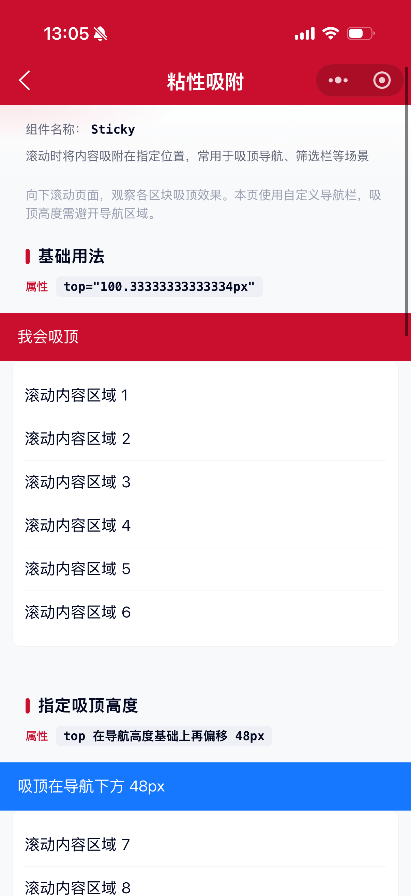
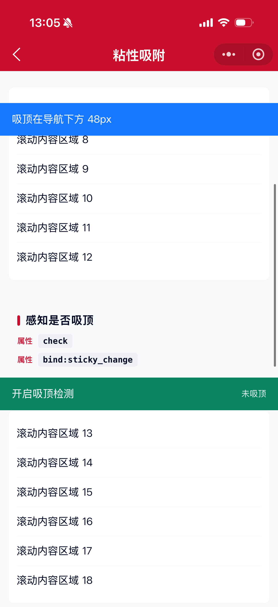

# Sticky 粘性吸附组件

用在需要在滚动中吸附在某些地方的情况，例如吸顶导航、筛选栏等。

## 示例图




## 注意事项

Sticky 组件实现依赖了 `position: sticky` 特性，该特性受父元素影响可能会失效。若遇到不生效的情况，请检查页面布局：

- 祖先节点不要设置 `overflow: hidden / auto / scroll`（除页面滚动容器外）
- 不要给 Sticky 父级设置会截断粘性定位的高度限制
- 可参考 [MDN: position](https://developer.mozilla.org/zh-CN/docs/Web/CSS/position) 排查

本组件库默认使用自定义导航栏，吸顶时通常需要设置 `top` 避开导航高度，或开启 `transparentTitle` 自动计算。

## 基础用法
页面 `.json` 文件 `usingComponents` 中引入组件
```json
// json
{
    "usingComponents": {
        "mx-sticky": "/components/mxwui/sticky/index"
    }
}
```

页面 `.wxml` 文件中使用组件
```html
<mx-sticky top="{{navHeight}}px">
    <view>我会吸顶</view>
</mx-sticky>
```

## 更多用法示例
### # 吸顶高度 top
属性：`top`，默认空。需带单位，如 `100px`、`24rpx`。
```html
<mx-sticky top="100px">
    <view>我会吸顶在距离顶部 100px 的地方</view>
</mx-sticky>
```

### # 是否吸顶 sticky
属性：`sticky`，默认 `true`。设为 `false` 时仅渲染插槽，不启用粘性定位。
```html
<mx-sticky sticky="{{false}}">
    <view>不吸顶</view>
</mx-sticky>
```

### # 感知是否吸顶 check
属性：`check`，默认 `false`。开启后可通过 `bind:sticky_change` 感知吸顶状态变化（有一定性能开销）。
```html
<mx-sticky
    top="{{navHeight}}px"
    check
    bind:sticky_change="handleStickyChange"
>
    <view>是否吸顶：{{stickyStatus ? '是' : '否'}}</view>
</mx-sticky>
```

```js
Page({
    data: {
        stickyStatus: false,
    },
    handleStickyChange(e) {
        this.setData({ stickyStatus: e.detail.status });
    },
});
```

### # 透明头模式 transparentTitle
属性：`transparentTitle`，默认 `false`。开启后自动按「状态栏 + 导航栏」高度吸附（等价于本库 `getNavHeight()`）。

可通过 `headerHeight` 覆盖自动计算结果，并通过 `bind:get_header_height` 拿到最终高度。
```html
<mx-sticky
    transparentTitle
    bind:get_header_height="handleGetHeaderHeight"
>
    <view>我会吸附在导航栏下方</view>
</mx-sticky>
```

```js
Page({
    handleGetHeaderHeight(e) {
        console.log(e.detail.height);
    },
});
```

### # 外部头部高度 headerHeight
属性：`headerHeight`，单位 `px`。仅在 `transparentTitle` 为 `true` 时生效；传入后优先使用该值，不再走系统计算。
```html
<mx-sticky transparentTitle headerHeight="{{88}}">
    <view>按外部高度吸顶</view>
</mx-sticky>
```

### # 层级 zIndex
属性：`zIndex`，默认 `99`。
```html
<mx-sticky top="{{navHeight}}px" zIndex="{{100}}">
    <view>自定义层级</view>
</mx-sticky>
```

### # 自定义样式 customStyle
属性：`customStyle`，写入吸顶根节点内联样式。
```html
<mx-sticky top="{{navHeight}}px" customStyle="background:#fff;">
    <view>自定义样式</view>
</mx-sticky>
```

## 插槽
仅有一个默认插槽，用于包裹需要吸顶的元素或组件。

## 参数
|参数|类型|必填|可选值|默认值|参数描述|
|----|----|----|----|----|----|
|top|String||带单位的 CSS 长度|`''`|吸顶高度，如 `100px`、`24rpx`|
|sticky|Boolean||`true`、`false`|`true`|是否启用吸顶|
|check|Boolean||`true`、`false`|`false`|是否感知吸顶状态|
|transparentTitle|Boolean||`true`、`false`|`false`|透明头模式，自动计算导航高度|
|headerHeight|Number||||外部传入头部高度（px），优先于自动计算|
|zIndex|Number|||`99`|吸顶时的 z-index|
|customStyle|String||CSS 字符串|`''`|根节点自定义样式|

## 事件
|事件名|说明|回调参数|
|----|----|----|
|bind:sticky_change|吸顶状态变化时触发，需开启 `check`|`event.detail.status`：是否处于吸顶状态|
|bind:get_header_height|透明头模式下计算完头部高度后触发|`event.detail.height`：头部高度（px）|

## 其他说明
- 透明头模式下自动计算高度，便于吸附在导航栏下方；若还需额外偏移，请直接使用 `top`。
- `top` 与 `transparentTitle` 同时存在时，以 `top` 为准。
- 吸顶检测基于 `IntersectionObserver`，仅在 `check` 为 `true` 时开启。
