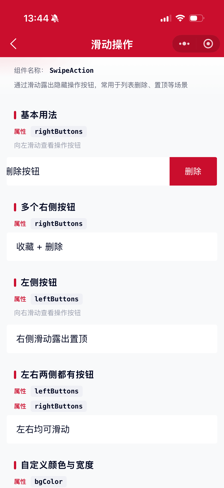
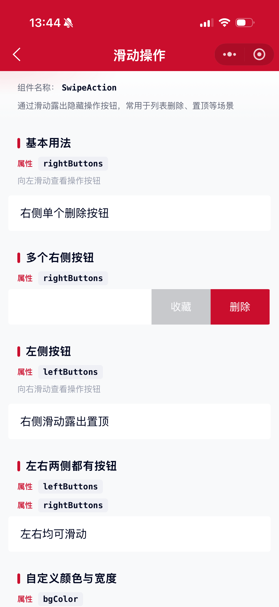
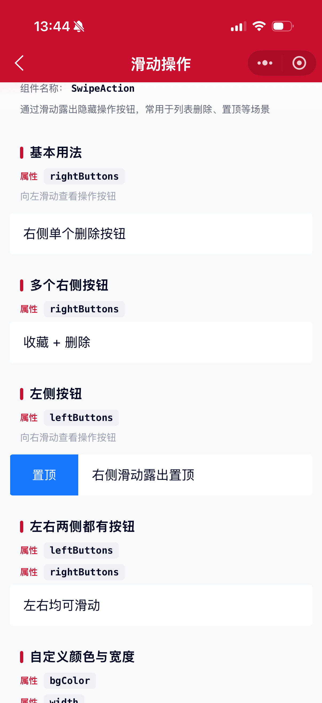

# SwipeAction 滑动操作组件

列表的功能扩展。通过滑动操作来展示隐藏的功能菜单，常用于删除、置顶、收藏等场景。

## 示例图





## 扫码查看


## 基础用法
页面 `.json` 文件 `usingComponents` 中引入组件
```json
// json
{
    "usingComponents": {
        "mx-swipe-action": "/components/mxwui/swipe-action/index"
    }
}
```

页面 `.wxml` 文件中使用组件
```html
<mx-swipe-action
    rightButtons="{{[{ text: '删除', type: 'danger' }]}}"
    bind:button_tap="onButtonTap"
>
    <view>左侧滑动露出删除</view>
</mx-swipe-action>
```

## 更多用法示例
### # 右侧按钮 rightButtons
属性：`rightButtons`，数组。向左滑动露出右侧操作区。
```html
<mx-swipe-action
    rightButtons="{{[
        { text: '收藏', type: 'default' },
        { text: '删除', type: 'danger' }
    ]}}"
    bind:button_tap="onButtonTap"
>
    <view>多个右侧按钮</view>
</mx-swipe-action>
```

### # 左侧按钮 leftButtons
属性：`leftButtons`，数组。向右滑动露出左侧操作区。
```html
<mx-swipe-action
    leftButtons="{{[{ text: '置顶', type: 'primary' }]}}"
    bind:button_tap="onButtonTap"
>
    <view>右侧滑动露出置顶</view>
</mx-swipe-action>
```

### # 左右两侧同时配置
可同时传入 `leftButtons` 与 `rightButtons`。
```html
<mx-swipe-action
    leftButtons="{{[{ text: '标为已读', type: 'primary' }]}}"
    rightButtons="{{[{ text: '删除', type: 'danger' }]}}"
>
    <view>左右均可滑动</view>
</mx-swipe-action>
```

### # 按钮类型 type
按钮对象字段 `type`，可选 `default`、`primary`、`danger`，默认 `default`。

| type | 默认背景色 |
| ---- | ---- |
| default | `#C8C9CC` |
| primary | `#1677FF` |
| danger | `#CA0E2D` |

```html
<mx-swipe-action
    rightButtons="{{[
        { text: '默认', type: 'default' },
        { text: '主要', type: 'primary' },
        { text: '危险', type: 'danger' }
    ]}}"
/>
```

### # 自定义颜色与宽度
按钮对象支持 `bgColor`、`color`、`width`（单位 rpx，默认 `160`）、`className`。
```html
<mx-swipe-action
    rightButtons="{{[
        { text: '编辑', bgColor: '#1677FF', color: '#fff', width: 140 },
        { text: '删除', bgColor: '#CA0E2D', color: '#fff', width: 140 }
    ]}}"
/>
```

### # 禁止滑动 disabled
属性：`disabled`，默认 `false`。
```html
<mx-swipe-action disabled rightButtons="{{[{ text: '删除', type: 'danger' }]}}">
    <view>不可滑动</view>
</mx-swipe-action>
```

### # 自动收起 autoClose
属性：`autoClose`，默认 `true`。点击按钮或内容区域后是否自动收起。
```html
<mx-swipe-action autoClose="{{false}}" rightButtons="{{[{ text: '删除', type: 'danger' }]}}">
    <view>点击后保持展开</view>
</mx-swipe-action>
```

### # 弹性回弹 elasticity
属性：`elasticity`，默认 `true`。拖动越界时是否有轻微回弹。
```html
<mx-swipe-action elasticity="{{false}}" rightButtons="{{[{ text: '删除', type: 'danger' }]}}">
    <view>关闭弹性</view>
</mx-swipe-action>
```

### # 默认展开 defaultSwiped
属性：`defaultSwiped`，可选 `left`、`right` 或空。非受控模式下默认展开方向。
```html
<mx-swipe-action defaultSwiped="right" rightButtons="{{[{ text: '删除', type: 'danger' }]}}">
    <view>默认展开右侧</view>
</mx-swipe-action>
```

### # 受控展开 swiped
属性：`swiped`，可选 `left`、`right`、`false` / `''`。传入后由外部控制展开状态。
```html
<mx-swipe-action
    swiped="{{swiped}}"
    rightButtons="{{[{ text: '删除', type: 'danger' }]}}"
    bind:swipe_end="onSwipeEnd"
>
    <view>受控模式</view>
</mx-swipe-action>
```

### # 标识与透传 name / extra
列表场景可通过 `name`、`extra` 区分项，事件回调中原样返回。
```html
<mx-swipe-action
    wx:for="{{list}}"
    wx:key="id"
    name="{{index}}"
    extra="{{item}}"
    rightButtons="{{[{ text: '删除', type: 'danger' }]}}"
    bind:button_tap="onDelete"
>
    <view>{{item.title}}</view>
</mx-swipe-action>
```

### # 兼容旧版 left / right
兼容 ant-design-mini 旧文档中的 `left`、`right` 写法，语义同 `leftButtons`、`rightButtons`。
```html
<mx-swipe-action
    right="{{[{ text: '删除', type: 'danger' }]}}"
    bind:right_button_tap="onRightTap"
>
    <view>兼容旧 API</view>
</mx-swipe-action>
```

### # 事件
```html
<mx-swipe-action
    rightButtons="{{rightButtons}}"
    bind:swipe_start="onSwipeStart"
    bind:swipe_end="onSwipeEnd"
    bind:button_tap="onButtonTap"
    bind:left_button_tap="onLeftTap"
    bind:right_button_tap="onRightTap"
    bind:content_tap="onContentTap"
>
    <view>内容</view>
</mx-swipe-action>
```

```js
Page({
    onButtonTap(e) {
        // e.detail: { direction, index, text, type, button, name, extra }
        console.log(e.detail);
    },
    onSwipeEnd(e) {
        // e.detail: { direction, swiped, name, extra }
    }
});
```

### # 组件实例方法
通过 `selectComponent` 获取实例后可调用：

| 方法 | 说明 |
| ---- | ---- |
| `open(position)` | 展开，`position` 为 `left` 或 `right` |
| `close()` | 收起 |

```js
this.selectComponent('#swipe').close();
```

## 参数
|参数|类型|必填|可选值|默认值|参数描述|
|----|----|----|----|----|----|
|leftButtons|Array||按钮对象数组|`[]`|左侧按钮（右滑露出）|
|rightButtons|Array||按钮对象数组|`[]`|右侧按钮（左滑露出）|
|left|Array||按钮对象数组|`null`|兼容旧 API，同 leftButtons|
|right|Array||按钮对象数组|`null`|兼容旧 API，同 rightButtons|
|autoClose|Boolean||`true`、`false`|`true`|点击后是否自动收起|
|disabled|Boolean||`true`、`false`|`false`|是否禁止滑动|
|elasticity|Boolean||`true`、`false`|`true`|是否开启越界弹性|
|damping|Number||数字|`70`|越界阻尼，值越大阻力越大|
|swiped|String/Boolean||`left`、`right`、`false`、`''`|`null`|受控展开状态|
|defaultSwiped|String||`left`、`right`、`''`|`''`|非受控默认展开|
|name|Any|||`''`|标识，事件中回传|
|extra|Any|||`null`|额外信息，事件中回传|
|className|String|||`''`|自定义类名|

### 按钮对象 SwipeButton
|字段|类型|默认值|说明|
|----|----|----|----|
|text|String|`''`|按钮文案|
|type|String|`default`|`default` / `primary` / `danger`|
|bgColor|String|按 type|背景色，优先级高于 type|
|color|String|`#FFFFFF`|文字颜色|
|width|Number|`160`|宽度，单位 rpx|
|className|String|`''`|按钮自定义类名|

## 事件
|事件名称|类型|返回值|事件说明|
|----|----|----|----|
|bind:swipe_start|Event|`{direction, swiped, name, extra}`|开始滑动|
|bind:swipe_end|Event|`{direction, swiped, name, extra}`|滑动结束（含吸附后状态）|
|bind:button_tap|Event|`{direction, index, text, type, button, name, extra}`|点击任一操作按钮|
|bind:left_button_tap|Event|同 button_tap|点击左侧按钮|
|bind:right_button_tap|Event|同 button_tap|点击右侧按钮|
|bind:content_tap|Event|`{position?, name, extra}`|点击内容区域|

## 其他说明
- 同页多个 `SwipeAction` 同时只会展开一项，滑动新项时会自动收起其他项。
- 滑动超过按钮区域约 `30%` 宽度后松手会吸附展开，否则回弹收起。
- 建议内容区域铺满宽度，并保证有足够高度以便点击操作按钮。
