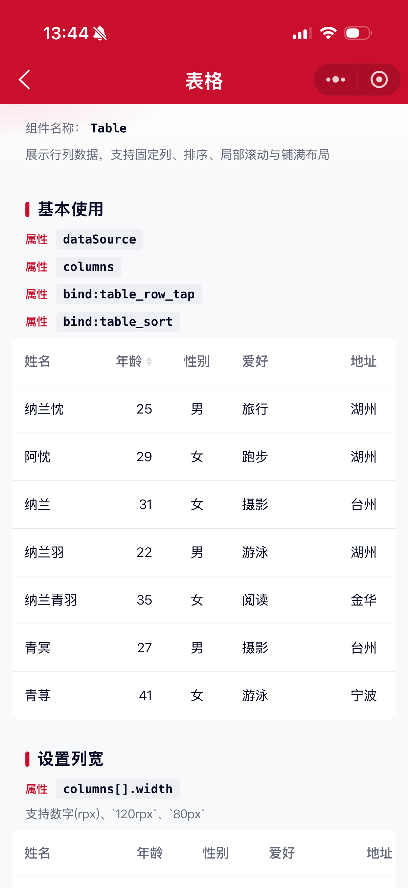

# Table 表格组件

展示行列数据。支持固定列、列排序、局部滚动、铺满布局与空状态插槽。

## 示例图



## 基础用法
页面 `.json` 文件 `usingComponents` 中引入组件
```json
// json
{
    "usingComponents": {
        "mx-table": "/components/mxwui/table/index"
    }
}
```

页面 `.wxml` 文件中使用组件
```html
<mx-table
    dataSource="{{dataSource}}"
    columns="{{columns}}"
    bind:table_row_tap="handleRowTap"
/>
```

```js
Page({
    data: {
        dataSource: [
            { key: 0, name: '小明', age: '18', sex: '男', address: '北京' },
            { key: 1, name: '小何', age: '32', sex: '女', address: '上海' },
        ],
        columns: [
            { title: '姓名', dataIndex: 'name', key: 'name', width: 150, fixed: true },
            { title: '年龄', dataIndex: 'age', key: 'age', width: 150, align: 'right', sorter: true },
            { title: '性别', dataIndex: 'sex', key: 'sex', width: 150, align: 'center' },
            { title: '地址', dataIndex: 'address', key: 'address', width: 250 },
        ],
    },
    handleRowTap(e) {
        const { row, index } = e.detail;
        console.log(row, index);
    },
});
```

## 更多用法示例
### # 设置列宽 width
在 `columns` 项中设置 `width`，仅 `displayType="DEFAULT"` 时生效。

支持：
- 数字：按 rpx 计算，如 `200`
- 字符串 rpx：如 `'120rpx'`
- 字符串 px：如 `'80px'`
- 百分比：如 `'25%'`

未设置时默认 `150`（rpx）。
```js
columns: [
    { title: '姓名', dataIndex: 'name', key: 'name', width: 200 },
    { title: '年龄', dataIndex: 'age', key: 'age', width: '100rpx' },
    { title: '性别', dataIndex: 'sex', key: 'sex', width: '80px' },
    { title: '地址', dataIndex: 'address', key: 'address', width: 280 },
]
```

```html
<mx-table dataSource="{{dataSource}}" columns="{{columns}}" />
```

### # 列对齐 align
在 `columns` 项中设置 `align`，可选 `left`、`center`、`right`，默认 `left`。表头与单元格同步对齐。

兼容旧属性 `textAlignRight`（等价于 `align: 'right'`）。
```js
columns: [
    { title: '左对齐', dataIndex: 'name', key: 'name', align: 'left' },
    { title: '居中', dataIndex: 'sex', key: 'sex', align: 'center' },
    { title: '右对齐', dataIndex: 'age', key: 'age', align: 'right' },
]
```

### # 局部滚动 scrollHeight
属性：`scrollHeight`，指定可滚动区域高度，如 `360rpx`、`200px`。
```html
<mx-table
    dataSource="{{dataSource}}"
    columns="{{columns}}"
    scrollHeight="360rpx"
/>
```

### # 铺满展示 displayType
属性：`displayType`，可选 `DEFAULT`、`FULL`，默认 `DEFAULT`。

- `DEFAULT`：按列宽展示，可横向滚动，支持固定列
- `FULL`：列宽均分铺满一屏
```html
<mx-table
    dataSource="{{dataSource}}"
    columns="{{columns}}"
    displayType="FULL"
/>
```

### # 固定列 fixed
在 `columns` 项中设置 `fixed: true`，该列在横向滚动时左侧固定，并在滚动时展示阴影。
```js
columns: [
    { title: '姓名', dataIndex: 'name', key: 'name', width: 150, fixed: true },
    // ...
]
```

### # 列排序 sorter
在 `columns` 项中设置 `sorter: true`，点击表头在「默认 → 升序 → 降序」间切换。

事件：`bind:table_sort`，回调 `e.detail` 含 `key`、`dataIndex`、`sorterStatus`（`normal` / `forward` / `reverse`）。
```html
<mx-table
    dataSource="{{dataSource}}"
    columns="{{columns}}"
    bind:table_sort="handleSort"
/>
```

### # 超出省略 ellipsisRow
在 `columns` 项中设置 `ellipsisRow`，控制单元格最大展示行数，超出以省略号展示。
```js
columns: [
    { title: '姓名', dataIndex: 'name', key: 'name', ellipsisRow: 2 },
    { title: '地址', dataIndex: 'address', key: 'address', ellipsisRow: 1 },
]
```

### # 空数据
`dataSource` 为空时展示空状态，默认带图标与文案，并在区域内水平垂直居中。

- `emptyText`：文案，默认 `暂无数据`
- `emptyIcon`：图标名，默认 `empty`；空字符串不展示图标
- `emptyIconUrl`：自定义图片，优先于 `emptyIcon`
- `emptyIconSize`：图标尺寸，单位 rpx，默认 `120`
- `emptyIconColor`：图标颜色，默认占位色

也可通过默认插槽完全自定义，此时需将 `emptyIcon`、`emptyText` 置为空字符串。
```html
<mx-table dataSource="{{[]}}" columns="{{columns}}" displayType="FULL" />

<mx-table
    dataSource="{{[]}}"
    columns="{{columns}}"
    displayType="FULL"
    emptyIcon="order"
    emptyText="暂无订单"
/>

<mx-table
    dataSource="{{[]}}"
    columns="{{columns}}"
    displayType="FULL"
    emptyIcon=""
    emptyText=""
>
    <view>暂无相关记录</view>
</mx-table>
```

### # 自定义根样式 customStyle
属性：`customStyle`，写入根节点内联样式。
```html
<mx-table
    dataSource="{{dataSource}}"
    columns="{{columns}}"
    customStyle="border-radius:16rpx;"
/>
```

## 自定义事件
```html
<mx-table
    dataSource="{{dataSource}}"
    columns="{{columns}}"
    bind:table_row_tap="handleRowTap"
    bind:table_cell_tap="handleCellTap"
    bind:table_sort="handleSort"
/>
```

```js
handleRowTap(e) {
    // e.detail = { row, index }
},
handleCellTap(e) {
    // e.detail = { row, rowIndex, cell, colIndex, value }
},
handleSort(e) {
    // e.detail = { key, dataIndex, sorterStatus }
},
```

## 参数
|参数|类型|必填|可选值|默认值|参数描述|
|----|----|----|----|----|----|
|dataSource|Array||||数据源|
|columns|Array||Column[]|`[]`|列配置|
|displayType|String||`DEFAULT`、`FULL`|`DEFAULT`|布局类型|
|scrollHeight|String||||可滚动区域高度，如 `360rpx`|
|emptyText|String|||`暂无数据`|空数据文案，空字符串时不展示文案|
|emptyIcon|String|||`empty`|空状态图标名，空字符串不展示|
|emptyIconUrl|String||||空状态自定义图片，优先于 emptyIcon|
|emptyIconSize|Number||数字|`120`|空状态图标尺寸，单位 rpx|
|emptyIconColor|String||颜色值|占位色|空状态图标颜色|
|customStyle|String||||根节点自定义样式|

### Column
|参数|类型|必填|可选值|默认值|参数描述|
|----|----|----|----|----|----|
|title|String||||列标题|
|dataIndex|String / Array||||取值字段，支持 `'a.b'` 或 `['a','b']`|
|key|String||||列唯一标识，默认取 `dataIndex`|
|width|Number / String||数字、`120rpx`、`80px`、`25%`|`150`|列宽，`DEFAULT` 模式生效；数字按 rpx 计算|
|fixed|Boolean||`true`、`false`|`false`|是否左侧固定|
|align|String||`left`、`center`、`right`|`left`|列对齐方式|
|textAlignRight|Boolean||`true`、`false`|`false`|是否右对齐（兼容旧写法，等价 `align: 'right'`）|
|sorter|Boolean||`true`、`false`|`false`|是否可排序|
|ellipsisRow|Number||数字||最大展示行数，超出省略|

## 事件
|事件名|说明|回调参数|
|----|----|----|
|table_row_tap|点击行|`{ row, index }`|
|table_cell_tap|点击单元格|`{ row, rowIndex, cell, colIndex, value }`|
|table_sort|点击排序表头|`{ key, dataIndex, sorterStatus }`|

## 其他说明
- 微信小程序不支持带作用域的 Slot，暂不提供单元格自定义插槽，单元格展示 `dataIndex` 对应字段文本。
- `displayType="FULL"` 时列宽均分，`width` / `fixed` 不再生效。
- `width` 支持数字（rpx）、`rpx` / `px` / `%` 字符串；数字默认按 rpx 换算为 px，未设置时默认 `150`。
- 固定列依赖 `position: sticky`，建议基础库 2.10.0+。
