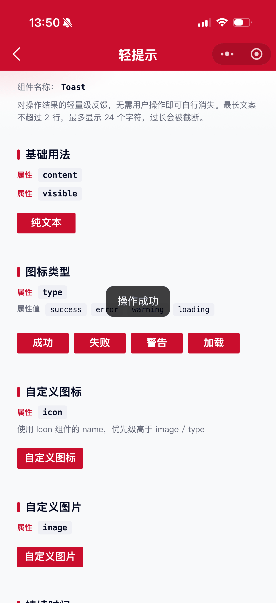
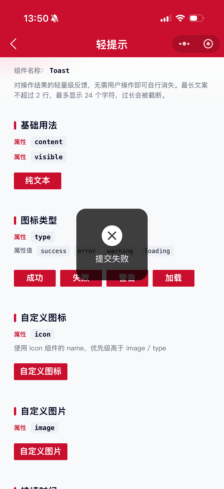
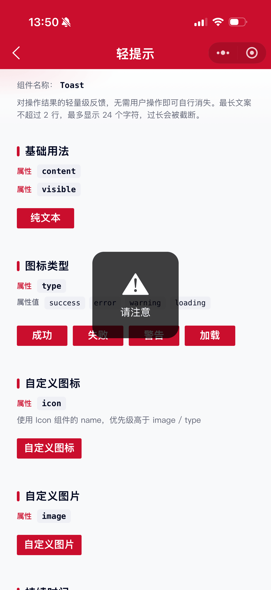
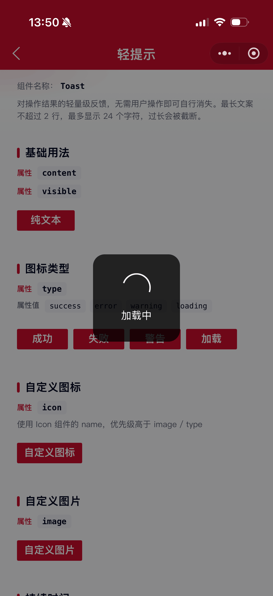
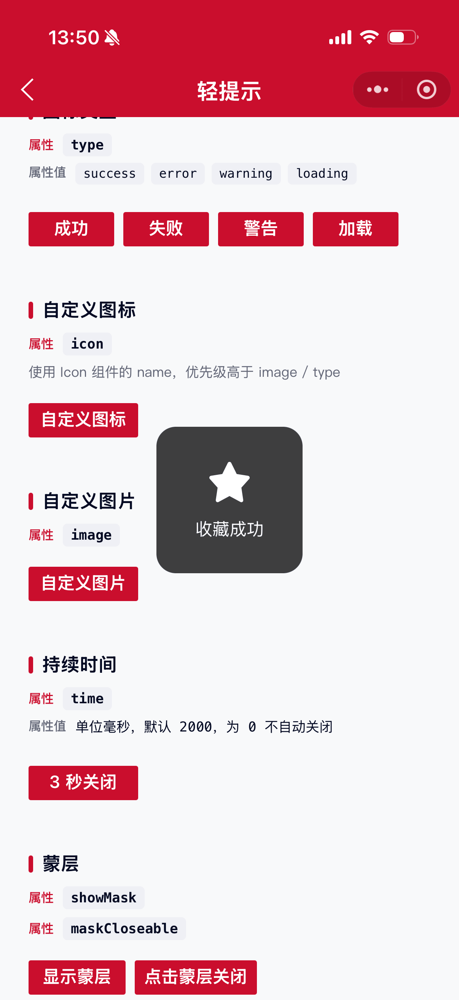

# Toast 轻提示组件

对操作结果的轻量级反馈，无需用户操作即可自行消失。最长文案不超过 2 行，最多可以显示 24 个字符，文案过长会被截断。

## 示例图








## 基础用法
页面 `.json` 文件 `usingComponents` 中引入组件
```json
// json
{
    "usingComponents": {
        "mx-toast": "/components/mxwui/toast/index"
    }
}
```

页面 `.wxml` 文件中使用组件
```html
<mx-toast
    content="操作成功"
    visible="{{visible}}"
    bind:toast_close="handleClose"
/>
```

```js
Page({
    data: {
        visible: false
    },
    handleShow() {
        this.setData({ visible: true });
    },
    handleClose() {
        this.setData({ visible: false });
    }
});
```

## 更多用法示例
### # 是否显示 visible
属性：`visible`，默认 `false`。
```html
<mx-toast visible="{{true}}" content="操作成功" />
```

### # 文本内容 content
属性：`content`，最多显示 24 个字符，超出截断并显示省略号；同时样式限制最多 2 行。
```html
<mx-toast visible="{{visible}}" content="操作成功" />
```

### # 图标类型 type
属性：`type`，可选 `success`、`error`、`warning`、`loading`。传入后展示对应内置图标。
```html
<mx-toast visible="{{visible}}" content="提交成功" type="success" />
<mx-toast visible="{{visible}}" content="提交失败" type="error" />
<mx-toast visible="{{visible}}" content="请注意" type="warning" />
<mx-toast visible="{{visible}}" content="加载中" type="loading" time="{{0}}" />
```

### # 自定义图标 icon
属性：`icon`，使用 Icon 组件的 `name`。与 `image` 互斥，且优先级高于 `image` / `type`。
```html
<mx-toast visible="{{visible}}" content="收藏成功" icon="collect_checked" />
```

### # 自定义图片 image
属性：`image`，图片链接。无 `icon` 时生效。
```html
<mx-toast
    visible="{{visible}}"
    content="自定义图片"
    image="https://example.com/icon.png"
/>
```

### # 持续时间 time
属性：`time`，单位毫秒，默认 `2000`。为 `0` 时不会自动关闭。
```html
<mx-toast visible="{{visible}}" content="3 秒后关闭" time="{{3000}}" />
<mx-toast visible="{{visible}}" content="不自动关闭" time="{{0}}" showMask maskCloseable />
```

### # 持续时间 duration
属性：`duration`，单位毫秒。传入后优先生效（覆盖 `time`），为 `0` 时不会自动关闭。一般推荐使用 `time`。
```html
<mx-toast visible="{{visible}}" content="3 秒后关闭" duration="{{3000}}" />
```

### # 蒙层 showMask / maskCloseable
属性：`showMask` 是否展示蒙层，默认 `false`；`maskCloseable` 点击蒙层是否关闭，默认 `false`。
```html
<mx-toast
    visible="{{visible}}"
    content="点击蒙层关闭"
    showMask
    maskCloseable
    time="{{0}}"
/>
```

### # 文字气泡圆角 textType
属性：`textType`，可选 `short`、`long`，默认 `long`。仅纯文本（无图标/图片）时生效；`short` 圆角更大。
```html
<mx-toast visible="{{visible}}" content="已保存" textType="short" />
<mx-toast visible="{{visible}}" content="操作成功" textType="long" />
```

### # 层级 zIndex
属性：`zIndex`，默认 `999`。
```html
<mx-toast visible="{{visible}}" content="操作成功" zIndex="{{1000}}" />
```

### # 自定义样式 customStyle / maskStyle
属性：`customStyle` 写入内容区样式；`maskStyle` 写入蒙层样式。
```html
<mx-toast
    visible="{{visible}}"
    content="自定义样式"
    customStyle="background:rgba(202,14,45,0.9);"
    showMask
    maskStyle="background:rgba(0,0,0,0.2);"
/>
```

## 自定义事件
事件：`bind:toast_close`，Toast 关闭后触发（自动关闭、点击蒙层关闭均会触发）。需在回调中将 `visible` 置为 `false`。
```html
<mx-toast
    visible="{{visible}}"
    content="操作成功"
    bind:toast_close="handleClose"
/>
```

## 参数
|参数|类型|必填|可选值|默认值|参数描述|
|----|----|----|----|----|----|
|visible|Boolean||`true`、`false`|`false`|是否显示|
|content|String||||文本内容，最多 24 字符|
|type|String||`success`、`error`、`warning`、`loading`||内置图标类型|
|icon|String||||自定义图标 name，优先于 image / type|
|image|String||||自定义图片链接|
|time|Number||数字|`2000`|持续时间（毫秒），`0` 不自动关闭|
|duration|Number||数字||持续时间（毫秒），传入后覆盖 time|
|showMask|Boolean||`true`、`false`|`false`|是否展示蒙层|
|maskCloseable|Boolean||`true`、`false`|`false`|点击蒙层是否关闭|
|maskStyle|String||CSS 字符串|`''`|蒙层自定义样式|
|textType|String||`short`、`long`|`long`|纯文本气泡圆角类型|
|zIndex|Number||数字|`999`|层级|
|customStyle|String||CSS 字符串|`''`|内容区自定义样式|

## 事件
|事件名称|类型|返回值|事件说明|
|----|----|----|----|
|bind:toast_close|Close||Toast 关闭后触发|

## 其他说明
- 媒体展示优先级：`icon` > `image` > `type`。
- 有图标/图片/loading 时使用方形大尺寸容器；纯文本时由 `textType` 控制圆角。
- `type="loading"` 通常配合 `time="{{0}}"` 与 `showMask` 使用，并在业务完成后将 `visible` 置为 `false`。
- 推荐使用 `time`（毫秒）；若同时传入 `duration`，以 `duration` 为准。
- 关闭后务必在 `toast_close` 回调中同步页面的 `visible` 状态。
