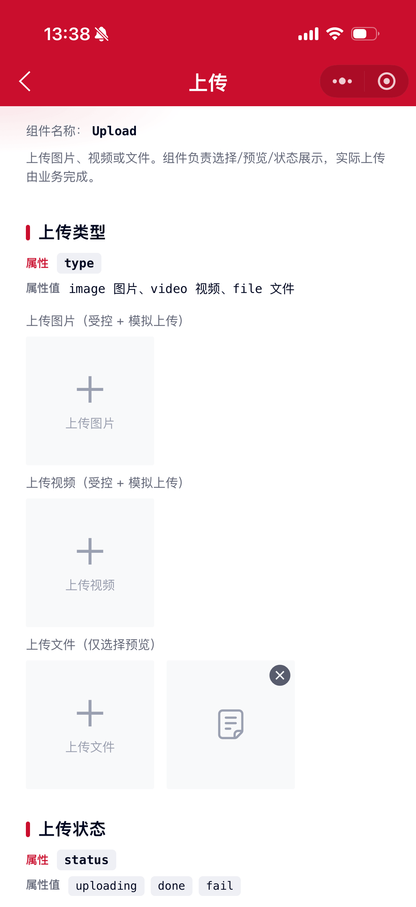
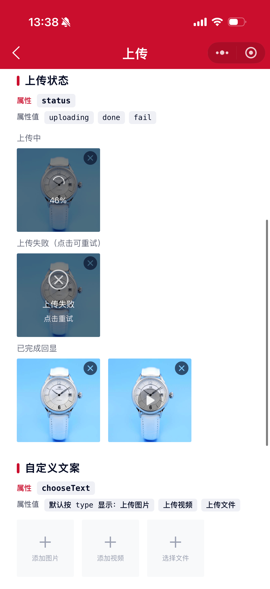

# Upload 上传组件

上传图片、视频或文件。组件负责选择、预览、删除与上传态展示；实际上传由业务监听事件后完成，再回写 `src` / `status`。

## 示例图




## 扫码查看


## 基础用法
页面 `.json` 文件 `usingComponents` 中引入组件
```json
// json
{
    "usingComponents": {
        "mx-upload": "/components/mxwui/upload/index"
    }
}
```

页面 `.wxml` 文件中使用组件
```html
<mx-upload type="image" />
```

## 更多用法示例
### # 上传类型 type
属性：`type`，可选 `image`、`video`、`file`，默认 `image`。

```html
<mx-upload type="image" />
<mx-upload type="video" />
<mx-upload type="file" />
```

### # 受控回写（推荐）
监听 `upload_change`，选择后自行上传，再回写远程地址与状态。

```html
<mx-upload
    type="image"
    src="{{imageSrc}}"
    status="{{imageStatus}}"
    percent="{{imagePercent}}"
    bind:upload_change="handleUploadChange"
/>
```

```js
handleUploadChange(e) {
    const {type, src, cover, file} = e.detail;
    if (type === 'del') {
        this.setData({imageSrc: '', imageStatus: '', imagePercent: 0});
        return;
    }
    if (type === 'choose' || type === 'retry') {
        this.setData({imageSrc: src, imageStatus: 'uploading', imagePercent: 0});
        // 业务上传，成功后：
        // this.setData({ imageSrc: remoteUrl, imageStatus: 'done', imagePercent: 100 })
        // 失败后：
        // this.setData({ imageStatus: 'fail' })
    }
}
```

### # 上传状态 status
属性：`status`，可选 `uploading`、`done`、`fail`，默认空。

也可用旧属性 `isFail` 表示失败（与 `status="fail"` 等价）。

```html
<mx-upload type="image" src="{{src}}" status="uploading" percent="{{46}}" />
<mx-upload type="image" src="{{src}}" status="fail" />
<mx-upload type="image" src="{{src}}" status="done" />
```

### # 尺寸 width / small
属性：`width` 单位 rpx，默认 `233`；`small` 为小尺寸，默认 `false`。

仅传 `small` 时，容器会自动缩小为 `160rpx`，并缩小图标与文案。若同时传了自定义 `width`，则以 `width` 为准。

```html
<mx-upload type="image" small />
<mx-upload type="image" width="{{160}}" small />
```

### # 自定义文案 chooseText
属性：`chooseText`，默认空。为空时按 `type` 自动显示：`上传图片` / `上传视频` / `上传文件`。

```html
<mx-upload type="image" chooseText="添加图片" />
<mx-upload type="video" chooseText="添加视频" />
<mx-upload type="file" chooseText="选择文件" />
```

### # 禁用 / 不可删除
属性：`disabled`、`deletable`，默认分别为 `false`、`true`。

```html
<mx-upload type="image" disabled />
<mx-upload type="image" src="{{src}}" deletable="{{false}}" />
```

### # 来源与大小限制
属性：`sourceType`，默认 `['album', 'camera']`；`maxSize` 单位字节，默认 `0`（不限制）。

```html
<mx-upload
    type="image"
    sourceType="{{['album']}}"
    maxSize="{{2 * 1024 * 1024}}"
    bind:upload_oversize="handleOversize"
/>
```

## 自定义事件
事件：`upload_choose`，点击上传入口时触发（选择系统面板前）。

事件：`upload_change`，选择 / 删除 / 重试时触发，`detail.type` 为 `choose` | `del` | `retry`。

事件：`upload_retry`，失败态点击重试时触发。

事件：`upload_oversize`，选择文件超出 `maxSize` 时触发。

```html
<mx-upload
    type="image"
    bind:upload_choose="onChoose"
    bind:upload_change="onChange"
    bind:upload_retry="onRetry"
    bind:upload_oversize="onOversize"
/>
```

## 参数
|参数|类型|必填|可选值|默认值|参数描述|
|----|----|----|----|----|----|
|type|String||`image`、`video`、`file`|`image`|上传类型|
|src|String||||资源地址|
|cover|String||||视频封面|
|width|Number||数字|`233`|组件宽高，单位 rpx|
|small|Boolean||`true`、`false`|`false`|小尺寸；未自定义 width 时容器变为 160rpx|
|status|String||`uploading`、`done`、`fail`||上传状态|
|isFail|Boolean||`true`、`false`|`false`|是否失败（兼容）|
|percent|Number||0-100|`0`|上传进度|
|disabled|Boolean||`true`、`false`|`false`|是否禁用|
|deletable|Boolean||`true`、`false`|`true`|是否可删除|
|sourceType|Array|||`['album','camera']`|图片/视频来源|
|maxSize|Number||数字|`0`|大小上限（字节），0 不限制|
|chooseText|String||||自定义上传文案，空则按 type 显示默认文案|
|autoPreview|Boolean||`true`、`false`|`true`|选择后是否本地回写 src|
|previewUrls|Array||||图片预览列表；视频可为 `[{url, poster}]`|

## 事件
|事件名称|类型|返回值|事件说明|
|----|----|----|----|
|bind:upload_choose|Custom|`{type}`|点击上传入口|
|bind:upload_change|Custom|`{type, src, cover, file?, status}`|选择/删除/重试|
|bind:upload_retry|Custom|`{type, src, cover}`|失败重试|
|bind:upload_oversize|Custom|`{file, maxSize}`|超出大小限制|

## 其他说明
- 组件不内置 OSS/服务端上传，需业务接入后回写。
- 选择成功后会先用临时路径本地预览，便于展示上传中态。
