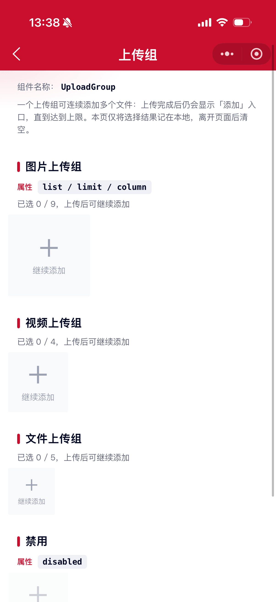

# UploadGroup 上传组组件

上传多个图片、视频或文件。负责多列布局与数量限制；单项能力委托 `mx-upload`。

## 示例图



## 扫码查看


## 基础用法
页面 `.json` 文件 `usingComponents` 中引入组件
```json
// json
{
    "usingComponents": {
        "mx-upload-group": "/components/mxwui/upload-group/index"
    }
}
```

页面 `.wxml` 文件中使用组件
```html
<mx-upload-group type="image" list="{{list}}" bind:upload_group_change="handleChange" />
```

## 更多用法示例
### # 上传类型 type
属性：`type`，可选 `image`、`video`、`file`，默认 `image`。

```html
<mx-upload-group type="image" list="{{list}}" bind:upload_group_change="handleChange" />
```

### # 列表 list（受控）
属性：`list`，数组项建议字段：`src`、`cover`、`status`、`percent`、`isFail`。

```js
Page({
    data: {
        list: []
    },
    handleChange(e) {
        const {list, type, index, src, cover} = e.detail;
        this.setData({list});
        if (type === 'choose' || type === 'retry') {
            // 业务上传该 index，成功/失败后更新 list[index].status / src
        }
    }
})
```

### # 列数 column / 数量 limit
属性：`column` 默认 `3`；`limit` 默认 `9`。未满 `limit` 时自动显示添加入口。

```html
<mx-upload-group type="image" column="{{4}}" limit="{{8}}" list="{{list}}" />
```

### # 禁用与来源限制
```html
<mx-upload-group
    type="image"
    list="{{list}}"
    disabled
    sourceType="{{['album']}}"
    maxSize="{{5 * 1024 * 1024}}"
/>
```

## 自定义事件
事件：`upload_group_change`，列表变化（选择/删除/重试），返回最新 `list`。

事件：`upload_group_choose`，点击上传入口。

事件：`upload_group_retry`，单项失败重试。

事件：`upload_group_oversize`，单项超大小。

```html
<mx-upload-group
    type="image"
    list="{{list}}"
    bind:upload_group_change="handleChange"
    bind:upload_group_choose="handleChoose"
    bind:upload_group_retry="handleRetry"
    bind:upload_group_oversize="handleOversize"
/>
```

## 参数
|参数|类型|必填|可选值|默认值|参数描述|
|----|----|----|----|----|----|
|type|String||`image`、`video`、`file`|`image`|上传类型|
|list|Array||||已选列表|
|column|Number||数字|`3`|每行列数|
|limit|Number||数字|`9`|最多数量|
|width|Number||数字|`0`|单项宽高 rpx，0 则按列数计算|
|disabled|Boolean||`true`、`false`|`false`|是否禁用|
|deletable|Boolean||`true`、`false`|`true`|是否可删除|
|sourceType|Array|||`['album','camera']`|图片/视频来源|
|maxSize|Number||数字|`0`|大小上限（字节）|
|chooseText|String||||自定义上传文案，空则按 type 显示默认文案|

## 事件
|事件名称|类型|返回值|事件说明|
|----|----|----|----|
|bind:upload_group_change|Custom|`{list, type, index, src, cover, file?}`|列表变化|
|bind:upload_group_choose|Custom|`{type, index}`|点击上传入口|
|bind:upload_group_retry|Custom|`{type, src, cover, index}`|失败重试|
|bind:upload_group_oversize|Custom|`{file, maxSize, index}`|超出大小|

## 其他说明
- 列表需业务受控维护：收到 `upload_group_change` 后 `setData({list})`。
- 单项上传态字段与 `mx-upload` 一致：`status` / `percent` / `isFail`。
- 建议为列表项提供稳定 `uid`（组件选择时也会自动补齐），便于列表渲染与异步上传回写。
- 图片/视频预览会带上整组资源，可左右滑动查看。
