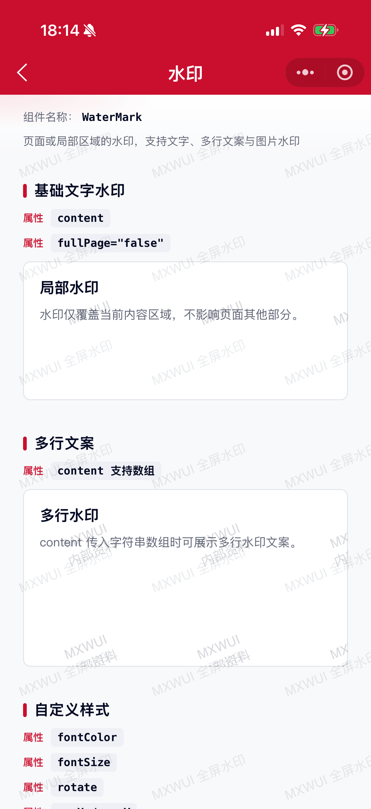
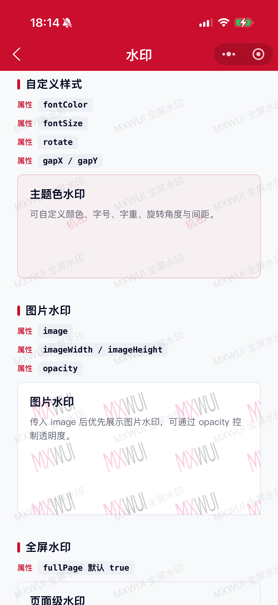

# WaterMark 水印组件

给页面或局部区域添加水印，支持文字、多行文案与图片水印，常用于防泄密、版权标识等场景。

## 示例图




## 扫码查看


## 基础用法
页面 `.json` 文件 `usingComponents` 中引入组件
```json
// json
{
    "usingComponents": {
        "mx-water-mark": "/components/mxwui/water-mark/index"
    }
}
```

页面 `.wxml` 文件中使用组件
```html
<!-- 全屏水印（默认） -->
<mx-water-mark content="MXWUI" />

<!-- 局部水印 -->
<mx-water-mark content="MXWUI" fullPage="{{false}}">
    <view>内容区域</view>
</mx-water-mark>
```

## 更多用法示例
### # 水印内容 content
属性：`content`，支持字符串或字符串数组。数组时按多行绘制。默认 `MXWUI`。
```html
<mx-water-mark content="MXWUI" fullPage="{{false}}">
    <view>内容区域</view>
</mx-water-mark>

<mx-water-mark content="{{['MXWUI', '内部资料']}}" fullPage="{{false}}">
    <view>内容区域</view>
</mx-water-mark>
```

### # 全屏 / 局部 fullPage
属性：`fullPage`，默认 `true`。为 `true` 时以固定定位覆盖整个页面；为 `false` 时覆盖组件内部内容区域（需配合默认插槽）。
```html
<!-- 全屏 -->
<mx-water-mark content="机密文件" fullPage="{{true}}" />

<!-- 局部 -->
<mx-water-mark content="局部水印" fullPage="{{false}}">
    <view class="box">内容区域</view>
</mx-water-mark>
```

### # 文字样式 fontColor / fontSize / fontWeight
属性：`fontColor` 默认 `rgba(4, 10, 35, 0.15)`；`fontSize` 单位 `px`，默认 `14`；`fontWeight` 默认 `normal`。
```html
<mx-water-mark
    content="机密"
    fullPage="{{false}}"
    fontColor="rgba(202, 14, 45, 0.18)"
    fontSize="{{16}}"
    fontWeight="bold"
>
    <view>内容区域</view>
</mx-water-mark>
```

### # 旋转与间距 rotate / gapX / gapY / width / height
属性：`rotate` 单位 `deg`，默认 `-22`；`gapX`、`gapY` 为水印间距，单位 `px`，默认 `24` / `48`；`width`、`height` 为水印单元尺寸，单位 `px`，默认 `120` / `64`。
```html
<mx-water-mark
    content="MXWUI"
    fullPage="{{false}}"
    rotate="{{-30}}"
    gapX="{{32}}"
    gapY="{{64}}"
    width="{{140}}"
    height="{{72}}"
>
    <view>内容区域</view>
</mx-water-mark>
```

### # 图片水印 image / opacity
属性：`image` 为图片地址，设置后优先于 `content`；`imageWidth`、`imageHeight` 控制绘制尺寸，单位 `px`，默认 `120` / `64`；`opacity` 控制图片透明度，范围 `0-1`，默认 `1`。
```html
<mx-water-mark
    image="https://cdn.mingsixue.com/xcx/MXWUI/mxwui.png"
    fullPage="{{false}}"
    imageWidth="{{64}}"
    imageHeight="{{64}}"
    width="{{120}}"
    height="{{120}}"
    opacity="{{0.2}}"
>
    <view>内容区域</view>
</mx-water-mark>
```

### # 层级 zIndex
属性：`zIndex`，默认 `9`。
```html
<mx-water-mark content="MXWUI" zIndex="{{100}}" />
```

### # 自定义根样式 customStyle
属性：`customStyle`，写入根节点内联样式。
```html
<mx-water-mark content="MXWUI" fullPage="{{false}}" customStyle="min-height:200px;">
    <view>内容区域</view>
</mx-water-mark>
```

## 参数
|参数|类型|必填|可选值|默认值|参数描述|
|----|----|----|----|----|----|
|content|String / Array|||`MXWUI`|水印文案，数组时多行展示|
|image|String||||图片水印地址，优先于 content|
|width|Number||数字|`120`|水印单元宽度，单位 px|
|height|Number||数字|`64`|水印单元高度，单位 px|
|rotate|Number||数字|`-22`|旋转角度，单位 deg|
|zIndex|Number||数字|`9`|水印层级|
|gapX|Number||数字|`24`|水平间距，单位 px|
|gapY|Number||数字|`48`|垂直间距，单位 px|
|fontSize|Number||数字|`14`|文字字号，单位 px|
|fontColor|String||颜色值|`rgba(4, 10, 35, 0.15)`|文字颜色|
|fontWeight|String||`normal`、`bold` 等|`normal`|文字字重|
|imageWidth|Number||数字|`120`|图片水印宽度，单位 px|
|imageHeight|Number||数字|`64`|图片水印高度，单位 px|
|opacity|Number||`0` ~ `1`|`1`|图片水印透明度|
|fullPage|Boolean||`true`、`false`|`true`|是否全屏覆盖页面|
|customStyle|String||CSS 字符串|`''`|根节点自定义样式|

## 其他说明
- `fullPage="{{true}}"` 时水印层为 `position: fixed`，覆盖整个页面，且不拦截点击（`pointer-events: none`）。
- `fullPage="{{false}}"` 时请通过默认插槽包裹需要加水印的内容区域，父级会相对定位。
- 同时传入 `image` 与 `content` 时，优先展示图片水印。
- `opacity` 仅作用于图片水印；文字水印透明度请通过 `fontColor` 的 rgba 控制。
- 尺寸相关参数（`width` / `height` / `gapX` / `gapY` / `fontSize` 等）均以 `px` 为单位，便于与 canvas 绘制对齐。
